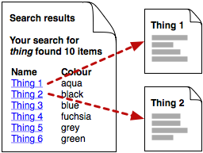
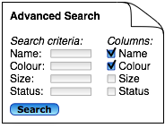
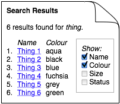

= The same but different - web application comparison support
hilton
v1.0, 2005-08-12
:title: The same but different- web application comparison support
:tags: [web]
ifdef::backend-html5[]
:in-between-width: width='85%'
:half-width: width='50%'
:half-size:
:thumbnail: width='60'
endif::[]

I've built a few web applications structured around 'one page for each item' plus navigation, i.e. one page for each row in the database's most important table. This is like there being a page for each book on Amazon.com.

After reading http://www.oreilly.com/catalog/infotecture2/[Information Architecture for the World Wide Web] a few years ago, I thought of most of the rest as the search and browse interfaces: categorise the books and make a clickable subject hiearchy for navigation, add a search form for more precise queries, and enhance both by allowing the user to switch between the two at will. This navigation interface would then allow you to find the right single page with the data you need. This is fine for web sites, where you navigate to a page, and read it - as for an article on a news web site, but this may fail to provide comparison support.

My last catalogue web application's search interface presented a table of search results, with the values in the 'name' column being links to the item's page, where all of its data was displayed. Names weren't unique, so I added a few more columns of identifying data to enable the user to choose the right item, and see all of its data. This meant that if you searched for an item by name and got many results, you could look at the items' versions and statuses.

At the time, it didn't occur to me that it might be useful to compare two items. To do that you would need to use several browser windows, and drag links from a search results window into other windows for the individual pages:

Needless to say, I doubt that many users found that to be a handy approach, or found it at all. Indeed, over time we enhanced the interface until the search form let you specify any combination of about twenty attributes to display for each item as columns in the search results table.

It is now obvious to me that we ended up doing this to provide support for comparison; much better to compare a dozen items' 'owner' by having an 'owner' column in the search results table, than to have to navigate to a dozen different pages.

I thought of this as a customisation of the search, so I included the checkboxes on the search form.

I now think it would be an improvement to separate the two sections of the search form - search criteria and checkboxes for search results display columns. Instead, first do the search, and then change the results display, if desired:

Note that considerable benefits accrue from doing all this in the URL query string, so that you can make hyperlinks to specific searches, use browser bookmarks to save a 'view' or be able to e-mail a view's URL. For example, a search results page might have a URL like `/results?query=thing&column=name&column=owner&sort=owner`.

This is implemented rather well in http://www.atlassian.com/software/jira/[Atlassian JIRA]'s support for http://www.atlassian.com/software/jira/docs/v3.3/navigatorcolumns.html#configuringnavigatorcolumns"]Configuring Navigator Columns], for example. It is not perfect though - the configuration is a user-preference, and you cannot set it in the URL query string, have different columns for different JIRA filters (views).

With incremental development in mind, I'd build this in this order:

* search results with fixed choice of columns
* add URL parameters for customising which columns are displayed
* add the list of checkboxes for specifying which columns are shown
* use cookies to record a user's preference, supposing that a certain user's attributes of interest are relatively fixed.

With all of this, what used to simply be 'search results' becomes a more flexible 'multiple items' view, with valuable comparison support.
