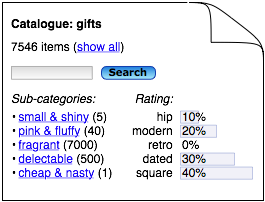

= Catalogue search/browse
hilton
v1.0, 2005-09-10
:title: Catalogue search/browse
:tags: [web]
ifdef::backend-html5[]
:in-between-width: width='85%'
:half-width: width='50%'
:half-size:
:thumbnail: width='60'
endif::[]

Search interfaces are relatively straightforward to design, not because they're simple, but because it is mostly a solved problem. Designing a browse interface is harder, because what makes sense for one set of information probably doesn't for another. I've been thinking about a better browse interface for the last web-based 'catalogue' I designed.

In http://http://www.jnd.org/books.html[Things That Make Us Smart], Donald Norman tells us that spatial 'navigation' only works:

* for collections with a natural spatial mapping, where there really is a single logical 'location' for each item</li>
* when there are few items at each spatial location.

In fact, using the term 'navigation' in the first place imposes a possibly inappropriate spatial metaphor. A natural alternative for most data sets is some hierarchy of categories - what librarian-types call a taxonomy, which although hard to design well has probably already been done. In this case, the most natural browse interface is to browse this taxonomy.

The last web-based catalogue I designed didn't have a browse interface, but probably should have. Instead, the nearest thing was to search for items in a particular category, which allowed category names to be displayed as links to a search for that category. This was okay, but lacked browse functionality, such as navigation down the category hierarchy, searching within the category or specific actions on items in the category.

Something like this would have been an improvement:

This is a page for some subset of the catalogue, instead of a page for a single item. This page allows for a link to a list of the items, a search 'in this category', links to similar subcategory pages, and use-case specific information, such as a breakdown of item count by status.

>Another option would be to combine this with the table/list of items, and put the other sections in side-bars:

image::../media/2005-09-10-catalogue-searchbrowse/browse-interfaces-listedalternative.png[An alternative category page design]

This drops the traditional web-site navigation menu on the left, which shows higher-level less-specific navigation, than the specific content on the page. Instead, the right hand side shows navigation and functionality that is specific, i.e. context-sensitive, for the data shown on this page. This is clearly more useful than using a lot of space to repeat the same global navigation on each page. Also, it is probably not difficult to make this appear natural from the user's point of view, so that usability is good.
