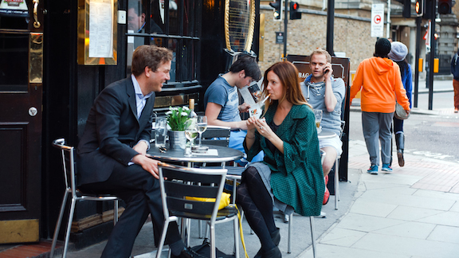

= Business lunch rules
Michael Pentowski
v1.0, 2005-09-13
:title: Business lunch rules
:tags: [opinion]
ifdef::backend-html5[]
:in-between-width: width='85%'
:half-width: width='50%'
:half-size:
:thumbnail: width='60'
endif::[]

The business lunch is something that is near and dear to my heart but, on reflection, what can I write that hasn't been said before? Nothing I suppose. But none the less, here are my ramblings on the business lunch and some tips to make the most out of the opportunity.

The purpose of the lunch - The business lunch always has a purpose, or at least pretends to have one. So... why are you actually going to this lunch at the expense of valuable work time? Are you establishing a new relationship, maintaining an existing one, looking for new ideas/partners, or simply getting out of the office for creative or other reasons (more later in my yet to be written: *Meeting for the sake of meeting*). Understanding the purpose of the lunch brings us to…

*The lunch agenda* - What do want to achieve in the given timeframe? Make an agenda and keep to it if possible. Depending on the mood during the lunch meeting having a secondary or hidden agenda can be efficient use of time. Kill two birds with one lunch. Results driven dining is key.

*Length* - Never book less than two hours for a business lunch. Of course, there are exceptions when you are dealing with known quantities, but on an exploration mission or a long overdue face-to-face there is no substitute for a long lunch to get through all the issues. I am not one who tends to make unnecessary meetings, so when I do happen to book time for a lunch, I make the time available. I get irritated by serial meeting freaks… they let you travel two hours for a pressured lunch, which in hindsight required another meeting because they simply did not book enough time for the niceties and the business at hand. Avoid this trap at all costs, one power lunch is worth three separate meetings if used properly.

*Invitees* - If it is a real meeting, bring the right people. Lead programmer, project manager, developer, CTO. If it is more social in nature, or a covert operation, then bring appropriate persons such as the charming secretary, or a marketing guy with good sense of humour.

*Location* - Put it in perspective. If you choose the restaurant, make sure they do consider vegetarians or have some sort of alternative menu. Vegetarians are used to disappointment, they only need one or two choices on the menu and they are happy. Next time you are at your favourite restaurants, look quickly at the menu to make sure it caters for a wider variety of appetites.

*The wait staff* – Always respect your wait staff and in most cases they will respect you. There is a far cry from expecting reasonable service and being a demanding elitist. There is also such a thing as too much service… Imagine trying to close the big deal, or making the elevator pitch (which took you an hour to build up the courage towards) and you get asked (yet again) if everyting is okay. Now this particular example is perhaps more appropriate in the Americas, where service is occasionally overdone for the sake of gratuity. The other extreme is Belgium (one of my favourite places to lunch) where service is sometimes considered an honor. However, the art of the long lunch is perfected in Belgium so this must be taken into consideration. But I digress…

*Etiquette* - Anyone can be eloquent if he or she cares to be. Charm and grace are natural, but can also be learned. Differences in cultures need to be considered. Americans eat sandwiches with their hands, Europeans tend to use knife and fork. Work your way from outside in with cutlery. I have been told that belching after a meal is flattering in some parts of the world, I think you will get a different reaction if you do this in western nations. Taking phone calls during lunch is not straight forward, all I will say is that if you keep your phone on during the lunch and you must take a call, excuse yourself and have the conversation in a quiet corner of the restaurant.

*Who pays* - The general rule of thumb for payment is the person requesting the meeting (or on home turf) pays the bill. My rule of thumb is more simple: always assume you will pay, and always offer to pay (unless of course it is old friends/partners then it just goes naturally). I deal with a lot of startup companies. I can not expect that they will have the dosh to pick up a lunch tab for me (I know what it is like to bootstrap). I am always interested to see how young guns react when the bills come, but as a senior entrepreneur I feel I have to help when I can. Plus, if we are having lunch, the odds are that I am also looking at business opportunities, therefore I consider this a cost of sales.

*Smoking and alcohol* - if you need to ask if it is appropriate, the answer should be self evident. Drinking before lunchtime is normally cause for concern, champagne being the only known exception.  Being located in Europe, smoking is something that is still acceptable in restaurants. However, smoking while others are still eating is not done. My general tip on the vices: if you are selling, don't light up or go for that third martini unless your lunch partners are doing so as well (and you have already achieved the business at hand with a clear head).

*Follow-up* - agree this during the lunch, even if for no other reason than to convince your manager that this was an important meeting which actually requires follow-up. If you are lucky, something will come of this and you have then justified your business lunch policy. And the expense forms that came with it…

_Photo: https://www.flickr.com/photos/94150506@N08/8931329670"[Lena Vasiljeva]_