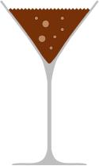

= Chocolate cocktails: brain food for after work
hilton
v1.0, 2005-09-23
:title: Chocolate cocktails: brain food for after work
:tags: [opinion, fun]
ifdef::backend-html5[]
:in-between-width: width='85%'
:half-width: width='50%'
:half-size:
:thumbnail: width='60'
endif::[]

While some things are best done serially, such as coding first and drinking beer later. For other things, superior results can be achieved through parallelisation. This article illustrates the Bacchanalian possibilities of chocolate, alcohol and a cocktail shaker.

There have been many other chocolate-alcohol drinks, but most fail because they barely taste of chocolate and are way too sweet. If that is what you like, then just drink the chocolate liqueur neat on the rocks and read no further.

Ingredients: the mix of ingredients is designed to create a chocolate milkshake feel, with the texture enhanced by the suspended cocoa power. Most importantly, though, the cocoa's bitterness balances the sweet liqueur, so that the cocktails are not too sickly-sweet to drink lots of. The key ingredient is the crème de cacao: in the Netherlands the best are http://bootz.nl/[Bootz] Cacao and http://www.dekuyper.com/nl/productinformatie.php?category=2&id=32[De Kuyper Crème de Cacao].

Preparation: add the ingredients to the cocktail shaker, along with three or four ice cubes. Shake and strain into a Martini glass.

== The Ambassador

Chocolate flavour. This is the basic chocolate cocktail in this series, since brandy is the obvious chocolate mixer. The remaining cocktails are variations on this recipe that introduce extra flavours using rum instead of brandy or a liqueur.

If you are lucky enough to live in the United Kingdom, you can upgrade this to a *Royal Ambassador* by using double cream instead of milk.

* 1 measure crème de cacao
* 1 measure milk
* 1 measure brandy
* 1 heaped teaspoon cocoa powder

== The War God

Chocolate caramel flavour. The Butterscotch Caramel liqueur is horrifically sweet, so adjust the amount to taste.

* 1 measure chocolate liqueur
* 1 measure milk
* ½ measure http://www.dekuyper.com/nl/productinformatie.php?category=2&id=55[De Kuyper Butterscotch Caramel Liqueur]
* ½ measure dark rum
* 1 heaped teaspoon cocoa powder

== The Captain Bligh

Chocolate coconut flavour. Once you have worked out where to buy the Batida de Coco, which is not actually that hard to find, you will first rediscover piña coladas, and then have some left over when you discover that unadulterated pineapple juice is even harder to find.

* 1 measure chocolate liqueur
* 1 measure http://www.batida.com/eng/[Batida de Coco]
* 1 measure dark rum
* 1 heaped teaspoon cocoa powder

== The Terrence

Chocolate orange flavour. The Rutte & Zn Royal Orange is much more subtle, with a more real orange flavour than most orangle liqueurs. If you must use something harsh like Cointreau, then use half-and-half Cointreau and brandy.

* 1 measure chocolate liqueur
* 1 measure milk
* 1 measure Rutte & Zn Royal Orange liqueur (substitute: Cointreau)
* 1 heaped teaspoon cocoa powder

== The Lunatich

Chocolate and nut flavour.

* 1 measure chocolate liqueur
* 1 measure milk
* 1 measure walnut liqueur
* 1 heaped teaspoon cocoa powder

Note: _no animals were harmed or code written during the research for this article._
