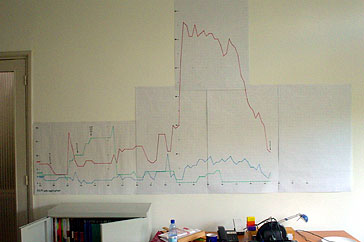
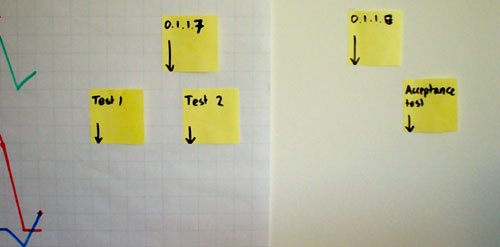

= Information radiators: from dashboard to wall
hilton
v1.0, 2005-10-07
:title: Information radiators: from dashboard to wall
:tags: [project-management]
ifdef::backend-html5[]
:in-between-width: width='85%'
:half-width: width='50%'
:half-size:
:thumbnail: width='60'
endif::[]

Many software project managers are keen on 'management dashboards' for project status information. I have never really liked the idea, but it was not until I put an 'information radiator' on the wall that I worked out why.

Alistair Cockburn introduced information radiators in http://alistair.cockburn.us/Agile+software+development+book[Agile Software Development]: "`An information radiator displays information in a place where passersby can see it. [...] Hallways qualify very nicely as good places for information radiators. Web pages don't.`" Here is my example: a time-series of the amount of work remaining that I drew over the course of a four month development phase.

In contrast, the 'dashboard' is a somewhat inappropriate metaphor that seems to be popular with managers who imagine themselves in some kind of 'driving seat' with interchangeable dumb engine parts under the bonnet. This is wrong thinking, because instead of engine parts, software development teams tend to contain intelligent people who have no problem understanding complex data, and do not need to be spoon-fed progress reports in meetings that only distract from making progress.

== Producing an information radiator

For the chart in the photo I plotted three different daily counts of open work items recorded in our http://atlassian.com/software/jira/[JIRA], an excellent work tracking tool for software development. For my current project it contains plenty of data to put on an information radiator, so several months and flip-charts later I had a very interesting information radiator, and several conclusions.

Maintenance is very little effort. Adding a short line segment to a chart each day is far faster than updating text can ever be. Moreover, JIRA makes data-gathering easy by being able to send daily e-mails that list the items in each category. The e-mail is a handy reminder, and also historical data that you need when you are not in the office to update the chart.

== Project status as talking point

One of the goals of this kind of information radiator is to prevent the nagging 'are you done yet?' questions. It does, but the wall chart encourages more discussion about progress, if anything, because it is such a talking point. This is largely because although the raw data is fairly boring, the time series reveals trends and key events. For example, when the number of open items spikes upwards people ask whether we just found a pile of bugs or if we just wrote descriptions of lots of new functionality. Similarly, when the number of items in progress drops, you wonder what else everyone is working on.

I suspect that this discussion is helpful, and that good things happen when the whole team are engaged in thinking about the status of the project.

== Designing an information radiator

I decided to chart three time-series: the number of work items remaining (red), the number in progress (blue), and the number finished but not tested (green). These work items were individual features, corresponding to user stories in Extreme Programming, or bugs. It turns out that the number of items remaining is the most interesting line; this is a variation of what Alistair Cockburn calls a http://alistair.cockburn.us/crystal/articles/evabc/earnedvalueandburncharts.htm[burn chart], which lets you see when items are being completed with a downward slope steep enough to be finished before a particular date.

In addition, certain days are labelled with a release number, which are major project milestones. Ideally, most of the work is finished before this happens.

The example in the photo starts with a spike in the second week which were new bugs after a round of testing. Two months later we created a mountain of work items representing the functionality to be completed during the next phase. Note that the top of the mountain is bumpy, because it took a couple of weeks to identify all of the individual features to implement. After that, we got a nice steady downhill, which gave us daily confidence that we could deliver on time.

Unsurprisingly, perhaps, more than one person has suggested using an electronic information radiator instead, or half-seriously suggested projecting the chart on the wall. Well, while implementing a Scalable Vector Graphics export from JIRA might be an interesting task, information radiators are much better on big sheets of paper on the wall that are easily and constantly visible.

== Version two: more interesting data

Having run out of wall space I have now started a new version of the chart for the next phase of the project. This version omits the blue and green lines for work completed or in progress; instead I split the red line into bugs and features, since they show quite different patterns. I have also added a line for non-coding work, such as functional design tasks, or bugs in the test data set. So far this is much more interesting.

Another new feature is the number of bugs added each day, which shows the difference between days where we did nothing, because we were on holiday for example, and days where we found five bugs and fixed them all. This data is interesting, because you want to see that the number of bugs found per day decreases over time during a test phase, while not remaining at zero for long enough to suggest that there is no testing.

The next new feature is to use yellow stickies for planned future milestones, such as releases, that may move around. The risk there is that it is too much fun to add more and move them all around every day; this is what happens to project managers who spend too much time with project management software and just end up playing with the Gantt charts. Stickies mostly avoid this because they are so easy to move around, and you cannot be too precise about where they go when they are off the chart.

In this example, there are thirteen working days left on the chart: the acceptance tests are planned for about two weeks after that.

== The future

The next thing to look forward to is the availability of large computer displays for the wall. In http://www.gartner.com/DisplayDocument?doc_cd=138271[The Evolving User Interface From Graphical UI to Environmental UI], Gartner predict that: 'By 2010, e-paper capabilities will be addressed, providing wall-size, low-resolution monochromatic displays, which will dip into the price range of a cubicle wall or high-end wallpaper by 2015.'

== Conclusions

Project progress information radiators might be just what you need to develop an agile approach to keeping a whole team up to date on project progress, and to move away from inefficient traditional reporting. You mileage will vary, of course, but this is a great example of the occasional power of the low-tech solution.

