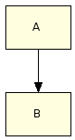
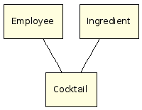
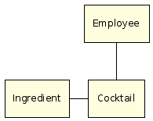
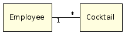
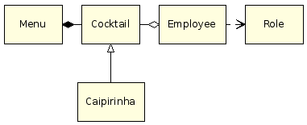
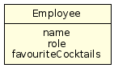

= UML class diagrams in Confluence using Graphviz and DOT
hilton
v1.0, 2007-04-27
:title: UML class diagrams in Confluence using Graphviz and DOT
:tags: [wiki,confluence]

One of the benefits of using Confluence
for our intranet wiki is the popularity of its plug-in architecture. One
plug-in that has turned out to be unexpectedly useful is the Graphviz
plug-in, which provides a quick and easy way to draw UML class diagrams
without getting sucked into endlessly tweaking the diagram. This article
shows you how.

This is actually very important for agile software development, when you
keeping to a useful minimum amount of documentation lets you put more
energy into producing working code. As I explained in an earlier article
on link:/posts/2006-12-04-wiki-wordprocessing[using a wiki for project
documentation], keeping design documentation in a collaborative on-line
environment like a wiki makes it far more useful than it would be on
paper, which is why print-oriented tools are not appropriate. The same
applies to the diagrams; vector drawing programs are overkill for design
diagrams, where the ease of making changes and publishing the results is
more important than fine control over high-resolution output.

== The Flowchart Macro

Atlassian http://www.atlassian.com/software/confluence/[Confluence]
comes with a
http://confluence.atlassian.com/display/CONF20/Flowchart+Macro[Flowchart
Macro], which uses http://graphviz.org/[Graphviz] to generate diagrams
from a code representation in the DOT language. The
http://graphviz.org/doc/info/lang.html[DOT reference] is sparse and
lacks examples, so you are better off with the other
http://www.graphviz.org/Documentation.php[Graphviz documentation], which
includes a DOT tutorial in PDF format, and a new
http://www.graphviz.org/doc/schema/attributes.xml[Node, Edge and Graph
Attributes] schema reference.

Here is a simple example to start with.

....
{flowchart}
A -> B
{flowchart}
....

Technically this a directed graph, with nodes A and B, and on directed
edge. The simplicity of the DOT language, if you are a programmer at
least, means that drawing diagrams with DOT has the same feel as
composing rich text documents using wiki syntax. Crucially, Graphviz
does the graph layout automatically, which leaves you free to focus on
the content.

This syntax defines a single edge from A to B. The two nodes do not have
to be declared previously.

== Basic UML

UML diagrams need different arrows to the flowchart macro's defaults.
First, we simply remove the arrows.

....
{flowchart}
edge [arrowhead="none"];
Employee -> Cocktail
Ingredient -> Cocktail
{flowchart}
....

This syntax uses the _edge_ keyword to set default attributes for all
edges, where _arrowhead_ is one of the many
http://graphviz.org/doc/info/attrs.html[Graph Attributes].

This may already be everything that you need to know how to draw;
although you can add far more detail about classes and relationships to
a UML class diagram, you get most of the value just by putting class
names in boxes and indicating which classes have some relationship.
After all, the details of attribute types and cardinalities are
perfectly well represented by the code itself.

By default, the DOT layout algorithm arranges nodes from top to bottom,
with edges directed downwards, avoiding crossing edges. Sometimes you
can improve the layout by specifying which nodes should be arranged
horizontally.

....
{flowchart}
edge [arrowhead="none"];
Employee -> Cocktail
subgraph {
  rank=same;
  Ingredient -> Cocktail
}
{flowchart}
....

== Multiplicity

Use arrow labels to indicate multiplicity:

....
{flowchart}
edge [arrowhead="none", fontname=Verdana, fontsize=8];
subgraph {
  rank=same;
  Employee -> Cocktail  [taillabel="1", headlabel="*"]
}

{flowchart}
....

== Relationship types

Use arrow types to indicate relationship types - composition (menu made
up of cocktails), aggregation (employee drinks various cocktails),
dependency (employees are defined by role) and generalisation
(http://en.wikipedia.org/wiki/Caipirinha[Caipirinha] is a kind of
cocktail):

....
{flowchart}
edge [arrowhead="none", fontname=Verdana, fontsize=8];
subgraph {
  rank=same;
  Menu -> Cocktail [arrowtail="diamond"]
  Cocktail -> Employee [arrowhead="odiamond"]
  Employee -> Role [arrowhead="vee", style="dashed"]
}
Cocktail -> Caipirinha [arrowtail="o"]
{flowchart}
....

This example uses more of the Graphviz
http://graphviz.org/doc/info/arrows.html[Arrow Shapes], for the head or
tail of each edge. Also, the dotted dependency line uses the edge's
_style_ attribute.

== Class attributes

Use 'record' shape types to make complex nodes:

....
{flowchart}
  node [shape=record];
  Employee [label="{Employee|name\nrole\nfavouriteCocktails}"]
{flowchart}
....

This is not a complete tutorial, since UML syntax is like an onion
(there is always another layer). However, this should be enough to get
you started.
