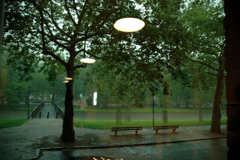
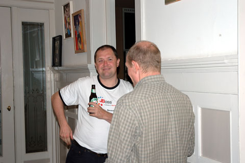
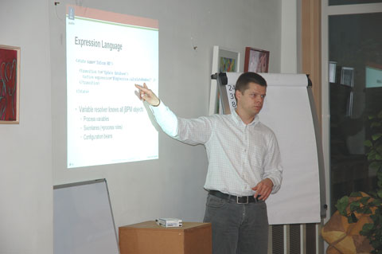
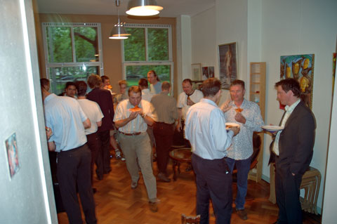
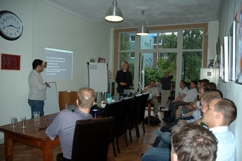

= Benelux JBoss User Group, 8 June 2007 - first photos 
evelienket
v1.0, 2007-06-15
:title: Benelux JBoss User Group, 8 June 2007 - first photos
:tags: [java,jbug,jboss]

On 8 June, we hosted https://blog.lunatech.com/posts/2007-05-24-jboss-benelux-user-group-8-june-2007[our first JBoss User Group
meeting] for this part
of the world. The event was extremely sociable, and there were two great
presentations, so we all met lots of people, had some fun and learned
about some JBoss-related technology. Here are some photos from the
event.

image:../media/2007-06-15-benelux-jboss-user-group-8-june-2007-first-photos/jbug-2007-06-photos-01.jpg[Drinks outside with the first few
arrivals]

Drinks outside with the first few arrivals.

image:../media/2007-06-15-benelux-jboss-user-group-8-june-2007-first-photos/jbug-2007-06-photos-02.jpg[Lunatech staff: Alex Kellett (left)
with the current interns - Sietse de Kaper, Jaco Adriaansen and Daan
Hoogenboezem (left to right)]

Lunatech staff: Alexander Kellett (left) with the current interns -
Sietse de Kaper, Jaco Adriaansen and Daan Hoogenboezem (left to right).

image:../media/2007-06-15-benelux-jboss-user-group-8-june-2007-first-photos/jbug-2007-06-photos-03.jpg[JBoss entertained: Alexandro, Koen and
Carlo from JBoss (left to right) enjoy a presentation, along with Bart
Schuller from Lunatech (right)]

JBoss entertained: Alexandro, Coen and Carlo from JBoss (left to right)
enjoy a presentation, along with Bart Schuller from Lunatech (right).

image:../media/2007-06-15-benelux-jboss-user-group-8-june-2007-first-photos/jbug-2007-06-photos-04.jpg[Tom Baeyens from JBoss (left) talks
about jPDL]

Tom Baeyens from JBoss (left) talks about
http://www28.cplan.com/cc158/session_details.jsp?isid=285612&ilocation_id=158-1&ilanguage=english[Java
Process Description Language].

image:../media/2007-06-15-benelux-jboss-user-group-8-june-2007-first-photos/jbug-2007-06-photos-05.jpg[Lunatech's meeting room is fine for a
small group; we may need somewhere bigger next time]

Lunatech's meeting room is fine for a small group; we may need somewhere
bigger next time.

Heavy rain during the presentations.

Koen and Bernard from JBoss Belgium.

Tom being expressive.

image:../media/2007-06-15-benelux-jboss-user-group-8-june-2007-first-photos/jbug-2007-06-photos-09.jpg[Gerald de Jong gets serious with Peter
Kaas, Lunatech's Technical Director, and some pizza]

Gerald de Jong gets serious with Peter Kaas, Lunatech's Technical
Director.

Meanwhile, everyone eats pizza.

image:../media/2007-06-15-benelux-jboss-user-group-8-june-2007-first-photos/jbug-2007-06-photos-11.jpg[Peter Hilton, Lunatech Research, talks
to Remko de Vrijer, Initworks]

Peter Hilton, Lunatech Research, talks to Remko de Vrijer, Initworks.
(The wifi key on the flip chart has been blurred in this photo.)

image:../media/2007-06-15-benelux-jboss-user-group-8-june-2007-first-photos/jbug-2007-06-photos-12.jpg[Michael Pentowski, director of Lunatech
Research, talks to Alexandro and Carlo de Wolf from JBoss]

Michael Pentowski, director of Lunatech Research, talks to Alexandro and
Carlo de Wolf from JBoss.

image:../media/2007-06-15-benelux-jboss-user-group-8-june-2007-first-photos/jbug-2007-06-photos-13.jpg[Sietse Kaper and Peter Kaas, from
Lunatech]

Sietse Kaper and Peter Kaas, from Lunatech.

image:../media/2007-06-15-benelux-jboss-user-group-8-june-2007-first-photos/jbug-2007-06-photos-14.jpg[Jaco Adriaansen and Alexander Kellett,
with Daniel Palomo van Es (left to right)]

Jaco Adriaansen and Alexander Kellett, with Daniel Palomo van Es (left
to right).

image:../media/2007-06-15-benelux-jboss-user-group-8-june-2007-first-photos/jbug-2007-06-photos-15.jpg[Peter Kaas talks about Lunatech's
experiences with EJB and JBoss]

Peter Kaas talks about Lunatech's experiences with EJB and JBoss.

Alexandro, JBoss, joins the discussion.

