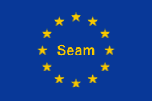

= The European Union - a metaphor for JBoss Seam
hilton
v1.0, 2007-12-11
:title: The European Union - a metaphor for JBoss Seam
:tags: [java,jboss,seam]

http://www.jboss.com/products/seam[JBoss Seam] is a
Java EE application framework whose many roles can make it hard to
introduce and explain. It turns out that the European Union (EU) is a
good metaphor for Seam, and not just for the humour-value.

== A unified model

The EU is a political framework that allows for some integration between
member states and provides a standard interface for interaction between
them. This is also what Seam does for Java EE APIs. On the other hand,
Seam does not have its own flag.

== Members

See if you can find a tenuous connection (middle) between each
technology that JBoss Seam integrates (left) and an EU member state
(right).

[width="100%",cols="34%,33%,33%",]
|===
a|
EJB

JAAS

Ajax

jBPM

JBoss Rules

Facelets

a|
inefficient - bureaucratic

extra security everywhere

a football team

led by Tom Baeyens

for people who like rules

where looks really matter

a|
France

UK

Netherlands

Belgium

Germany

Italy

|===

== Improvements

Perhaps the area where the metaphor breaks down is in the area of
improvements. Not everyone in the EU agrees that EU law improves on the
member states' own way of doing things. This differs from Seam, for
example, because Seam has indisputably taken JSF and provided
alternatives for its worst shortcomings, such as how annotations in Seam
components replace so much XML. The EU, on the other hand, is rarely
credited with increasing agility or efficiency. Or escape from XML Hell.

