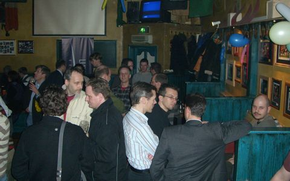
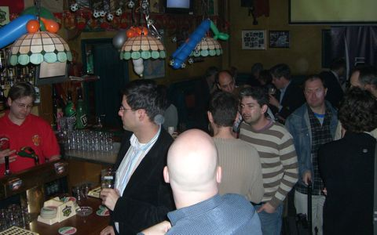
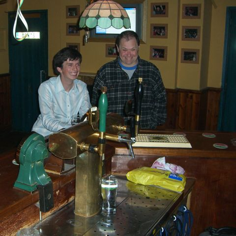
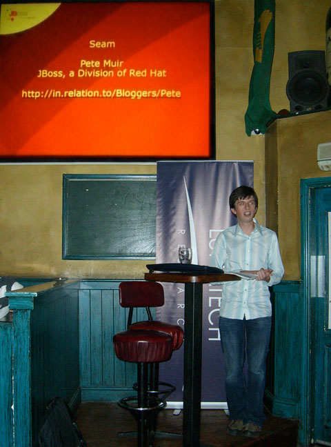
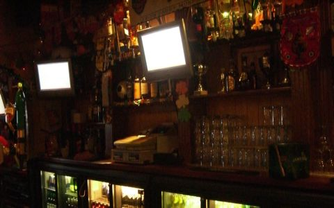
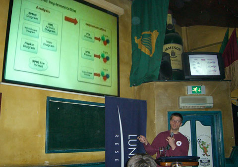
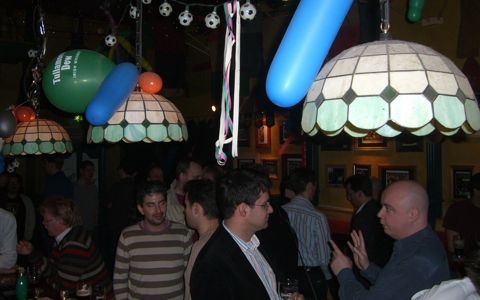

= Benelux JBoss User Group, 29 February - photos
hilton
v1.0, 2008-03-03
:title: Benelux JBoss User Group, 29 February - photos
:tags: [java,jboss,jbug,event]

Here are some photos from Friday's https://blog.lunatech.com/2008-01-17-jbug-2008-02[Benelux JBoss User
Group] event at http://www.paddymurphys.nl/[Paddy Murphy's Irish
Pub] in Rotterdam. The event was a great
success with around 60 attendees making this a relatively large JBoss
User Group.

Everyone turned up in time to meet a few people and have a pint before
the presentations started.

Pete Muir and Koen Aers from JBoss were very happy to arrive at the bar,
before Pete's presentation.

Pete Muir gave a presentation about http://seamframework.org/[Seam].

Extra television screens in the sports bar made sure everyone could see
the slides.

image:../media/2008-03-03-jbug-2008-02-photos/jbug-2008-02-photos-7.jpg[The audience watching the presentation]

Tom Baeyens did a presentation about
http://www.jboss.com/products/jbpm[jBPM]

… and everyone had a good time.

