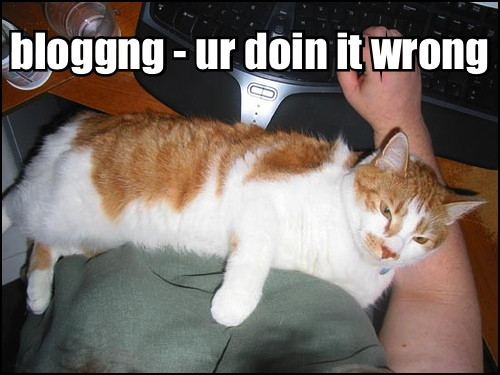
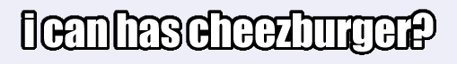
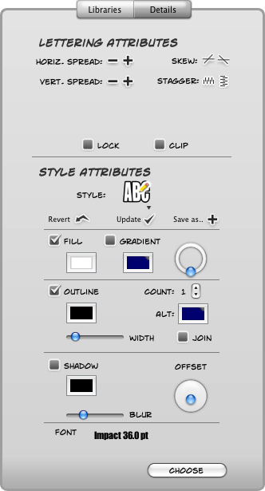
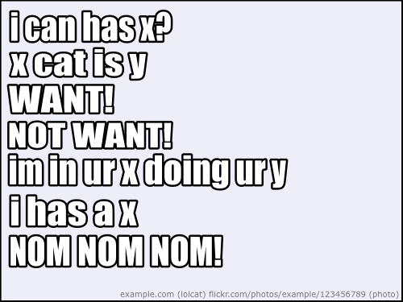
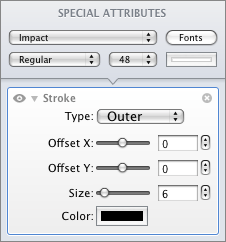

= How to draw lolcats
hilton
v1.0, 2008-05-27
:title: How to draw lolcats
:tags: [fun]

In his
excellent book http://www.jnd.org/books.html#434[The Invisible
Computer], Donald Norman explains the
computer changing from something you might have one of at home (a
multi-purpose PC) to an unseen component in special-purpose devices from
washing machines and refrigerators to portable telephones and music
players. The same thing is happening with graphics software, and this
article considers one specific example. Along the way, I also explain
how to produce http://en.wikipedia.org/wiki/Cat_macro[cat macros].

There used to only be one kind of graphics software, which I will call
'Photoshop'. In principle, this is general-purpose software for anything
that you might want to do with graphics (by which I mean 2D bitmap
images, for the purposes of this article). However, this software has
inevitably become more complex and costly over the years, to the point
where http://www.adobe.com/products/photoshop/[Photoshop CS3], for
example, is only really suitable for design professionals who can
justify the time and expense, or similarly dedicated amateurs.

Cat macros (or http://www.lolcats.com/[lolcats]), as popularised by
http://en.wikipedia.org/wiki/I_Can_Has_Cheezburger%3F[I Can Has
Cheezburger?], are fairly simple to produce, but there are still
http://community.livejournal.com/cat_macros/profile[rules] that make it
harder:

. the photo's subject must be a cat, preferably a cute kitten
. the caption is white text in the Impact font
. the caption has a 3-pixel anti-aliased black outline.

There are also rules about spelling, and which clichés and
http://en.wikipedia.org/wiki/Snowclone[snowclones] make the lolcat
funnier, but they are outside the scope of this article.

== Photoshop

Photoshop has a layer style that does exactly what we want to a text
layer. This is the brute force approach: add every possible feature
until it is possible to do anything. The clever thing about Photoshop,
of course, is that it remains usable rather than drowning under the
weight of feature bloat.

The procedure in Photoshop is as follows.

. Open the cat photo.
. Select the text tool, click to place the insertion point and type a
caption.
. Set the text font to Impact and size to 36 pt or 48 pt, say.
. Select the text layer, then _Layer > Layer style... > Stroke_ and
choose these settings:

image:../media/2008-05-27-how-draw-lolcats/slolcat-photoshop.png[Photoshop Layer Style]

[start=5]
. Position the caption.
. Select _File > Save for web and devices..._ and save the cat macro as
a JPEG.

This gives the expected result.

Drawing lolcats in Photoshop is pretty easy, but starting up Photoshop
takes half the time, and it is too expensive to use for drawing lolcats.

Exercise for the reader: create a Photoshop macro that adds a default
caption in the correct style - a kind of cat macro macro.

== Comic Life

http://plasq.com/comiclife/[Comic Life] is a specialist graphics
application, designed for producing comics. Comic Life has one killer
feature that is useful for drawing lolcats: funky lettering styles.

First, create a lolcat lettering style:

. Create a new document.
. Drag 'LETTERING' onto the page, and in the dialogue box click the
_Place Lettering_ button.
. With the lettering selected, select the _Details_ pane on the
right-hand inspector, and choose the following settings, and then select
_Save as_ in the _Style Attributes_ section in the middle of the
inspector and save a new _lolcat_ style.

Now draw the lolcat:

. create a new comic
. select _Page Format_ and set the size in points to the photo
dimensions in pixels
. drag the _ONE_ panel from the _Built-in: Basic_ library on to the
page, to fill the page
. drag the photo into the panel, which it resizes to fill
. drag 'Lettering' onto the frame, and in the dialogue box enter your
caption
. select the 'lolcat' style you created earlier, and resize the text
frame to put the letter proportions back to normal
. select _Export to Image(s)_ and save a JPEG.

The most useful feature in Comic Life here, apart from the lettering
style, is that you can put a frame on the page if you want a border
around each image, such that you can just drag and drop photos into the
frame (shown here with a light blue background and black border), and
the photo is automatically cropped scaled to fill the frame. For this to
work well, the frame has to have the correct proportions, which is why
you need to set the page size first.

However, the text frame does not seem to fill the page well enough for a
pixel-perfect export.

An even bigger annoyance is that the text frame size stays the same when
you edit the text or change the style, which means that you have to
manually stretch the text horizontally. For example, if you remove half
of a caption, the remaining letters become twice as wide. This also
happens when you place new text, because the default style uses a wider
font than Impact, so selecting the previously saved 'lolcat' lettering
style results in expanded Impact characters. (This has been
http://plasq.com/component/option,com_joomlaboard/Itemid,0/func,view/id,5588/view,flat/catid,8/[mentioned]
on the Comic Life forum.)

== Drawit Lite

http://www.getdrawit.com/[Drawit Lite] is a vector drawing application
that has the key advantages of being extremely simple to use, and
handling bitmap images well. Drawing lolcats in Drawit Lite is extremely
simple:

. open the photo in Drawit Lite, which sets the canvas size
. insert a text layer, and enter the caption
. set the text attributes and add a _Stroke_ effect as follows:

[start=4]
. export as a JPEG.

The only thing that would make this faster would be the ability to save
the text style, so Drawit Lite is the best option so far.

Note that one cool feature about using Drawit for this kind of thing is
that if you zoom in, it behaves like a bitmap tool and shows you bigger
pixels, which makes it a kind of export preview.

== Microsoft Office

This post on http://icanhascheezburger.com[icanhascheezburger.com]
suggests the possibility of built-in Office functionality:

image:../media/2008-05-27-how-draw-lolcats/lolcat-office-assistant.jpg[Office Assistant]

However, plausible though the parody is, even Microsoft Word does not
have so much feature bloat that it includes lolcat support. Perhaps it
would be different if Microsoft ever managed to develop a decent
graphics application. (Does anyone actually use Expression?)

== PHP-based web application

The simplest cat macro tool turns out to be a web application, which
makes sense when you consider how little user-interaction is really
required. For example, with the Big Huge Labs
http://bighugelabs.com/flickr/lolcat.php[Lolcat Generator], you simply
choose a photo, text for the top or bottom, and left, centre or right
alignment. The results are good and, crucially, follow the rules.

The http://wigflip.com/roflbot/[roflbot] is a more sophisticated version
of the same thing, that lets you position the text by dragging with the
mouse. Sadly, the built in pictures are not all cats.

This is the best kind of web application; done well, the software is
almost invisible, like the computer in Donald Norman's washing machine.

== Special-purpose graphics applications

Photoshop may still be the ultimate general-purpose bitmap image editing
tool, but despite the likes of Photoshop Elements and the GIMP, there
are enough niche applications and plenty of room for special-purpose
graphics applications, even as web applications.

