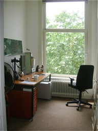
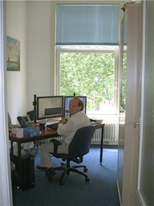
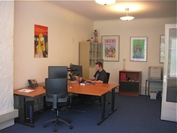
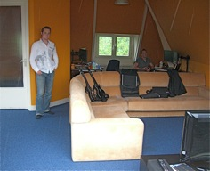

= The programmer’s private office
hilton
v1.0, 2008-07-22
:title: The programmer’s private office
:tags: [working-environment]

In http://blog.stackoverflow.com/index.php/2008/05/podcast-7/[StackOverflow Podcast
#] 7, http://www.joelonsoftware.com/[Joel
Spoelsky] points out that 'I have yet to
find another company except for Microsoft and Apple, I think, that has
private offices for developers'. Personally, I agree with Joel that that
it is valuable for a developer to have a private office, but then I
would say that because I have one:

My private office gives me three things that I love: control over my
environment, less noise and distraction, and a crucial noise-reduction
flow-enhancement device: a door.

Although we do not all have private offices at Lunatech, I am not the
only senior developer who does. Willem-Jan has the desk in the middle,
angled for the optimum view of the canal (we _are_ in the Netherlands):

Martin sits as far away from the door as possible, and enjoys a garden
view. More importantly for the rest of us, his carefully cultivated
collection of junk does not infect where the rest of us work:

image:../media/2008-07-22-programmer’s-private-office/office-martin.jpg[office-martin.jpg]

Sietse, one of the more junior developers, has to share his office with
Daan, although they also have huge desks, that would not fit in one of
the small rooms. However, Sietse (pictured) gets the place to himself
most of the time because Daan (not pictured) works on-site four days per
week:

The same goes for the Erik and Floris, the
http://www.wipido.com/[Wipido] developers upstairs, who share an office.
However, having a larger room does mean they have room for a sofa, an
enormous wide-screen television and Guitar Hero (which
http://www.codinghorror.com/[Jeff Attwood] might just approve of):

Of course, even given the choice, not everyone wants a private office.
Some developers, like Bart, actually prefer the continuous interaction
with colleagues you get from having other people in the room, or at
least do not mind the noise. Still others, like Nicolas, seem to be able
to work anywhere as long as they have a laptop to work on and headphones
to replace noise with music.

