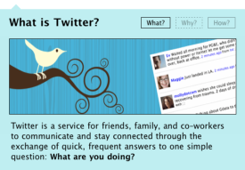
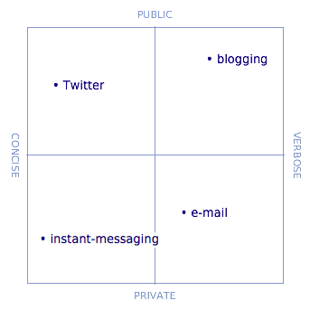

= How to explain Twitter
hilton
v1.0, 2008-08-14
:title: How to explain Twitter
:tags: [opinion,fun]

After ignoring
http://twitter.com/[Twitter] at first, my curiosity about a new
communication channel led me to start using it this year. The easy thing
about Twitter is working out how to use it. The hard thing about Twitter
is to explain to other people what is going on and why. This article has
a few suggestions.

A long-term technology trend, characteristically accelerated by the
Internet, is the introduction of new ways to communicate that supplement
existing channels rather than replacing them. Although many ultimately
disappear, many have made it through the whole
http://www.straight-edge-life.com/SXE/640[Ghandi-cycle] (obscurity,
ridicule, conflict, then success). Along the way, many technologies have
provoked the most bizarre discussions about their _raison d'être_, as if
any technology were ever self-justifying.

When you start using a technology that is still being ignored, people do
not respond when you tell them that you are using it. Twitter is now in
the ridicule phase, which I noticed as soon as I started telling people
that I had opened a Twitter account: reactions are frequently both
strong and dismissive.

[[Theostensiblereason]]
== The ostensible reason

*Twitter is a way to quickly and frequently communicate what you are
doing*, according to Twitter's own web site.

You even get a cute avian metaphor; Twitter posts are called 'tweets'.

Writing a public incremental daily diary is clearly behaviour that would
require some justification, so Twitter has a
http://twitter.com/help/why[help page that explains why] you might do
this. You may or may not buy this. You may or may not be prepared to
admit to friends and colleagues that you think this is reasonable
behaviour.

[[Theanalyticalexplanation]]
== The analytical explanation

The analytical approach to explaining Twitter considers how it relates
to established Internet-based communication channels.

*Twitter is like IM but public, and like blogging but less verbose.*
This is mostly saying what Twitter is not, of course, but at least it
suggests a short answer.

[[Theshortanswer]]
== The short answer

*Twitter is blogging, but with very short posts.* Micro-blogging, if you
like. A Twitter post has to be at least as concise as this paragraph.

When I compare Twitter to blogging, I sometimes see in people's eyes
that they think that blogging is 'stupid' as well. Meanwhile, in the
face of its clear mainstream success, they have either given up fighting
it or are just keeping quiet because they know that they have lost.

There is a clear emotional and ideological gulf between people who write
by choice or even for pleasure, and those for whom writing will only
ever be 'work'. I blame schools. No wonder people who love or hate
writing wind each other up, a situation hardly helped by contributions
like Steve Yegge's judgement that
http://steve.yegge.googlepages.com/you-should-write-blogs[You Should
Write Blogs], and other such evangelism.

[[Theconstructivisthypothesis]]
== The constructivist hypothesis

*Twitter is not _for_ anything, it is up to you how you use it.* Perhaps
Twitter needs no more explanation or justification than web pages or
printers do. These are all ways to publish information that each turn
out to be useful in more than one way.

However, this hypothesis leads us to expect that Twitter will be copied
or independently re-invented as the same thing with a different
explanation as use. As far as I know, that has not happened yet.

[[Thepersonalview]]
== The personal view

Fortunately, Twitter is all about _me_, in common with the way that I
experience other social networking software, so I get to decide how to
use Twitter. Your mileage may vary.

. Post about what you do, what you learn and new ideas you have.
. Conversations belong in instant messaging at chat rooms, not on
Twitter.
. Write for your audience; ignore 'followers' you have never met.
. Only follow people you know, because 140 characters leaves no room for
the context you need to understand someone's perspective.

*Use Twitter to explain yourself, every day.*

