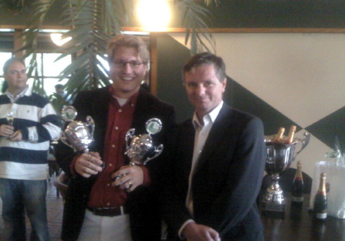

= Lunatech Golf Invitational 2008
Michael Pentowski
v1.0, 2008-10-02
:title: Lunatech Golf Invitational 2008
:tags: [ventures]

On September 26th, 2008, the http://www.lunatech-ventures.com/event/register/lunatech_invitational_2008[Lunatech Golf
Invitational]
was held at the http://www.rottebergen.nl/[Golfbaan Rottebergen].
After a few minute last minute cancellations, due to obligations on the
European and American tours, 21 players set off to win the coveted
event. There were two major prizes which the players were competing for:
stableford scoring and stroke play.

After drinking some coffee, confusion, late arrivals, and last minute
shuffling of flights, the event kicked off at 12:01 under beautiful
skies.

The first flight were on top of the leader board, albeit short-lived.
Paul had the closest to the pin sewn up (or so he thought), Ferdinand
had both the stableford and the stroke play in hand (until he made a
miscalculation, see below), and Michael was seen muttering to himself on
every shot. While there was strong competition for the trophies in all
the flights, there was also ferocious competition for the sympathy
prize. The locals who go fishing for lost balls will have a bountiful
harvest this year.

Before dinner, the awards were handed out during the drinks reception:

* Barlies won the longest drive for the ladies
* Martijn won the longest drive for the men
* Pascal won the closest to the pin
* Rogier Van den Heuvel won the stableford AND strokeplay (see note)

link:../media/2008-10-02-lunatech-golf-invitational-2008/golf-2008.jpg[]

As said earlier, Ferdinand was playing well and on hole 10 he gave up
after having a bad hole but only being 10 meters from the hole. Had he
gotten down in less than 4 from there he would have won the stroke play.
In good spirit, Rogier gave him the stroke play trophy, the sign of a
true champion!

After the awards ceremony we enjoyed a dinner together, accompanied by
some wine, excellent company, and golf stories. Most importantly we
enjoyed a lovely day while others were forced to work. We are looking
forward to seeing you all at next years event, we will try to improve on
all aspects of the Lunatech Invitational.
