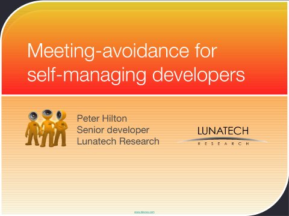

= Meeting-avoidance for self-managing developers - Devoxx 2008
hilton
v1.0, 2008-12-05
:title: Meeting-avoidance for self-managing developers - Devoxx 2008
:tags: [project-management]

This week, Peter Hilton will be
presenting http://www.devoxx.com/display/JV08/Meeting-avoidance+for+self-managing+developers[Meeting-avoidance for self-managing
developers]
at Devoxx in Antwerp. With 3200 attendees, Devoxx is the world's biggest
vendor-independent Java conference, and a key event for European Java
developers.

link:../media/2008-12-05-meeting-avoidance-self-managing-developers-devoxx-2008/meeting-avoidance.pdf[Slides] (PDF, 1.6 MB)

link:../media/2008-12-05-meeting-avoidance-self-managing-developers-devoxx-2008/meeting-avoidance.pdf[]

