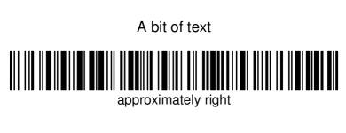
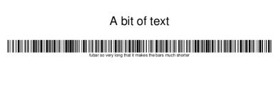
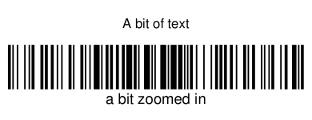
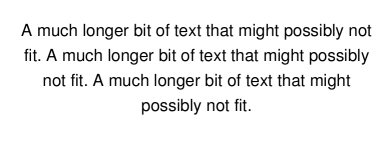
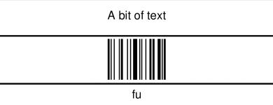
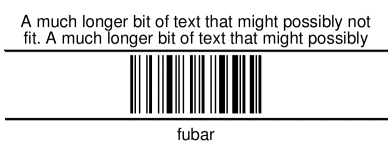
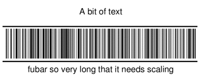

= Generating scalable barcodes with iText and Seam
UnFromage
v1.0, 2009-11-23
:title: Generating scalable barcodes with iText and Seam
:tags: [java,pdf,itext,seam,jsf]

This article explains how to use Seam's JSF
mapping for iText to generate a sheet of product barcodes with scalable
barcodes.

== The problem

We want to generate a PDF with 11 rows by 3 columns of product labels.
Those labels consist of:

. A product name
. A barcode containing the product reference
. The product reference in human-readable form

Seam has a JSF mapping for the excellent iText PDF library that supports
generating PDFs, making the table that will host our labels, and of
course making barcodes. Once we set up the page margins and containing
table, a naïve approach to the problem will have us generate the
following table cell for one label (with all margins and alignment
removed for clarity and borders added for visibility):

[source,xml]
----
<p:cell borderWidth="1" fixedHeight="73.7"> 
 <p:paragraph>A bit of text</p:paragraph> 
 <p:barCode type="CODE128" code="approximately right"/> 
</p:cell>
----

[.image-wrap]##

Aside from my bad cropping to extract the image from the example sheet,
this seems about right.

=== What if the product reference is longer?

Now suppose (as in our case) that the sheet is generated from values
that can vary in length. Let's try our solution with a longer product
reference:

[source,xml]
----
<p:cell borderWidth="1" fixedHeight="73.7"> 
 <p:paragraph>A bit of text</p:paragraph> 
 <p:barCode type="CODE128" code="fubar so very long that it makes the bars much shorter"/> 
</p:cell> 
----

[.image-wrap]##

You notice right away that the barcode is longer and the bars are
shorter. The reason why this is so is that in both cases iText made a
barcode with bars that are 30 points in height, but since the barcode's
width is proportional to the length of the product reference (which is
encoded in the barcode) the barcode doesn't fit in the cell anymore, so
it is scaled down. What you might not notice right away is that the
human-readable text is also scaled down. And what only the person
scanning the barcode will notice is that such thin barcodes are hard to
scan because the laser needs to be aligned much more precisely.

This is not good.

=== What if the product reference is shorter then?

Let's try our solution with a shorter product reference:

[source,xml]
----
<p:cell borderWidth="1" fixedHeight="73.7"> 
 <p:paragraph>A bit of text</p:paragraph> 
 <p:barCode type="CODE128" code="fu"/> 
</p:cell> 
----

[.image-wrap]##

Obviously this doesn't work. But why? The answer is simple once you know
how it works in iText: it's simply the opposite effect of scaling. When
the product reference is shorter, the barcode is narrower, and the cell
scales it up so that its width will fit the cell's width, but that
causes the barcode's height to overflow the cell's height and it simply
disappears.

To illustrate this, look at this example with a product code just long
enough for the barcode to fit, while still being zoomed in:

[source,xml]
----
<p:cell borderWidth="1" fixedHeight="73.7"> 
 <p:paragraph>A bit of text</p:paragraph> 
 <p:barCode type="CODE128" code="a bit zoomed in"/> 
</p:cell> 
----

[.image-wrap]##

This is not good, since the barcode can disappear from screen depending
on its width.

=== Can't we adjust the barcode's width and height then?

Not directly. In iText you can specify the barcode's height, but since
there is scaling that depends on the width it is useless. What you can
do is set the barcode's height and disable scaling, in which case
smaller barcodes will not take then entire cell's width but have the
same height as those that are larger and do take the entire width.

Of course disabling scaling is not possible in Seam's barcode JSF
mapping, so we have to tweak it. Also this approach breaks down when the
product reference is too wide to be contained in the cell, which will
make the barcode overflow left and right, so still not enough.

=== Do we have any other problems then?

Yes we do. Let's try with a longer product name:

[source,xml]
----
<p:cell borderWidth="1" fixedHeight="73.7"> 
 <p:paragraph>A much long bit of text that might possibly not fit. A much long bit of text  
  that might possibly not fit. A much long bit of text that might possibly not fit. </p:paragraph> 
 <p:barCode type="CODE128" code="fu"/> 
</p:cell> 
----

[.image-wrap]##

What you see here is that if the product name is too long it pushes the
barcode outside of the cell which makes it disappear.

Also not good.

== The solution

Now that we have identified all the shortcomings let's list the features
we're missing:

. barcodes should have a fixed height
. short barcodes should not be scaled up
. barcodes that would not fit should be scaled down but only in width
. human-readable product codes should not be scaled
. product names that are too long should be clipped and not take the
barcode's place

The solution is comprised of the following actions:

. split the cell in three so that each part overflows independently of
the other
. make sure the barcode is not scaled unless it needs to, and then only
length-wise
. dissociate the human-readable product code from the barcode to avoid
scaling it with the barcode

For this we need to extend Seam's barcode JSF mapping.

=== The new JSF barcode component

Here is the code necessary to extend Seam's JSF barcode component:

[source,java]
----
package com.lunatech.jsf; 

// …

import org.jboss.seam.pdf.ITextUtils;
import org.jboss.seam.pdf.ui.UIDocument;
import org.jboss.seam.ui.graphicImage.GraphicImageStore.ImageWrapper;
import org.jboss.seam.ui.graphicImage.Image.Type;

import com.lowagie.text.*;
import com.lowagie.text.pdf.*;

public class UIBarCode extends org.jboss.seam.pdf.ui.UIBarCode {

 protected Object itextObject;
 protected Float maxWidth;
 protected Boolean noText;

 public void setMaxWidth(Float max) {
  this.maxWidth = max;
 }

 public void setNoText(Boolean noText) {
  this.noText = noText;
 }

 public Boolean getNoText() {
  return (Boolean) valueBinding("noText", noText);
 }

 @Override
 public void restoreState(FacesContext context, Object state) {
  Object[] values = (Object[]) state;
  super.restoreState(context, values[0]);

  maxWidth = (Float) values[1];
  noText = (Boolean) values[2];
 }

 @Override
 public Object saveState(FacesContext context) {
  Object[] values = new Object[3];

  values[0] = super.saveState(context);
  values[1] = maxWidth;
  values[2] = noText;

  return values;
 }

 /** creates the iText representation of this JSF component */
 @Override
 public void createITextObject(FacesContext context) throws IOException {
  Barcode barcode = createBarcodeType(getType());

  // Set other properties like superclass [copy the code here]

  Boolean noText = getNoText();
  if (noText != null && noText.booleanValue()) {
   barcode.setFont(null);
  }

  // Create Image in itextObject like parent class [copy the code here]

  Image image = (Image) itextObject;

  Float maxWidth = (Float) valueBinding("maxWidth", this.maxWidth);

  if (maxWidth != null && image.getWidth() > maxWidth) {
   // only scale the width
   image.scaleAbsoluteWidth(maxWidth);
  }
  // putting the image in these structures makes the cell not scale this image
  itextObject = new Phrase(new Chunk(image, 0, 0));
 }

 protected Integer lookupCodeType(String codeType) {
  // Copy from parent class. Thanks private
 }

 protected Barcode createBarcodeType(String barcodeType) {
  // Copy from parent class. Thanks private
 }

 // Override since parent's itextObject is private. Thanks again private
 @Override
 public void removeITextObject() {
  itextObject = null;
 }

 // Override since parent's itextObject is private. Thanks again private
 @Override
 public Object getITextObject() {
  return itextObject;
 }
}
----

Once you have that, you need a taglib.xml file to declare your tag and
namespace:

[source,xml]
----
<facelet-taglib> 
 <namespace>http://com.lunatech/pdf</namespace> 
 <tag> 
  <tag-name>barCode</tag-name> 
  <component> 
   <component-type>com.lunatech.jsf.UIBarCode</component-type> 
  </component> 
 </tag> 
</facelet-taglib> 
----

And a faces-config.xml for… well what the hell is that for really? It
looks pretty lame:

[source,xml]
----
<faces-config> 
 <component> 
  <component-type>com.lunatech.jsf.UIBarCode</component-type> 
  <component-class>com.lunatech.jsf.UIBarCode</component-class> 
 </component> 
</faces-config> 
----

Now you just need to define your prefix to use the new JSF component in
your views:

[source,xml]
----
xmlns:l="http://com.lunatech/pdf" 
----

=== Testing our solution on short product codes

This time setting the barcode's height is meaningful since scaling won't
affect it.

[source,xml]
----
<p:cell borderWidth="1" fixedHeight="25"> 
 <p:paragraph>A bit of text</p:paragraph> 
</p:cell> 
<p:cell borderWidth="1" fixedHeight="32.7"> 
 <l:barCode maxWidth="177.54" barHeight="28" noText="true" type="CODE128" code="fu"/> 
</p:cell> 
<p:cell borderWidth="1" fixedHeight="16"> 
 <p:paragraph>fu</p:paragraph> 
</p:cell> 
----

[.image-wrap]##

It works as expected: the barcode is as high as possible while not being
scaled length-wise.

=== Testing our solution with longer product names

Let's confirm that longer product names do not impact our barcode:

[source,xml]
----
<p:cell borderWidth="1" fixedHeight="25"> 
 <p:paragraph>A much long bit of text that might possibly not fit.  
  A much long bit of text that might possibly not fit. A much long bit of text that  
  might possibly not fit.</p:paragraph> 
</p:cell> 
<p:cell borderWidth="1" fixedHeight="32.7"> 
 <l:barCode maxWidth="177.54" barHeight="28" noText="true" type="CODE128" code="fubar"/> 
</p:cell> 
<p:cell borderWidth="1" fixedHeight="16"> 
 <p:paragraph>fubar</p:paragraph> 
</p:cell> 
----

[.image-wrap]##

So far so good.

=== Testing our solution with longer product codes

Now let's see what happens when the product code is super long:

[source,xml]
----
<p:cell borderWidth="1" fixedHeight="25"> 
 <p:paragraph>A bit of text</p:paragraph> 
</p:cell> 
<p:cell borderWidth="1" fixedHeight="32.7"> 
 <l:barCode maxWidth="177.54" barHeight="28" noText="true"  
            type="CODE128" code="fubar so very long that it needs scaling"/> 
</p:cell> 
<p:cell borderWidth="1" fixedHeight="16"> 
 <p:paragraph>fubar so very long that it needs scaling</p:paragraph> 
</p:cell> 
----

[.image-wrap]##

This time the barcode is scaled length-wise to fit the cell's width and
not overflow left and right. Notice that the barcode height is constant
while the human-readable product code is not scaled.

== The full JSF view for the curious

Since we have removed all margins for clarity, let's see what the final
label page looks like:

[source,xml]
----
<p:document xmlns:p="http://jboss.com/products/seam/pdf" 
  xmlns:l="http://com.lunatech/pdf" 
  pageSize="A4" disposition="attachment" margins="14.17 14.17 14.17 14.17" 
  fileName="#{productCode}.pdf" 
> 
 <p:font size="8"> 
  <p:table columns="3" headerRows="0" widths="30 30 30" widthPercentage="100" > 
   <!-- The {{l:repeat}} tag repeats its contents a certain number of times. --> 
   <l:repeat times="11"> 
    <l:repeat times="3"> 
     <p:cell borderWidth="0" horizontalAlignment="center" fixedHeight="25"  
             paddingTop="5.67" paddingLeft="5.67" paddingRight="5.67"> 
      <p:paragraph alignment="center">#{productLabel}</p:paragraph> 
     </p:cell> 
    </l:repeat> 
    <l:repeat times="3"> 
     <p:cell borderWidth="0" horizontalAlignment="center" fixedHeight="32.7"  
             paddingLeft="5.67" paddingRight="5.67"> 
      <l:barCode maxWidth="177.54" minBarWidth="0.7" barHeight="28"  
                 noText="true" type="CODE128" code="#{productCode}"/> 
     </p:cell> 
    </l:repeat> 
    <l:repeat times="3"> 
     <p:cell borderWidth="0" horizontalAlignment="center" fixedHeight="16"  
             paddingBottom="5.67" paddingLeft="5.67" paddingRight="5.67"> 
      <p:paragraph alignment="center">#{productCode}</p:paragraph> 
     </p:cell> 
    </l:repeat> 
   </l:repeat> 
  </p:table> 
 </p:font> 
</p:document>
----

If you want you can look at the [.nobr]#link:../media/2009-11-23-generating-scalable-barcodes-itext-and-seam/barcode-sheet.pdf[final
results in PDF]#.

== Conclusion

We have managed to use and extend Seam's JSF components for PDF using
iText to generate exactly what we needed. Everything looks good and
supports both short and long product codes and names with a strong
layout that will not break.
