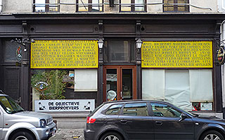
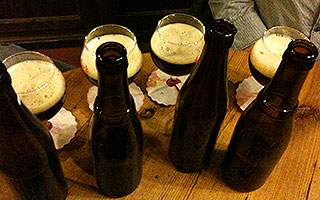
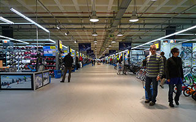
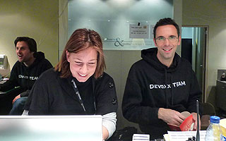
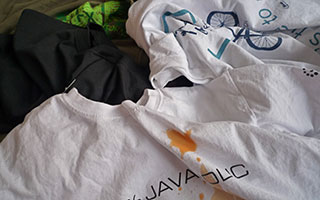

= 10 Devoxx tips
PeterHilton
v1.0, 2010-11-23
:title: 10 Devoxx tips
:tags: [playframework,event]

Last week we were at http://devoxx.com/[Devoxx] in
Antwerp. This means that there are now 51 weeks until Devoxx 2011, which
means that this is the perfect time to start preparing. Here are ten top
tips to help you get the most out of the conference next year.

[[go]]
== 1. Make sure you can actually go

____
Moi, j'encourage les gens à réfléchir s’il faut pas changer de boite si
vous pouvez pas venir à Devoxx l’année prochaine.
____

Nicolas Martignole,
http://lescastcodeurs.com/2010/11/les-cast-codeurs-podcast-episode-31-special-devoxx-2010/[Les
Cast Codeurs Podcast 31] (at 45:58):

Make sure you can actually go to Devoxx, and change jobs if your
employer won't let you (via @lescastcodeurs). If you have to choose
between JavaOne and Devoxx then choose Devoxx, which may have just
established itself as the better and certainly more focused Java
conference. Note that this tip is originally from Nicolas Martignole
(a.k.a. http://www.touilleur-express.fr/[Le Touilleur Express]).

[[cards]]
== 2. Take lots of business cards

Some people are surprised that Devoxx conference-goers do not use their
iPhones for absolutely everything, and still swap business cards, while
the reality is that physical cards still work best. These days all the
cool kids have small batches of custom-designed cards from
http://moo.com/[moo.com] - I am looking forward to some good Devoxx
designs for next year. If you cannot afford business cards, then just
print your Twitter name on little address stickers or something. Also
recommended:
http://thedailywtf.com/Articles/JustInTime-Business-Cards.aspx[Just-In-Time
Business Cards] (tick the swag box).

[[early]]
== 3. Arrive in town early

Arrive in Antwerp the night before your first day at Devoxx so you don't
have your luggage at the conference, and so you have more time to use up
all of your business cards. You cannot make the conference longer, but
you can have more time in Antwerp. Similarly, assume that you are going
to meet cool people to have lunch with on Friday before you head home.

[[sociable]]
== 4. Be sociable in the evening

Kulminator, Vleminckveld 32, Antwerp

If you don't have plans, perhaps because you arrived the evening before
the conference, go to
http://hilton.org.uk/antwerp/kulminator[Kulminator] for beer and
friendly customers (probably Devoxx attendees in general, and the Dutch
Java Knights on the Tuesday evening). Take a map, because Kulminator is
hard to find.

*2011 update: Kulminator is
https://plus.google.com/photos/101174951617223562800/albums/5673423416237350737[closed
for Devoxx week!]*

Alternatively, make plans to meet up with random people. The best way to
do this is to organise an event yourself, especially if you can get some
sponsorship to pay for beer, and get someone famous to announce the
event on Twitter. At the very least, announce the event yourself using
your own Twitter account and the #devoxx hashtag. You do have a Twitter
account, right?

[[beer]]
== 5. Drink beer

Freshly-poured Westvleteren at Kulminator

If you are out being sociable in the evening, for example, take the
opportunity to learn about more new things than open-source Java web
application development frameworks. To continue the learning experience
into the evening, only drink beer that you have never had before. If you
think that you have already tried all of major beers, then head to
Kulminator, where drinking just the beers on tap that you have never
tried is a major undertaking.

Dinner is optional, because beer is food and because however late it is
you can still go to Frituur No 1 for chips and gravy.

[[warm]]
== 6. Keep warm

Decathlon: they sell hats and gloves in here somewhere

Antwerp's humid November weather can be surprisingly chilly. After you
realise how cold you are going to get walking back to your hotel from
Kulminator each night, consider getting a warm hat from the enormous
Decathlon megastore right next to Metropolis, where the conference is.

A warm hat is especially essential if you are foolish enough to attempt
to 'look for a restaurant somewhere' with a large group, which
inevitably involves lots of wandering aimlessly around the old town. If
you find yourself in this situation, head for
http://www.pelgrom.be/[Pelgrom], which is a big and warm cellar
restaurant, near the cathedral on Pelgrimstraat 15.

[[light]]
== 7. Travel light

Don't take a bag on the first day, having checked into your hotel and
dropped your luggage the night before, and use the conference back-pack
so you have less to carry.

[[valerie]]
== 8. Be nice to Valérie

Valérie Hillewaere and Stephan Janssen at Devoxx '08.

http://www.linkedin.com/in/valeriehillewaere[Valérie Hillewaere] is a
Devoxx hero, as are the rest of the team, despite not getting as much
attention as Stephan. Take the time to tell them what a great job
they're doing.

*Update: shortly after Devoxx 2010, Valérie wrote in to say that she was
leaving the Devoxx team. This means that in 2011 you should be nice to
http://www.linkedin.com/pub/kristien-leyn/12/556/b4[Kristien Leyn]
instead.*

[[swag]]
== 9. Collect swag

Maximise your swag-collecting efficiency at each stand in the exhibition
hall by simply starting with 'Can I have a t-shirt please?', which
forces the rep to be up-front about what they want from you. While
you're there, consider asking what it is they are selling because it
might be interesting. The software product exhibitors tend to have
interesting techies on their stands, unlike the IT consultancy companies
who just have random employees or recruiters.

== 10. Network

Join the conversation instead of only listening to presentations,
because you often learn the most from the people you meet in the breaks.
If you find yourself in a talk that is not great, just leave and find
someone more interesting to talk to in the exhibition hall, especially
after 5 pm when the Red Hat and Oracle stands generally have free beer.
If you are at the conference with colleagues, don't act like you are
joined at the hip: go off on your own and find interesting people to
introduce your colleagues to.

