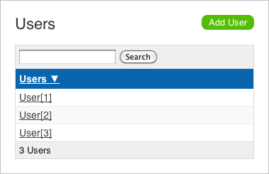
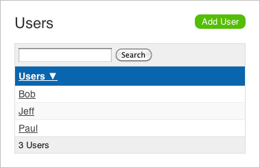

= Declarative model class enhancement in Play 1.2
PeterHilton
v1.0, 2011-01-11
:title: Declarative model class enhancement in Play 1.2
:tags: [playframework,java]

The Play framework is
a web application development framework that is not only surprisingly
usable and flexible, it is also extremely extensible. This article shows
an example of how to use one of Play's extension points to declaratively
enhance model classes, in Play 1.2.

In summary, this article describes a simple example of how to define a
Java annotation that will declaratively add behaviour to a model class
in a Play framework application. You can do with with a custom
annotation and a Play module that enhances the model JavaBean class.

[[problem]]
== The problem

Suppose your Play application uses the CRUD module to provide a default
user-interface for managing data such as the following JavaBean.

[source,java]
----
 public class User extends Model {

   public String name;
   public String email;
   public String address;
}
----

The CRUD module's default admin page lists the users like this:

`User[1]` is the default `toString()` implementation’s output. You can
fix this by overriding the `toString()` method in the `User` class, like
this:

[source,java]
----
 @Override
public String toString() {
   return name;
}
----

which changes the output to:

What would be much more cool would be to achieve the same result by
simply adding a `@CrudName` annotation to the model:

[source,java]
----
public class User extends Model {

   @CrudName
   public String name;
   public String email;
   public String address;
}
----

[[architecture]]
== Architectural considerations

On the face of it, there is not much benefit to this example, because
the original `toString()` method is trivial to add. However, it is still
a worthwhile simplification if you have a large number of model classes.

What is more significant, however, is the general concept of using
annotations to declaratively write richer model classes, since it may be
possible to use this facts about the model to replace model-specific
business logic code. This could, in turn, allow for more of the
application code to be generic framework-style code, resulting in less
code overall. This may particularly appeal to developers working with
model-driven engineering.

[[module]]
== Play module

To keep this extension separate from the CRUD module and our
application, we will add this as a separate Play module, which we will
be able to use for more than one application. Create the module:

[source]
----
play new-module crudname
----

This creates a structure that is very similar to a Play application, but
without an `application.conf` file, which modules do not have. Delete
the following files and directories that we will not use for this
module, because it will not contain any model, view or controller code:

* `crudname/app`
* `crudname/commands.py`
* `crudname/conf`

This leaves the following:

* `crudname/build.xml` - the Ant build file that generates a JAR archive
for the module's Java code
* `crudname/src/play/modules/crudname` - the source directory for the
module's Java code
* `crudname/src/play.plugins` - an initially empty file for registering
the module's Play plug-ins.

Unfortunately, you cannot use the `play eclipsify` command on a module,
for example. This means that you will have to manually add
`$PLAY_HOME/framework/play.jar` to your development environment's
compile classpath.

[[annotation]]
== Model annotation

First, we add the `@CrudName` annotation that we will use on fields in
our Play application’s model classes.

In `crudname/src/play/modules/crudname/com/lunatech/crud/` add the
annotation:

[source,java]
----
 package com.lunatech.crud;

import java.lang.annotation.Retention;
import java.lang.annotation.RetentionPolicy;

@Retention(RetentionPolicy.RUNTIME)
public @interface CrudName {

}
----

This is simply a marker annotation that the Play enhancer will use at
runtime to identify the property to use for the generated `toString()`
implementation.

[[enhancer]]
== Model enhancer

The enhancer extends the `play.classloading.enhancers.Enhancer` helper
class to identify the application’s model classes, search for a
`@CrudName` annotation, and use the marked field to generate a
`toString` method.

In `crudname/src/play/modules/crudname/com/lunatech/crud/` add the
class:

[source,java]
----
 package com.lunatech.crud;

import javassist.CtClass;
import javassist.CtField;
import javassist.CtMethod;
import javassist.NotFoundException;
import play.classloading.ApplicationClasses.ApplicationClass;
import play.classloading.enhancers.Enhancer;

/**
 * Adds a <code>toString()</code> method to model classes, from the first 
 * property that is annotated with the {@link CrudName} annotation.
 */
public class CrudNameEnhancer extends Enhancer {

   @Override
   public void enhanceThisClass(ApplicationClass appClass) throws Exception {
      CtClass ctClass = makeClass(appClass);

      // Only enhance model classes.
      if (!ctClass.subtypeOf(classPool.get("play.db.jpa.JPABase"))) {
         return;
      }

      // Only enhance if there is no toString() method.
      try {
           ctClass.getDeclaredMethod("toString");
           return;
      }
      catch (NotFoundException e) {
         // toString method not found, so continue.         
        }

      // Find an enhance annotated fields.
      for (CtField ctField : ctClass.getDeclaredFields()) {
         if (hasAnnotation(ctField, CrudName.class.getName())) {
            final String code = "public String toString() { " +
                  "return this." + ctField.getName() + ".toString(); }";
            final CtMethod toString = CtMethod.make(code, ctClass);
            ctClass.addMethod(toString);
            break;
         }
      }

      // Done - update class.
      appClass.enhancedByteCode = ctClass.toBytecode();
      ctClass.defrost();
   }
}
----

This code is based on enhancers that are included in Play, such as
`play.classloading.enhancers.PropertiesEnhancer` and
`play.db.jpa.JPAEnhancer`, which are pretty easy to follow (although
some of the comments are in French).

Note that the enhancement is aborted if a `toString` method already
exists: you may prefer to consider this case a programming error and
throw a fatal exception.

[[plugin]]
== Play plug-in

The Play plug-in is the class that provides access to the Play
framework's extension points. In this case, we use the class enhancement
extension point that makes it possible to select certain application
classes to dynamically modify after they are loaded. This is the
technique used, for example, to generate JavaBean getter and setter
methods from model classes’ public fields at run-time.

In `crudname/src/play/modules/crudname/com/lunatech/crud/` add a Play
plugin that will apply the enhancer to the application classes:

[source,java]
----
 package com.lunatech.crud;

import play.PlayPlugin;
import play.classloading.ApplicationClasses.ApplicationClass;

/**
 * Play plugin to extend CRUD module functionality
 */
public class CrudPlugin extends PlayPlugin {

   @Override
   public void enhance(ApplicationClass appClass) throws Exception {
      new CrudNameEnhancer().enhanceThisClass(appClass);
   }
}
----

Enable the plugin by adding the following line to the initially-empty
`crudname/src/play.plugins` file:

[source]
----
1000:com.lunatech.crud.CrudPlugin
----

The 1000 is a plug-in priority (beyond the scope of this article).

[[together]]
== Putting it together

Build the plug-in by creating a `crudname/lib` directory and running the
module’s Ant build, which creates `crudname/lib/play-crudname.jar`.

Add the module to our application by adding one line to its
`conf/application.conf` file:

[source,java]
----
 
module.crudname=../crudname
----

Restart the Play application (to load the plug-in), and load the admin
page. Now the page lists the users' `name` properties:

== Conclusion

The Play framework API makes it easy to write very clean extension code
for adding functionality to the framework. This allows the core
framework to remain lightweight, and for additional functionality to be
provided by optional modules, so that the core framework remains simple
and lightweight, while supporting a broader set of rich functionality.

