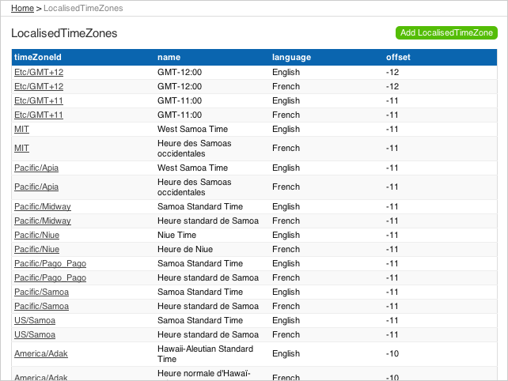
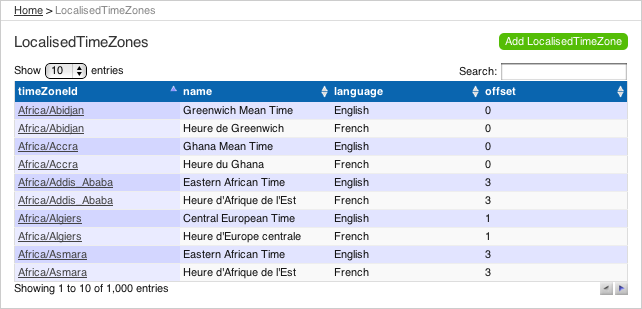

= Integrating Play framework 1.2 with jQuery DataTables
PeterHilton
v1.0, 2011-01-28
:title: Integrating Play framework 1.2 with jQuery DataTables
:tags: [playframework,jquery]

This article describes how to integrate
http://www.datatables.net/[DataTables] with a http://playframework.com/[Play framework] web 1.2 application. DataTables is
a jQuery plug-in for adding sorting, paging and search functionality to
tables on a web page. This kind of JavaScript client solution is a good
fit with the Play framework, because Play does not interfere with
anything you might want to do in your web application’s
HTML/CSS/JavaScript layer, and also provides server-side support for
Ajax integration.

== Overview

. Set-up an example application - create an application with some data
to display.
. Customise the table view - strip the view template down to a plain
HTML table.
. Add the DataTables module - add the jQuery plug-in from a new Play
module.

[[architecture]]
== Architectural considerations

The Play CRUD module is part of the web framework that generates HTML on
the server. In this example, this means generating an HTML table from
the data in the database. In its default implementation, the CRUD module
uses parameters for paging, searching and sorting to generate the HTML
for a single 'page' of data - 15 rows, say.

The generated HTML table provides a good starting point for using
DataTables, which can enhance an existing HTML table by modifying the
DOM to support paging, sorting and search. For example, given a 100-row
HTML table, DataTables can display this ten rows at a time, with page
controls and search boxes to filter the displayed rows. This is a good
solution when there is a limited number of total rows to display.
However, if you are displaying data from a database table that contains
thousands of rows, say, then performance will suffer as the HTML becomes
too large to transfer to the web browser quickly enough.

The obvious way to address this is to load the data from separate Ajax
requests, which is beyond the scope of this article.

It is also worth considering the option of compressing the HTTP response
further by adding a proxy server with GZIP compression, such as Apache
HTTPD with the
http://httpd.apache.org/docs/2.0/mod/mod_deflate.html[mod_deflate]
module.

[[application]]
== Set-up an example application

For this example, we will use the Play CRUD module as our example
application. The DataTables integration will not be specific to the CRUD
module - the same approach will work with any Play application, but the
CRUD module gives us convenient out-of-the-box controllers and views to
get started with.

First, create a new play application:

[source]
----
play new crud-datatables-example
----

Next, configure the database and enable the CRUD module. In the new
application’s `conf/application.conf` uncomment the `db=mem` in-memory
database configuration, and add this line under `# ---- MODULES ----`
near the top:

[source]
----
module.crud=${play.path}/modules/crud
----

If you are using Eclipse, Idea or NetBeans, run the relevant command to
configure the project build path, e.g.:

[source]
----
play eclipsify crud-datatables-example
----

Add a model class that we will use to populate our database with data to
display:

[source,java]
----
package models;

import java.util.Locale;
import java.util.TimeZone;
import javax.persistence.Entity;
import play.db.jpa.Model;

@Entity
public class LocalisedTimeZone extends Model {

   public String timeZoneId;
   public String name;
   public String language;
   public int offset;
   
   public LocalisedTimeZone(TimeZone zone, Locale locale) {
      this.timeZoneId = zone.getID();
      this.name = zone.getDisplayName(locale);
      this.language = locale.getDisplayLanguage();
      this.offset = zone.getRawOffset() / 3600000;
   }
}
----

Add an application bootstrap class to load data at start-up, using data
built into the JDK for convenience:

[source,java]
----
import java.util.Locale;
import java.util.TimeZone;
import models.LocalisedTimeZone;
import play.jobs.Job;
import play.jobs.OnApplicationStart;

@OnApplicationStart
public class Bootstrap extends Job {

   @Override
   public void doJob() {
      if (LocalisedTimeZone.count() == 0) {
         for (String id : TimeZone.getAvailableIDs()) {
            final TimeZone zone = TimeZone.getTimeZone(id);
            new LocalisedTimeZone(zone, Locale.ENGLISH).save();
            new LocalisedTimeZone(zone, Locale.FRENCH).save();
            new LocalisedTimeZone(zone, new Locale("nl")).save();
         }
      }
   }

}
----

Now run the application, which should start-up without errors:

[source]
----
play eclipsify crud-datatables-example
----

[[view]]
== Customise the table view

Next we have to simplify the table view so that DataTables can replace
the CRUD functionality for sorting, pagination and search.

First, copy the CRUD 'list' template so we can over-ride it. In the
application directory:

[source]
----
play crud:ov --template CRUD/list
----

Now simplify the new template, removing search and pagination, which
will come from DataTables.

[source,html]
----
#{extends 'CRUD/layout.html' /}

    
    <h2 id="crudListTitle">&{'crud.list.title', type.name}</h2>

    

        #{crud.table fields:['timeZoneId', 'name', 'language', 'offset'], sort:'dummy' /}
    

    
    

        <a href="@{blank()}">&{'crud.add', type.modelName}</a>
    

----

In our version, we add to parameters to the `crud.table` tag. First, the
`fields` parameter specifies which model properties are included in the
table. Second, the `sort` parameter specifies a non-existent field name,
to disable sorting.

Finally, we need to disable paging by setting a large page size so that
the table displays all of the rows from the database. In
`crud-datatables-example/conf/application.conf`, add the line:

[source]
----
crud.pageSize=2000
----

Finally, navigate to http://localhost:9000/localisedtimezones

[[module]]
== Add the DataTables module

At this point, we also need to customise the `#{crud.table`} tag, so now
it is time to create our new module.

Create the module next to the example application - in the directory
that contains the Play application:

[source]
----
play new-module crud-datatables
----

Add the module to `crud-datatables-example/conf/application.conf`

[sourcee]
----
module.crud-datatables=../crud-datatables
----

Restart the Play application, and the log should show the new module:

Download http://www.datatables.net/download/[DataTables] and, to keep
these instructions simple, add the whole `DataTables-1.7.5` folder into
`crud-datatables/` - the module folder.

Add a static route to `crud-datatables/conf/routes`

[source]
----
# DataTables distribution resources
GET        /datatables/        staticDir:DataTables-1.7.5/media
----

Import the module routes by adding a line in
`crud-datatables-example/conf/routes` *above* the CRUD module import:

[source]
----
*      /          module:crud-datatables
----

Now customise the CRUD module page template so we can add script
sections for DataTables. First, override the layout template - in the
application folder:

[source]
----
play crud:ov --layout
----

Edit the new `crud-datatables-example/app/views/CRUD/layout.html`
template and add the following lines just before the HTML `</head>`
closing tag:

[source,html]
----
#{get 'moreCss' /}

#{get 'moreScripts' /}
----

Enable DataTables by adding a JQuery script section to the top of
`crud-datatables-example/app/views/CRUD/list.html`

[source,html]
----
#{set 'moreCss'}
<link rel="stylesheet" type="text/css" media="screen" href="/datatables/css/demo_page.css">
<link rel="stylesheet" type="text/css" media="screen" href="/datatables/css/demo_table.css">
#{/set}
#{set 'moreScripts'}
    
    
    
#{/set}
----

The three lines of JavaScript in the third `script` tag use jQuery to
apply DataTables to the existing HTML table on the page.

[[next]]
== Next steps

At this point you may notice that the CRUD module and DataTables default
styles are ugly when combined. Fortunately, both provide a lot of
flexibility for styling; developing the combination into an integrated
look-and-feel is a straightforward front-end design task, albeit one
that is outside the scope of this article.

Also, if you have enough data that serving all of it as single HTML
table is too big, you will want to use DataTables’ server-side
processing support to load the data from an Ajax request. This is
described in the follow-on to this article:
http://blog.lunatech.com/2011/02/07/ajax-datatables-playframework[Ajax
DataTables with the Play framework].

