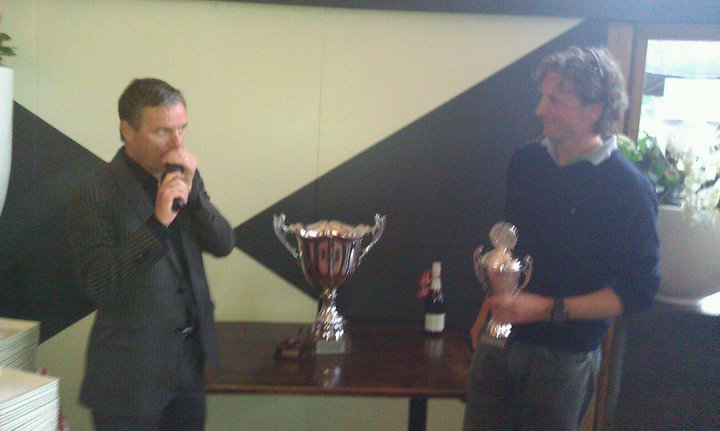

= Lunatech Invitational Golf Event 2011 
PeterHilton
v1.0, 2011-06-28
:title: Lunatech Invitational Golf Event 2011 
:tags: [ventures,event]

The Lunatech Golf Invitational 2011 was
held on Friday, 10 June, 2011. Although it was the first rainy day in
weeks, this could not affect the mood of the participants. After some
last minute cancellations, we have 32 players and 21 clinic attendees,
along with some additional friends and colleagues who joined the
festivities during the evening.

With lunch packets in hand, the first flight set off at 11:58, the last
flight at 13:15. The winners had two excellent scores for their
respective handicaps: Mark Rooijens (36 handicap) shot a 90 strokeplay,
which using the maximum allowed handicap correction for the Lunatech
Open (24) gives him a net score of 66 and 45 stableford points. Bas van
Nispen (18 handicap, playing handicap of 17) shot an 84, which gives him
a net score of 67 and 41 stableford points.

Herman Slagter has won the award for longest drive and gave beautiful
speech acceptance speech: "It is great to be the winner of the most
important award..". Danny Fiere won the prize for the neary, almost
getting his second hole in one of the year.

There were joint winners for the clinic, Arjen and Frans.

* Strokeplay - Mark Rooijens 66 handicap corrected strokeplay
* Stableford - Bas van Nispen 41 stableford points
* Longest drive - Herman Slagter
* Neary - Danny Fiere
* Clinic - Arjen Groeneveld & Frans-Anton van Gils
* Honorable mention - Keith and Frans for providing the in-course
cocktails.

NB: Last year David Young was the single winner of both trophies,
Stableford and Strokeplay, with a round of 78. The only tarnish on his
victory is that we actually forgot to publish an article last year after
the event. So our our apologies to David and of course our
congratulations.

Lunatech is already looking forward to organizing the sixth edition in
2012. There have been inquiries from leading USPGA and European tour
players so 2012 promises to be a great event with a top-notch field of
competitors.

In case you took pictures during the event, feel free to send them to
marketing@lunatech.com so we can post them to the blog.

Thanks again everyone for joining us!

image:../media/2011-06-28-lunatech-invitational-golf-event-2011/audience.jpg[image]
