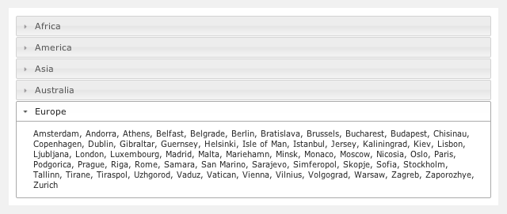
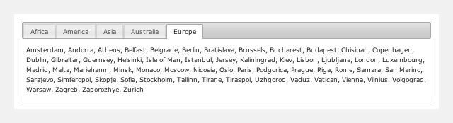

= Lazy loading page content with jQuery UI, Ajax and Play 1.2
hilton
v1.0, 2011-08-10
:title: Lazy loading page content with jQuery UI, Ajax and Play 1.2
:tags: [playframework,jquery]

This article

This
article shows you how to use http://jqueryui.com/[jQuery UI]
components to load page content using Ajax from a http://www.playframework.org/[Play
framework] 1.2 web application. This can
be useful as a way of improving web page performance by delaying loading
of some page content that might not be needed at first, or ever.

This follows on from the earlier article
https://blog.lunatech.com/posts/2011-07-05-jquery-ui-ajax-autocomplete-playframework[jQuery
UI Ajax autocomplete with Play] by providing examples of more jQuery UI
components. As before, the lesson is that Play framework does not need
to have its own built-in user-interface components because it works so
well with existing JavaScript-based user-interface component libraries.

This article’s examples and source code are available as part of the
Play framework http://www.playframework.org/modules/jqueryui[jQuery UI
module].

== Architecture

In the simple model web application model, the server generates HTML
documents that are rendered in a web browser. Ajax extends this model by
using JavaScript code on the web client that acts as an Ajax client for
additional server resources. This article is about the scenario where
this Ajax client code loads additional web page content from the server,
after the initial page has rendered, and adds this content to the page.

The client code consists of jQuery UI components with JavaScript code
that manages the Ajax requests and updates the web page content. The
server is a Play framework application that renders content as data in
JSON format.

[[accordion]]
== Accordion for lazy-loading content

The jQuery UI http://jqueryui.com/demos/accordion/[accordion] widget
groups sections of web page content so that only one section is shown at
a time. Clicking a section’s header collapses one section and expands
another. Although all of these sections can be part of the initial HTML
document, we can also use this widget to avoid loading a section’s
content until it is going to be displayed.

[[accordionclient]]
=== Client

The HTML part of the client consists of a `div` element that contains
the the header for each section, without any section content, and two
additional elements. The class name allows the JavaScript to select this
element. Second is an HTML5 data attribute which we use to capture the
server-side controller URL in the HTML document and therefore make it
available to the JavaScript. We do this to avoid having to put the URL
in the static JavaScript code, and so we can use the Play template
syntax for generating the URL from a controller action reference.

[source,html]
----

<h3><a href="#">Africa</a></h3>
<h3><a href="#">America</a></h3>
<h3><a href="#">Asia</a></h3>
<h3><a href="#">Australia</a></h3>
<h3><a href="#">Europe</a></h3>

----

The client-side JavaScript has two sections. The first simply adds the
`div` elements that will hold the section content:

[source,javascript]
----
$('div.accordion h3').each( function() {
    $(this).after('

');
});
----

The second section turns this into an accordion component, setting
various options.

[source,javascript]
----
$('div.accordion').each( function() {
    var $accordion = $(this);
    var serverUrl = $accordion.data('url');
    $(this).accordion({
        autoHeight: false,
        active: false,
        changestart: function(event, ui) {
            if (ui.newContent.is(':empty')) {
                $(ui.newContent).load(serverUrl + escape(ui.newHeader.text()));
            }
        },
        change: function() {
            $accordion.accordion('resize');
        }
    });
});
----

The `active` option is set to `false` to initially collapse all
sections, so that no content is loaded until a section is selected.

The `changestart` option specifies a function that uses Ajax to load the
content from the given server URL. The condition avoids loading the
content if it has already been loaded, and the `div` is no longer empty.
This event is triggered when a section is selected, but before updating
the view.

The `change` option specifies a function that resizes the content `div`
element to display the new content.

[[accordionserver]]
=== Server

The server-side is a Play controller action that renders a content
section. The first part, for this example, is some test data - a list of
‘location’ names extracted from the JDK’s time zone list:

[source,java]
----
static Set<String> regionLocations(final String region) {
    final SortedSet<String> result = new TreeSet<String>();
    final String[] timeZones = TimeZone.getAvailableIDs();
    for (int i = 0; i < timeZones.length; i++) {
        final String[] parts = timeZones[i].split("/");
        boolean regionMatches = parts[0].equals(region);
        if (parts.length == 2 &amp;&amp; (region == null || regionMatches)) {
            final String location = parts[1].replaceAll("_", " ");
            result.add(location);
        }
    }
    return result;
----

The interface with the client-side widget is the following controller
action, which simply renders the list of location name Strings for the
given header name.

[source,java]
----
public static void region(final String header) {
    final Set<String> locations = TestData.regionLocations(header);
    render(locations);
----

The view simply renders a `div` element containing a comma-separated
list of location names:

[source,html]
----

#{list locations, as:'location'}
${location}#{ifnot location_isLast}, #{/ifnot}
#{/list}

----

The result is an accordion, with content loaded from an Ajax request:

[[tabs]]
== Tabs for lazy-loading content

jQuery UI http://jqueryui.com/demos/tabs/[tabs] are similar to the
accordion, in that they divide page content into sections such and
display one at a time, but with a different layout. We can use the same
technique as above to lazy load the tab contents.

[[tabsclient]]
=== Client

As before, the view consists of initial HTML that defines the sections,
and some JavaScript. The HTML is a list of links to the controller
action that will return the tab’s content:

[source,html]
----

<ul>
<li><a href="@{jqueryui.Accordion.region('Africa')}">Africa</a></li>
<li><a href="@{jqueryui.Accordion.region('America')}">America</a></li>
<li><a href="@{jqueryui.Accordion.region('Asia')}">Asia</a></li>
<li><a href="@{jqueryui.Accordion.region('Australia')}">Australia</a></li>
<li><a href="@{jqueryui.Accordion.region('Europe')}">Europe</a></li>
</ul>

----

The client-side JavaScript is even shorter in this case, the tabs
plug-in supports Ajax loading out of the box.

[source,javascript]
----
$('div.tabs').tabs({
    ajaxOptions: {
        error: function(xhr, status, index, anchor) {
            $(anchor.hash).html('Error loading tab');
        }
    }
});
----

[[tabscerver]]
=== Server

For the server we can simply re-use the existing
`jqueryui.Accordion.region(String header)` controller action that we
used for the accordion, since the content is the same.

The result is a set of tabs:

== Conclusion

Once you get used to jQuery and jQuery UI widgets, it is extremely easy
to use Play to implement an Ajax-based user-interface. This allows the
different people involved to do what they do best: the jQuery UI
developers make the widgets work across multiple browsers, leaving the
web application developer to implement a server-side with Play and wire
the two together with a little JavaScript.

