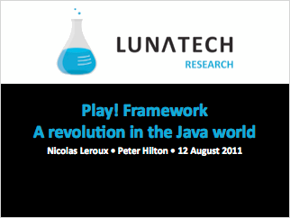
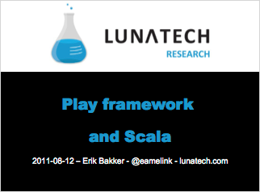

= August Play!ground presentation slides & video
hilton
v1.0, 2011-08-17
:title: August Play!ground presentation slides & video
:tags: [event,playframework]

On 12 August 2011, Lunatech hosted the first
Play!ground in the Netherlands - an event for developers interested in
the http://www.playframework.org/[Play framework]. Here are the slides
from the presentations.

== Play! Framework

Nicolas Leroux & Peter Hilton, Lunatech. link:../media/2011-08-17-playground-slides-video/play-2011-08.pdf[slides]
(PDF, 1.9 MB)

link:../media/2011-08-17-playground-slides-video/play-2011-08.pdf[]

== Play Framework & Scala

Erik Bakker, Lunatech. link:../media/2011-08-17-playground-slides-video/play-2011-08-scala.pdf[slides] (PDF, 126 KB)
and http://embed.minoto-video.com/15/oEnJiaNdXK2o[video] (33:26)

link:../media/2011-08-17-playground-slides-video/play-2011-08-scala.pdf[]
