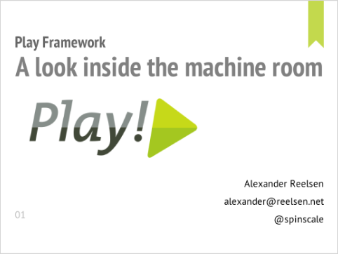
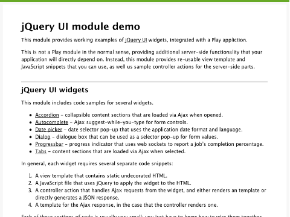

= Play!ground presentation slides & code
hilton
v1.0, 2011-10-03
:title: Play!ground presentation slides & code
:tags: [event,playframework]

On
30 September 2011, Lunatech hosted the second Play!ground event for
http://www.playframework.org/[Play framework] users. Here are the
slides and source code from the presentations.

== A look inside the machine room

Alexander Reelsen.
http://spinscale.github.com/play-advanced-concepts.html[slides] (HTML)

http://spinscale.github.com/play-advanced-concepts.html[]

== jQuery UI module

Peter Hilton, Lunatech. https://github.com/hilton/jqueryui-module[source
code] (GitHub)

https://github.com/hilton/jqueryui-module[]

== Gratuitous book promotion

Peter Hilton (left) also took the opportunity to get Alexander Reelsen
(right) to autograph his copy of the
https://blog.lunatech.com/posts/2011-09-19-playframework-cookbook-review[Play
Framework Cookbook].

https://blog.lunatech.com/posts/2011-09-19-playframework-cookbook-review[image:../media/2011-10-03-playground-slides-code/play-2011-09-alexander.jpg[Peter
Hilton and Alexander Reelsen]]
