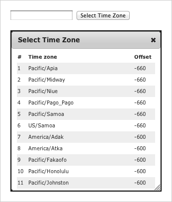

= Selector dialogue with jQuery UI, Ajax and Play
hilton
v1.0, 2011-10-11
:title: Selector dialogue with jQuery UI, Ajax and Play
:tags: [playframework,jquery]

This article
shows you how to use a http://jqueryui.com/[jQuery UI] component and
Ajax to implement a dialogue box (a.k.a. ‘a dialog’) that contains a
selector in a http://www.playframework.org/[Play framework] web
application. You frequently need one of these for web page forms where
you need to select something for a list of thousands of values, such as
selecting a person from a table of ten thousand employees.

This follows on from two earlier articles about jQuery UI components:
http://blog.lunatech.com/2011/07/05/jquery-ui-ajax-autocomplete-playframework[jQuery
UI Ajax autocomplete with Play] and
http://blog.lunatech.com/2011/08/10/lazy-loading-jquery-ui-ajax-play[Lazy
loading page content with jQuery UI, Ajax and Play].

For this article, we use the simpler example of selecting a time zone
from a table:

This article’s examples and source code are available as part of the
Play framework http://www.playframework.org/modules/jqueryui[jQuery UI
module].

== Architecture

The basic architecture for an HTML form is that the user can either
enter values or select options that are encoded in HTML as part of the
form. In this article’s approach, we extend the HTML form using Ajax and
a JavaScript client component. The client code consists of jQuery UI
components with JavaScript code that manages the Ajax requests and
updates the web page content. The server is a Play framework application
that renders content as an HTML fragment.

[[dialog]]
== Dialogue box for selecting a value

Use the jQuery UI http://jqueryui.com/demos/dialog/[dialog widget] (i.e.
a dialogue box) to show additional user-interface elements that are not
part of the main page. A common use case is to show a ‘selector pop-up’
that provides a richer user-interface for selecting a value than a
pick-list. This is especially useful when the dialog contents are
lazy-loaded.

For example, if you want to select a person from a list of ten names,
then you can use a static HTML pick-list. If you want to select from a
list of hundreds of names, then use an
http://blog.lunatech.com/2011/07/05/jquery-ui-ajax-autocomplete-playframework[autocomplete]
widget that shows you names that match your input. However, if you need
to select from a list of thousands of people then you need more than
just the name to identify the person you want. A dialogue box gives you
room to show a more sophisticated search/browse interface.

=== Client

The widget is based on a text input, and a button that will open the
dialogue.

[source,brush:,html;,gutter:,false]
----
<input name="location">
<button data-url="@{jqueryui.Dialog.timeZones()}">Select Time Zone</button>
----

The dialog.js JavaScript attaches a click handler to the button. This
click handler uses the jQuery UI dialog plug-in to open a dialog box,
and loads the dialog contents from the resource given by the data-url
attribute value, via an Ajax request.

[source,brush:,javascript;,gutter:,false]
----
$(function() {

   $('.selector button').click(function() {
      var $dialog = $('
').addClass('dialog');

      // Load the dialog contents.
      var $button = $(this);
      var serverUrl = $button.data('url');
      $dialog.load(serverUrl, function() {

         // Add the DIV to the page and open the dialog.
         $('body').append($dialog);
         $dialog.dialog({
            height:320,
            title:'Select Time Zone'
         });

         // Handle row selection: copy the selected row's value to the input field.
         $dialog.find('tr').click(function() {
            var timeZoneId = $(this).children('td::nth-child(2)').text();
            var $input = $button.siblings('input');
            $input.val(timeZoneId);
            $dialog.dialog('destroy');
         });
      });
   });
});
----

=== Server

The server-side resource that is used to populate the dialog contents is
simply a server-side view: the controller renders all of the data as an
HTML table.

[source,brush:,html;,gutter:,false]
----
<table>
   <tr><th>#</th><th>Time zone</th><th title="UTC offset (minutes)">Offset</th></tr>
   #{list timeZones, as:'tz'}
   <tr class="${tz_parity}">
      <td>${tz_index}</td>
      <td>${tz.ID}</td>
      <td>${tz.rawOffset.intdiv(60000)}</td>
   </tr>
   #{/list}
</table>
----

A more realistic example might include server-side filtering of a long
list, so that the selector can be used to select one of thousands of
values.

== Conclusion

This is not a difficult technique: once you get the hang of integrating
a jQuery UI component with a Play view template and a controller for the
Ajax request, you can see that there is very little code. This is also a
useful technique - a specific example of making a richer more
sophisticated user-interface, but in a simple way that any developer can
understand.

