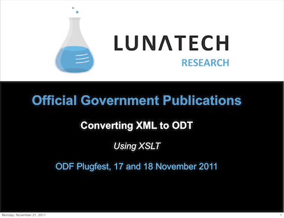

= Official Government Publications - ODF Plugfest presentation
wjkveen
v1.0, 2011-11-21
:title: Official Government Publications - ODF Plugfest presentation
:tags: [event]

Last
week Willem-Jan Veen, senior developer at Lunatech Research, gave a
presentation about Dutch official government publications in ODF at (http://plugfest.opendocsociety.org/doku.php?id=plugfests:201111_gouda:info[ODF
Plugfest] in Gouda.

ODF Plugfests are primarily meant for suppliers of ODF suites and
document generators. During the Plugfest, interoperability is tested
using specific scenarios. Suppliers also have a chance to present
developments in their products and discuss the ODF Standard.

Our contribution to the Plugfest is presenting our experiences in a
large scale project for the Dutch Government. We implemented amongst
others the conversion to ODT of official state publications, such as
legislation, state bulletins, parliamentary proceedings and many more,
as part of the http://www.overheid.nl/help/oep/[Official Publication
Project (OEP)].

link:../media/2011-11-21-official-government-publications-odf-plugfest-presentation/plugfest-presentation-11-11.pdf[]

Of course, we have put our
link:../media/2011-11-21-official-government-publications-odf-plugfest-presentation/plugfest-presentation-11-11.pdf[presentation] (PDF) online.
