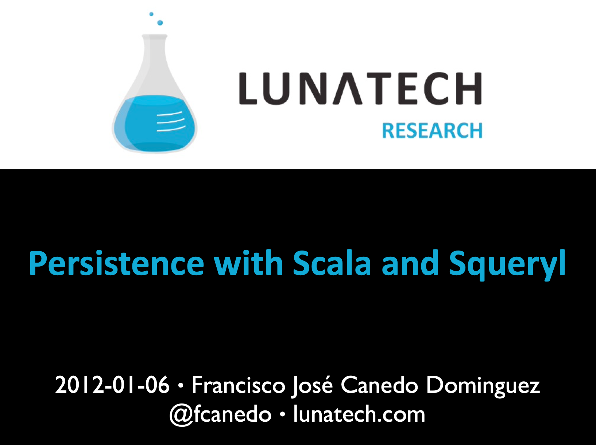
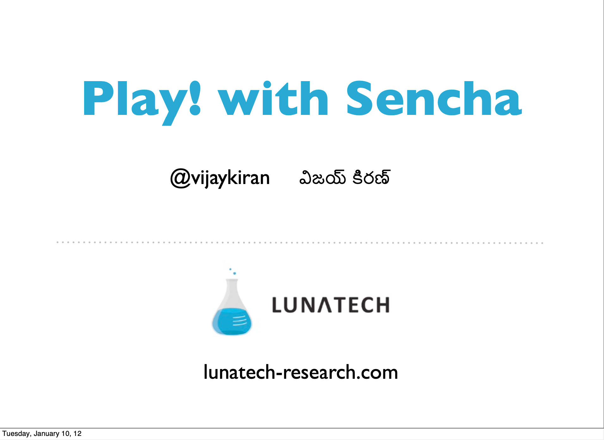
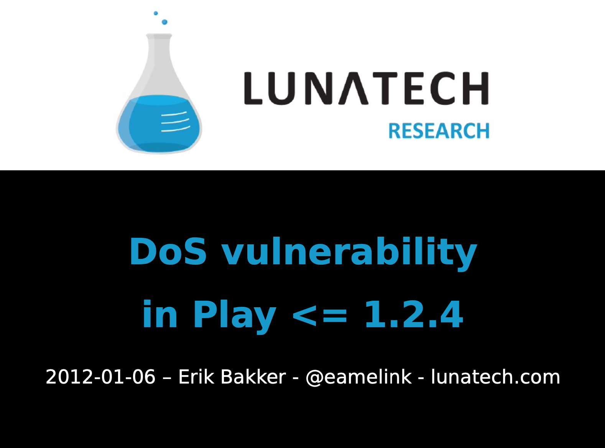

= January 2012 Play!ground presentation slides
vijaykiran
v1.0, 2012-01-12
:title: January 2012 Play!ground presentation slides
:tags: [event,playframework,playground]

On 6 January 2012, Lunatech hosted the Play!ground in the Netherlands -
an event for developers interested in the http://www.playframework.org/[Play
framework]. Here are the slides from the
presentations.

== Persistence with Scala and Squeryl

Francisco José Canedo Dominguez, Lunatech.
link:../media/2012-01-12-january-2012-playground-presentation-slides/20120106-play-scala-squeryl.pdf[slides] (PDF, 127 KB)

link:../media/2012-01-12-january-2012-playground-presentation-slides/20120106-play-scala-squeryl.pdf[]

== Play! with Sencha 

Vijay Kiran, Lunatech. link:../media/2012-01-12-january-2012-playground-presentation-slides/play-with-sencha-vijay.pdf[slides] (PDF, 300
KB)

link:../media/2012-01-12-january-2012-playground-presentation-slides/play-with-sencha-vijay.pdf[]

== DoS vulnerability in Play <= 1.2.4

Erik Bakker, Lunatech. link:../media/2012-01-12-january-2012-playground-presentation-slides/colliding-hashes-erik.pdf[slides] (PDF, 55
KB)

link:../media/2012-01-12-january-2012-playground-presentation-slides/colliding-hashes-erik.pdf[]
