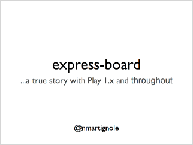
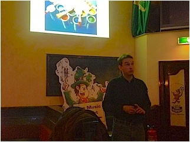
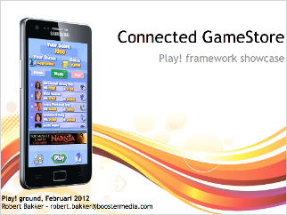
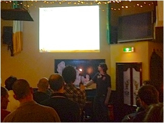

= February Play!ground presentations and photos
hilton
v1.0, 2012-02-06
:title: February Play!ground presentations and photos
:tags: [event,playframework,playground]

On
3 February 2012, Lunatech hosted a Play!ground event at Paddy Murphy’s
Irish pub in Rotterdam - an event for developers interested in the http://www.playframework.org/[Play
framework]. Here are the slides from the
presentations.

== Express-board

Nicolas Martignole, http://www.express-board.fr/[express-board.fr].
link:play-2012-02-expressboard.pdf[slides] (PDF, 3.4 MB)

link:../media/2012-02-06-playground-presentations-photos/play-2012-02-expressboard.pdf[]

== Connected GameStore

Robert Bakker, BoosterMedia. link:../media/2012-02-06-playground-presentations-photos/play-2012-02-booster.pdf[slides] (PDF,
3.4 MB)

link:../media/2012-02-06-playground-presentations-photos/play-2012-02-booster.pdf[]

