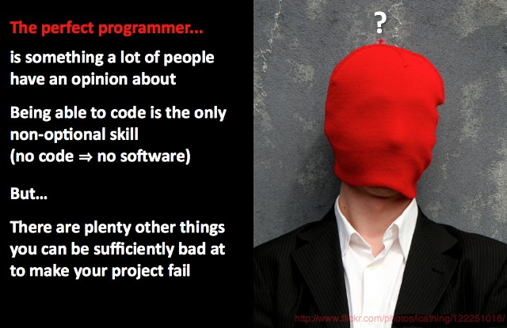

= Lunatech presents at 010DEV
hilton
v1.0, 2012-05-23
:title: Lunatech presents at 010DEV
renaissance
:tags: [event]

This week, on 25 May 2012, Peter
Hilton will present *In search of the perfect programmer* at
http://010dev.nl/[010DEV]. In Rotterdam, obviously.

http://010dev.nl/[image:../media/2012-05-23-010dev-perfect-programmer/010dev-banner.jpg[010DEV]]

The perfect programmer is something a lot of people have an opinion
about. Being able to code is the only non-optional skill, but here are
plenty other things you can be sufficiently bad at to make your project
fail. What is the ideal background for a programmer?

These days, it’s somewhat obvious to people in the software development
industry that good software gets built by multidisciplinary teams. The
catch is that there is no agreement at all about which disciplines you
need to make up a good team, and we end up with a different mix for
every new project or start-up company. If that weren’t bad enough, more
disciplines means more team members, while what we usually need in
software development is smaller teams, not bigger ones. What’s a
software developer to do?

_In search of the perfect programmer_ asks these questions and more.
Come and join the conversation at 010DEV.

