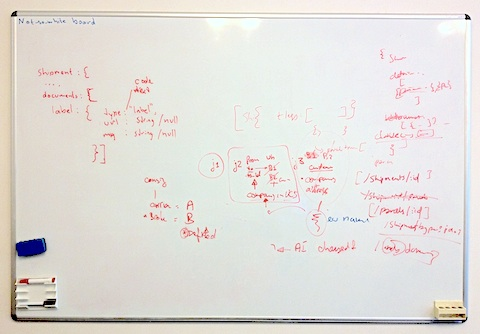

= Essential Scrum hardware - lots of whiteboards
hilton
v1.0, 2012-08-10
:title: Essential Scrum hardware - lots of whiteboards
environment set-up
:tags: [scrum,methodology]

In case you’re
wondering how many whiteboards your Scrum team members need, the correct
answer is ‘one each’.

[[scrum]]
== The Scrum board is not a whiteboard

A development team often only has one whiteboard that gets used for the
Scrum board, because it’s a convenient way to draw the board.
Whiteboards aren't just for the Scrum board: you need them for
day-to-day discussions, because whiteboards are really rapid-prototyping
tools for text and diagrams.

It’s a waste to write on paper stickies with a whiteboard marker, and
then stick them to a whiteboard. Any flat surface would do, although you
may get in trouble if you draw columns on the wall with a marker.
Instead, you can just tape paper signs to the wall to indicate the Scrum
board columns, such as _To do_ and _Done_.

[[bandwidth]]
== High-bandwidth communication

Scrum is all about verbal communication, which it emphasises over
written documentation. Scrum does this for three reasons: to keep
software requirements flexible until as late as possible in the
development process, because verbal communication doesn’t take as long,
and because a conversation between two people has higher bandwidth than
writing a specification.

The highest bandwidth communication between two people is face-to-face
verbal communication… plus a whiteboard. It’s a conversation with quick
diagrams.

It matters that the diagrams are low-fidelity
http://www.danroam.com/the-back-of-the-napkin/[back-of-the-napkin]-style
diagrams, because these are quick to draw. If you draw diagrams on a
computer, the diagramming software invokes a time warp: time slows down
while you endlessly fiddle with box alignment and arrow placement. A
picture is also worth a thousand words in that it takes just as long to
produce.

[[team]]
== Team whiteboards

Despite whiteboards’ usefulness, many teams have a shared whiteboard.
Just one. If there’s only one whiteboard then there can only be one
high-bandwidth conversation at a time. This isn’t what you want:
centralised discussion is for old-fashioned school classrooms and
meetings, not for productive teams. Treating a whiteboard marker like a
team’s talking stick would be as annoying as a version control system
that locks files on check-out.

Sometimes you can tell that you don’t have enough whiteboards: they’re
all full up, and people have to write ‘DNE’ (do not erase) on
whiteboards that other people use. Here’s a simple rule of thumb: if you
have fewer whiteboards than people then you don't have enough.

https://plus.google.com/107170847819841716154/posts/VDBWUNxc3wN[Comments
on Google+]

