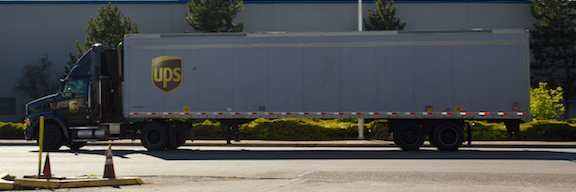
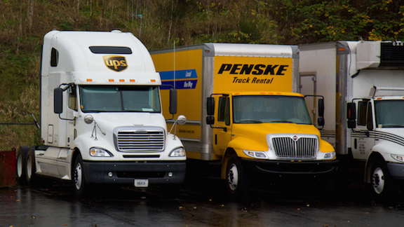

= Third-party Logistics (3PL) domain expertise
hilton
v1.0, 2014-03-11
:title: Third-party Logistics (3PL) domain expertise
:tags: [case-study]

In 1996, Lunatech entered into a partnership with UPS Supply Chain Solutions (UPS-SCS), that led to the development of an innovative supply chain operations household-name global electronics and computer hardware vendors.

Today, UPS still manages global supply chains electronics products,
including warehousing and transport, using a custom IT solution
developed by Lunatech that provides end-to-end supply chain visibility.
This approach, together with the software that Lunatech developed,
enabled UPS to optimise these supply chains and innovate to deliver a
unique logistics service.

Lunatech’s specific logistics domain expertise has allowed us to first
build a system that supports this supply chain, in the form of a
visibility solution. Lunatech further extended this system to support
additional business processes, such as automated decision making to
select transport companies. For more than ten years, we have continued
to collaborate with UPS’ logistics operations staff to further improve
the supply chain process, bringing repeated ROI to the business
operation.

== Third-party logistics (3PL)

To provide some context, consider how a global product distribution
supply chain works. This involves various roles for UPS and their
customer - the `vendor' who sells electronics or computer hardware.

To work with UPS, Lunatech has to understand how their logistics
operation works. As a starting point, consider that the vendor sells
electronics, such as communications hardware like network switches, to
customers world-wide. One way to think about how this supply chain works
is to imagine that the vendor makes the telephones and delivers them to
customers. However, in this case the vendor does not own trucks or
employ drivers, since shipping is not their core business, so instead
they might hire a transport company to deliver the telephones - UPS
brown trucks performing deliveries around the world.

The next step in outsourcing supply chain operations is further
outsourcing. Instead of managing their own warehouse, the vendor can
outsource the whole logistics operation to UPS, which is called
third-party logistics (3PL) because a third-party manages logistics
activities, such as transportation, warehousing, inventory management,
packaging, and freight forwarding. The usual 3PL set-up would be for the
vendor’s stock, e.g. crates of telephones, to be stored in one or more
UPS warehouses, and shipped to customers world-wide by UPS.

UPS Supply Chain Solutions (UPS-SCS) is a global third-party logistics
(3PL) provider, alongside companies like Companies such as Panalpina,
Kuehne + Nagel, DB Schenker, FedEx and DHL Express.

== 3PL implementations

In 1996, UPS set-up a third-party logistics (3PL) operation for a global
communications hardware vendor. This initial implementation involved
reporting the delivery status of each shipment to the vendor, to give
them visibility of the UPS-managed supply chain. Despite being only the
first step in supply chain visibility, this was hard because the
warehouse operation did not know when shipments were delivered: they did
not have access to information from the transport organisation.

To implement visibility, Lunatech developed a new system that integrated
multiple incompatible data sources into a single data model. This
enabled the system to generate consolidated delivery status reporting,
so that UPS could provide their customer with the delivery information
they needed.

In 1997, UPS followed on from the success of the first implementation by
providing visibility to another household-name vendor - a global
computer hardware vendor. This implementation went further, by
integrating information for shipments from multiple warehouses,
delivered by multiple carriers (transport companies). This was possible
because at this stage, Lunatech understood the supply chain well enough
to be able to further develop the visibility platform to handle this
additional complexity.

Integrating multiple organisations’ data involves not only data
modelling, but integrating incompatible data models in software that
translates between them in order to provide a unified view. Outsourcing
transport to multiple companies adds significant complexity to the
logistics visibility problem, making this a challenging goal. In fact,
we can re-state the business goal: to integrate IT for multiple 3PL
operations, including both transport and warehouse functions.

Having successfully completed these 3PL implementations, UPS and
Lunatech were able to go further by evolving the supply chain business
model itself, in a logical extension of the outsourcing behind 3PL.

== Fourth-party logistics (4PL)

UPS’s collaboration with Lunatech allowed them to go beyond their 3PL
operation: the next step was for the logistics operator itself to
outsource logistics services. UPS can use its own transportation to ship
world-wide, but in practice it is more cost effective to use different
carriers depending on whether you are shipping to a nearby country or
halfway around the world. Similarly, depending on the location, there
may be alternatives to using a UPS warehouse. When the logistics
supplier essentially performs a management function, and uses other
suppliers for the various logistics activities, we call this
fourth-party logistics (4PL).

In 2000, UPS introduced fourth-party logistics (4PL) to their customer’s
supply chain, managing the complete supply chain from warehouse to
transportation and customer-delivery. To achieve this, Lunatech again
extended the visibility platform developed for UPS. As well as
integrating information from multiple warehouses and carriers, Lunatech
integrated with the hardware vendor’s own systems by developing new
message-based middleware. At the same time, Lunatech extended the
system’s reporting capabilities to generate carrier performance and
warehouse activity reports, used for invoicing.

In the 4PL approach, UPS outsources both warehousing and transportation
instead of using their own infrastructure, which means that their whole
business for their customer - the hardware vendor - is about managing
information. 4PL is an information-centric business activity that
requires IT systems that capture and directly use a customer-specific
domain model, and are integrated with the multiple third-parties whose
infrastructure is used.

Lunatech made the 4PL implementation possible by becoming a long-term
technical partner and developing significant domain expertise. First,
the 4PL required a successful 3PL operation to build on, with the proven
IT systems that Lunatech had developed. In addition, UPS could only move
to 4PL because they had in Lunatech a technical partner who understood
their supply chain domain well enough to collaborate on new models and
solutions.

In practice, there are very few 4PL contracts in the supply chain world,
due to the difficulty of making it work. Few operations world-wide can
deliver on this promise.

== Business goals - fourth-party logistics

In 2000, the original business goal of Lunatech’s work for UPS was to
implement end-to-end visibility for a 4PL process. This meant developing
software to consolidate information about orders and shipments from the
many different companies who perform supply chain activities. This kind
of visibility is a central challenge in supply chain operations - to
systematically gather information companies such as transporters, who
may be competing with each other.

Consider a single example: shipment status information. The central
information in this visibility system is the status of a given shipment:
how far it has progressed through the supply chain, and any problems
that have arisen, such as a delay in customs clearance or damage to the
shipment. Shipment status updates are a typical area for additional
complexity in a 4PL operation, because of differences in the way that
different transport companies provide information.

A status update typically includes a shipment reference, a time and
location, and a status such as `shipment delayed'. However, not everyone
agrees on what a `shipment' is. Consider a delay to a truck containing
200 parcels packed into ten pallets or crates: do you expect one status
update, or ten or 200? The answer is that `it depends', which translates
to complexity in the IT system that consolidates status updates from
multiple transporters into a single view that has a single notion of
`shipment' versus `parcel'.

image::vcsplus-shipment-details.png[Supply chain visibility software
developed by Lunatech for UPS]

_Screen shot: supply chain visibility software developed by Lunatech for
UPS._

== Results

The result of UPS’ successful collaboration with Lunatech has been to
develop IT solutions to unique supply chain problems, which are not
handled by standard IT products or even configurable product suites.

The benefit to UPS is clear: this collaboration has enabled fifteen
years of multi-million Euro contracts to manage their customers’ supply
chains.
