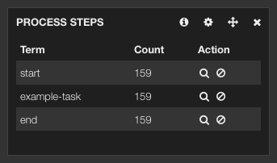

= Business process visibility with ALEK
hilton
v1.0, 2014-03-26
:title: Business process visibility with ALEK
:tags: [activiti,elasticsearch,kibana,logstash]

The Elasticsearch, logstash and Kibana combination (a.k.a. ELK) seems to be popular in devops for system monitoring, but is equally applicable to all time-based data. This article demonstrates using Kibana to provide visibility for a business process implemented using the Activiti Business Process Management (BPM) platform.

This sample application demonstrates generic business process visibility
using the ALEK stack (http://www.activiti.org[Activiti],
http://logstash.net[logstash],
http://www.elasticsearch.org/overview/elasticsearch/[Elasticsearch] and
http://www.elasticsearch.org/overview/kibana/[Kibana]).

Source code: https://github.com/lunatech-labs/activiti-logstash.

This application provides visibility for a trivial business process:

image::../media/2014-03-26-activiti-logstash-elasticsearch-kibana/process.png[Process diagram]

This simple process consists of a single service task that doesn’t
actually do anything. All we want to know is the process state when this
task is activated. Because this process does not include any service
tasks, this is an example of an unattended process that runs like a
batch process.

== How the sample application works

The application consists of a minimal amount of Scala code and
configuration for the following steps.

[arabic]
. The `Main` class is the entry point, which starts the Activiti engine
using an in-memory H2 database and deploys the business process from an
XML definition.
. `Main` then executes the deployed process a few times with random data
in process variables.
. `LoggingEventListener` is an Activiti event listener that logs the
current process variables each time an activity (process node) is
activated.
. `logback.xml` configures http://logback.qos.ch[logback] to write a log
file.
. `logstash.conf` configures logstash to parse the resulting log file
and insert process logging into ElasticSearch.
. Kibana’s default logstash dashboard displays the results.

== Example output

You can use `sbt run` to run the example. The log file output uses
`application` and `process` loggers, and produces the following output.

....
2014-03-24 18:30:54,615 INFO application Main
2014-03-24 18:30:56,935 INFO application Deploy business process
2014-03-24 18:30:57,494 INFO application Execute business processes
2014-03-24 18:30:57,609 INFO process.logging-test:19:1903 execution=1904 number=526 country=BD currency='Solomon Islands Dollar' activity=start
2014-03-24 18:30:57,610 INFO process.logging-test:19:1903 execution=1904 number=526 country=BD currency='Solomon Islands Dollar' activity=example-task
2014-03-24 18:30:57,614 INFO process.logging-test:19:1903 execution=1904 number=526 country=BD currency='Solomon Islands Dollar' activity=end
2014-03-24 18:30:57,732 INFO process.logging-test:19:1903 execution=1911 number=694 country=HN currency='New Taiwan Dollar' activity=start
2014-03-24 18:30:57,732 INFO process.logging-test:19:1903 execution=1911 number=694 country=HN currency='New Taiwan Dollar' activity=example-task
2014-03-24 18:30:57,733 INFO process.logging-test:19:1903 execution=1911 number=694 country=HN currency='New Taiwan Dollar' activity=end
2014-03-24 18:30:57,853 INFO process.logging-test:19:1903 execution=1918 number=951 country=MM currency='Testing Currency Code' activity=start
2014-03-24 18:30:57,854 INFO process.logging-test:19:1903 execution=1918 number=951 country=MM currency='Testing Currency Code' activity=example-task
2014-03-24 18:30:57,854 INFO process.logging-test:19:1903 execution=1918 number=951 country=MM currency='Testing Currency Code' activity=end
2014-03-24 18:30:57,884 INFO application Done
....

The `process` logger category includes the business process definition
ID, which is useful if you have multiple business processes. Each
`process` log message consists of key-value pairs for the process
variables, plus additional `execution` (process execution ID) and
`activity` (process node ID) values.

The logstash configuration ignores all but the `process` log statements,
parses the key-value pairs into `facets' and inserts a `document' into
Elasticsearch for each log statement. For example:

....
{
       "message" => "2014-03-24 18:39:18,083 INFO process.logging-test:20:2003 execution=2011 number=213 country=GD currency='Turkish Lira' activity=example-task",
      "@version" => "1",
    "@timestamp" => "2014-03-24T18:39:18.083+01:00",
          "host" => "flowers",
          "path" => "/Users/pedro/Documents/code/lunatech/activiti-logstash/process.log",
         "level" => "INFO",
        "logger" => "process.logging-test:20:2003",
     "execution" => "2011",
        "number" => "213",
       "country" => "GD",
      "currency" => "Turkish Lira",
      "activity" => "example-task"
}
....

You can then modify Kibana’s default logstash dashboard by adding panels
that show values for the various facets.

link:../media/2014-03-26-activiti-logstash-elasticsearch-kibana/kibana.png[image:../media/2014-03-26-activiti-logstash-elasticsearch-kibana/kibana-small.png[Example Kibana dashboard panels]]

In this example the first panel shows a timeline of log events, grouped
into one-second intervals, a pie chart of currencies and a map of
countries.

As well as using different panels to show different values for a single
facet, such as countries, you can also select a value in Kibana to
filter by a particular value. This means that you can select a process
step by filtering on available values, by selecting the magnifying glass
icon in the actions column in the panel:

Together with selecting a specific time interval, selecting facet values
like this is what makes a Kibana dashboard into an interactive business
report, allowing the experimentation that makes spreadsheets so popular
among business users.

== Conclusion

There’s no rocket science here, just the implementation of a simple
idea: if you log interesting business events in a format that is
convenient to parse using logstash, then all you need is a simple
logstash configuration and Kibana defaults to get a useful dashboard.

Choosing `interesting business events' is the only hard thing in
practice. In a real business application, it is not always obvious to
its developers which data at which time provides valuable visibility for
business users.

However, this is easier when you use a BPM engine to model the business
process. A consequence of this modelling is that that the interesting
business events are explicitly modelled as process steps, so you just
have to log these process steps. For a particular business process, the
interesting `event' might be the start of the process, the end or a
single key step in the process. However, if you can filter reports on
process step identifiers (as in the example above) then it’s simpler to
simply log all process steps and make the selection later.
