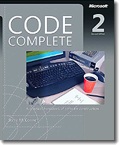

= Lunatech blog retrospective - 2006
hilton
v1.0, 2014-05-28
:title: Lunatech blog retrospective - 2006
:tags: [opinion]

2006 brought another random collection of articles to the Lunatech Blog. Here is a selection of my favourites.

In many ways, commercial Java development back in 2006 wasn’t that
different from how it is today. Not everything is the same though. Back
then, most of us hadn’t thought about moving on from Java to other
programming languages yet, JIRA still didn’t have the complexity or
serious competition that it has today, and http://www.devoxx.com[Devoxx]
was still called Javapolis.

image:../media/2006-06-28-books-software-developers/books-for-developers-envisioninginformation.png[Envisioning
Information]
image:../media/2006-06-28-books-software-developers/books-for-developers-managinghumans.png[Managing
Humans]

== Tips for programmers

https://blog.lunatech.com/posts/2006-04-28-tuples-java[Tuples in Java] was
perhaps the first hint of things to come. In fact, Bart published this
article a month after the Scala 2.0 release. These kinds of Java
techniques are of course less relevant now that we use Scala for our new
development projects, but also remind us that you don’t have to fully
adopt a technology to get some benefit from the good parts.

https://blog.lunatech.com/posts/2006-06-28-books-software-developers[Books for
software developers], on the other hand, looked backwards at great books
that provide valuable inspiration in both technical and non-technical
skills. All of these books are still worth reading, with only _Effective
Java_ being less relevant than it was eight years ago.

== Tips for writers

https://blog.lunatech.com/posts/2006-09-11-how-use-bullet-lists[How to use
bullet lists] was my first attempt to show people how to improve their
writing by making syntax more consistent. It seems logical from a
programmer’s perspective, which is why it was satisfying to publish, but
this kind of article is probably entirely futile: I doubt that anyone
ever read this and put it into practice. This is a shame, because so
much software development documentation is hard to read and could easily
be improved. Perhaps this is because programmers prefer arguments about
white-space than about words.

https://blog.lunatech.com/posts/2006-12-04-wiki-my-word-processor[Wiki is my
word-processor] is the result of too much experience of how
word-processors are more of a problem than a solution in software
development. Word-processors gave technical writers too many things
(mostly formatting) to fiddle to have time to write readable text. This
article describes how the solution for software project documentation
had turned out to be a wiki, not a better word-processor.

== Event of the year

https://blog.lunatech.com/posts/2006-12-22-javapolis-2006[JavaPolis 2006]
rounded off the year with an excellent developer conference that turned
out to be an excellent opportunity to network and connect with other
developers, and to drink beer, of course. The talks were good but the
conversations were better, which was a realisation that would generate
even more opportunity in the year to come.
