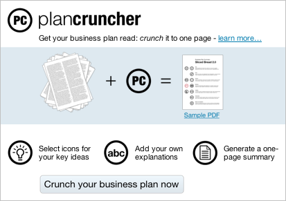

= Lunatech blog retrospective - 2010
hilton
v1.0, 2014-06-10
:title: Blog retrospective 2010
:tags: [blog]

2010 was the year we really started getting into the Play Framework, 
    and stopped having to battle JSF. This was a Good Thing.

Play gave us new topics to present and write about, as we explored the
difference it made, compared to Java EE. Meanwhile, we also worked on
and wrote about business topics.

== Technology

https://blog.lunatech.com/posts/2010-06-14-how-demo-play-framework-live-coding-script[How
to demo the Play framework - live coding script] is a variation on the
tutorial style that gives explicit step-by-step instructions for
creating a new application and using basic features. This could also
have been called `The Play Framework kata', because it’s both a
demonstration that highlights how easy this is with Play, and practice
for something that you do a lot. That second point is interesting
because it was one of the more subtle benefits of switching from JSF to
Play.

With a JSF application, creating a new application without cruft was a
non-trivial task, which usually ended up starting with a code generator
and cleaning up afterwards, or copying an existing project and hoping
that you didn’t end up with things that shouldn’t be there. I once spent
some time working out how to create a minimal Seam 2 application with no
unnecessary files and no requirement for a database: this wasn’t easy.
With Play, on the other hand, creating a new application is so fast that
it’s a useful technique for trying out a single line of code that seems
to be broken in a complex application. And if you practise this, it’s
even faster.

https://blog.lunatech.com/posts/2010-03-15-play-framework-usability[Play
framework usability], on the other hand, is a think-piece that later
became part of a presentation that I gave several times. Blog posts like
this serve a different purpose: instead of being focused helping a
smart-but-busy reader complete a task, which is how you write a
tutorial, this kind of article is an experiment in telling a story. If
the story is interesting, it will be retold, in different ways. This
wouldn’t have been the first time that a conversation at a conference
later becomes a blog post, followed by presentations, applying new ideas
on projects and, ultimately, even a book.

== Business

https://blog.lunatech.com/posts/2010-08-05-how-get-job-lunatech[How to get a
job at Lunatech] and
https://blog.lunatech.com/posts/2010-08-16-how-get-job-interview-lunatech[How
to get a job interview at Lunatech] combined two different angles in a
pair of blog posts about recruitment, from our side of the table. The
first offered our perspective on why giving your CV to a recruiter is a
bad idea and the second gives job seekers specific advice on how to get
a meeting (i.e. a job interview) with a company like ours.

https://blog.lunatech.com/posts/2010-03-03-plan-cruncher[Plan Cruncher: shorter
business plans] applies similar ideas to the challenge of getting a
different kind of meeting: how entrepreneurs can pitch their start-up to
potential investors. Plan Cruncher is an idea I had and a concept that I
developed in this article as a result of reading bad business plans from
otherwise interesting start-ups, and from sitting in on pitch meetings
whose main purpose was to discover basic information that was missing
from the business plan.

https://blog.lunatech.com/posts/2010-03-29-plan-cruncher-play-production[Plan
Cruncher - Play! in production] - was the inevitable software
implementation that followed soon after. We built it as a Play Framework
demonstration application, but it turned out to be a popular application
and still gets plenty of traffic years later. It turns out that writing
a business plan is something that benefits from simplification and
guidance. As with a job interview, sometimes its better to skip the
game-playing and just get to the point.

== Events

https://blog.lunatech.com/posts/2010-11-23-10-devoxx-tips[10 Devoxx tips]
rounded off the year with some tips for next year, following the main
developer event of the year in Antwerp, as usual. A conference like
Devoxx remains a unique opportunity to learn a lot in a few days and
meet people who enable collaborations that will allow you to continue to
benefit in the future. Of the ten tips, the first is the most important:
show up. Or, as Nicolas Martignole said in the _Les Cast Codeurs
Podcast_, `I encourage people to think about whether they should work
for a different company if they can’t go to Devoxx next time'.
