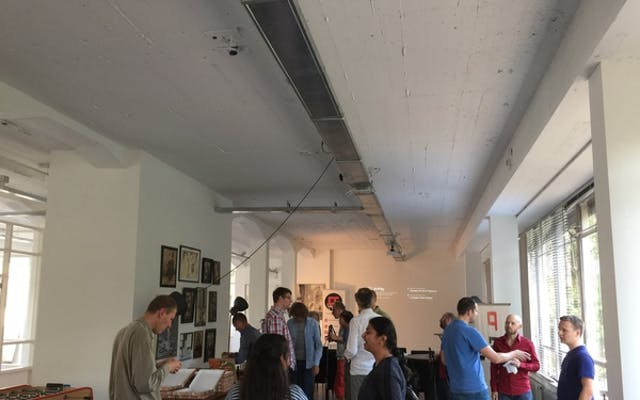

= Functional Rotterdam - 5th Edition
VijayKiran
v1.0, 2016-01-04
:title: Functional Rotterdam - 5th Edition
:tags: [event]

Every first Tuesday of the month, at Lunatech we are organize a meetup focussed on Functional Programming. Tomorrow is the 5th edition of the event. You can join the fun by going to our http://www.meetup.com/Functional-Rotterdam/[meetup page].

This is an informal event where we share our experience of using functional programming in our projects and learn from others who work in different languages. In the past we had presentations about Scala, Spark, Elm, Frege apart from a coding dojo at the last event. 

Do join us by RSVPing on the http://www.meetup.com/Functional-Rotterdam/[meetup page]!

