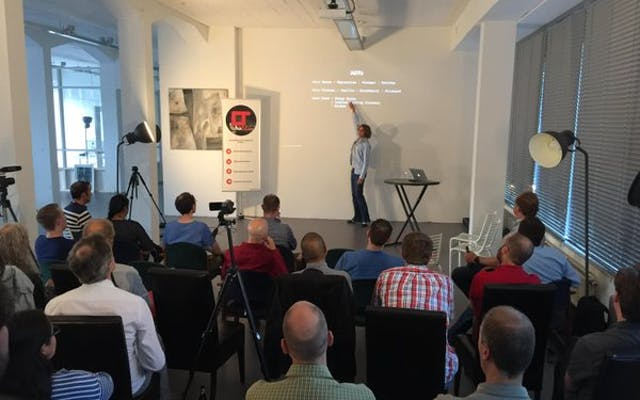

= Functional Rotterdam -10-
Antoine Laffez
v1.0, 2016-06-20
:title: Functional Rotterdam -10-
:tags: [fp,event]

Just a reminder, this Thursday. the 23rd of June, Lunatech is hosting the monthly Functional Rotterdam even

At *Lunatech Office Baan 74, Rotterdam*

Meetup focusing on Software development with Functional Programming Techniques using Scala, Clojure, Haskell etc...

18:30 - 19:00 Doors Open/Snacks

19:00 - 20:00 Architecture, Front End and a Bit of Front-End Architecture - *Jan Hein Hoogstad*

[quote, Alan Kay]
Lisp isn’t a language, it’s a building material.

 Architecture teaches us that there is strong connection between the history of building materials and the actual structures that are built. Introducing philosophers Walter Benjamin and Peter Sloterdijk’s thoughts on the influence of materials on the practice and theory of building, I will draw a parallel between historical buildings (such as the Sagrada Família and the Chrysler Building) and the way we build front-end applications. We will discuss how using different languages and techniques leads to different artifacts, and explore specific patterns and principles from back-end development that we can use to build better architected front-end software.

 After my talk, attendees will know: why and how front-end structures become increasingly complex, what software designers can take from the history of architecture, and a set of principles from back-end and distributed architecture to introduce into front-end architecture 

20:00 - 21:00  Scala Days - Recap - *Bart Schuller*

Lunatech went to *Scala Days* last week In Berlin. Bart Schuller will give a recap of interesting things/talks happened there for us who couldn't attend. See you there !

