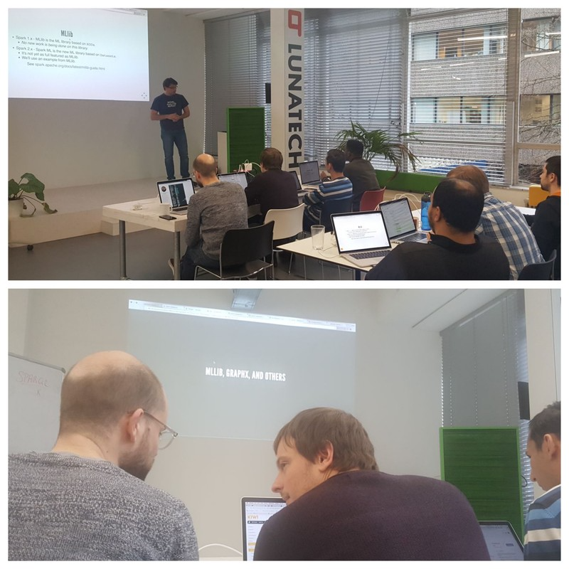

= Apache Spark for Scala Training - 2nd Session at Lunatech
Antoine Laffez
v1.0, 2018-02-05
:title: Apache Spark for Scala Training - 2nd Session at Lunatech
:tags: [event,scala,spark]

After https://www.linkedin.com/in/xavier-tordoir-ba95b673/[Xavier Tordoir] from http://kensu.io[Kensu], https://www.linkedin.com/in/andypetrella/[Andy Petrella] joined our offices to do a second “Lightbend Spark for scala-Professional course”. As introduced 2 weeks ago this course allows Full Stack Developers and DevOps to dive into the world of modern Data Analytics.

Some of the participants decided to take the dive. https://www.linkedin.com/in/mariadominguezroman/[Maria Dominguez] and https://www.linkedin.com/in/gopurohit/[Sandeep Purohit] both Software engineer at Lunatech followed this course with particular attention. Indeed Maria and Sandeep want to be Lightbend certified trainer as well. Maria explains why she decided to do this:

[quote, Maria Dominguez, Why did you choose to be an Apache Spark trainer?]
Spark is a very nice engine for big data processing that I had the opportunity to use in a previous Lunatech project. I could experiment with the Machine Learning API and train and use models to make predictions on real time data. New useful features have been added to Spark since then, which make it even more attractive for use cases in the big data world. Becoming a trainer in such a technology is a great idea because it will allow me to easily bring its contents to more people in a more efficient way. 

[quote, Maria Dominguez, What are the benefits to being a Lightbend certified trainer for yourself and your current enterprise?]
Having a Lightbend certification is a guarantee of sharing best practices for developing Spark applications with Scala. When a company like Lightbend, which counts with Spark as part of its Fast Data Platform, certifies that you can be one of the trainers, that means that you are fully qualified to show Spark’s usage and advantages to others. That translates directly into a benefit for Lunatech, as having certified trainers as part of the company will improve the expertise within the company, as well as scheduling trainings for the employees can be done directly. 

[quote, Maria Dominguez, Do you see any possibilities or exciting projects that you can do with Apache Spark?]
Streaming data processing, enrichment, analysis, machine learning… there is indeed a broad umbrella of use cases for Spark, so yes, I see a lot of opportunities to use Spark. Considering the evolution towards big and fast data, I believe there will arise even more projects to be implemented using Apache Spark. 

If you are interested in these high-skilled upgrade courses you can contact: https://www.linkedin.com/in/xavier-tordoir-ba95b673/[Xavier Tordoir] or https://www.linkedin.com/in/andypetrella/[Andy Petrella] CEO’s and Founders at Kensu. 

We remind you that Lunatech regularly organises training for its employees. We have offices in Rotterdam, Amsterdam and the Paris region. If you want to be part in the Lunatech adventure do not hesitate to contact us for more information mailto:info@lunatech.com[info@lunatech.com] and mailto:employment@lunatech.com[employment@lunatech.com].