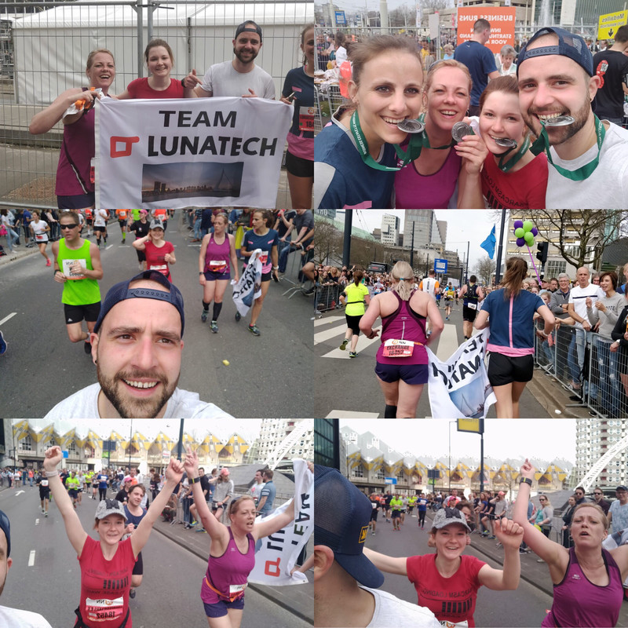

= NN Rotterdam Marathon 2018
Antoine Laffez
v1.0, 2018-04-16
:title: NN Rotterdam Marathon 2018
:tags: [event]

The 2018 Edition of the NN Rotterdam Marathon took place on the 8th of April under sunny and warm weather. The NN Marathon is the biggest, fastest, and best marathon in the Netherlands. 13.000 participants, more than 950.000 spectators and 1 Lunatech team for this 38th edition.

Our business relay team consisted of Yentl, our Rotterdam office manager, Nataliia and Bogdan, Software Developers, and Maaike, our corporate recruiter. Supported by their colleagues, a huge crowd, and an incredible atmosphere, they finished with a time of 4:05 min which allowed them to rank on the 50th place in their category.

The male winner, Kenneth Kipkemoi, finished in 2 hours and 5 minutes and Visiline Jepkesho dominated the female category with a time of 2 hours and 23 minutes. Our enthusiastic participants are very eager to participate next year!We are very proud that you had given the best you could and that you finished this competition under the heat. 2019 Edition we will conquer!