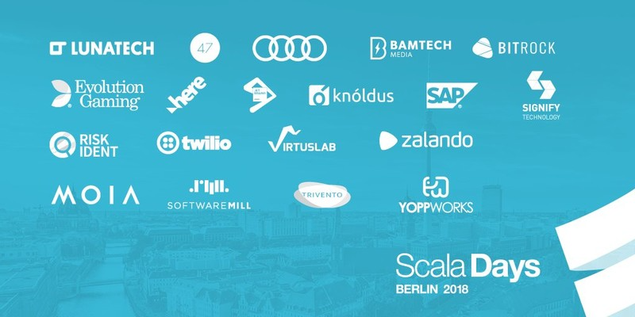

= Lunatech Platinum Sponsor Scala Days 2018 Berlin
Antoine Laffez
v1.0, 2018-05-10
:title: Lunatech Platinum Sponsor Scala Days 2018 Berlin
:tags: [event,scala]

In a few days the most well known Scala conference in Europe will be held: https://eu.scaladays.org/[Scala Days]. Berlin will be hosting the event in the https://convention.visitberlin.de/en/meetingguideberlin/locations/kosmos-eventlocation[Kosmos center]. People from all over the world will join for this highlights Scala event.

This year again, an absolutely breathtaking program with the presence of Martin Odersky, Adriaan Moors, Miles Sabin and many more. The greatest Scala speakers will discuss topics such as Akka, Lagom, Apache Spark and Kafka. Tuesday 15th from 18:00-20:00 Welcome Reception will be sponsored by Lunatech.

Besides attending presentation on stage, there is a possibility to meet people on the booths of prestigious sponsors such as Lightbend, Audi, Jet Brains, and of course Lunatech. Who will be *Platinum sponsor for the 3rd year in a row*. Impressive logistics has been put in place to allow more than 40 Lunatech-developers, from the Netherlands and France, to go to Berlin and take part of this event. Because at Lunatech we believe that knowledge and personal growth are very important, it's part of our company-DNA.

In a demo at our booth, Willem Jan-Glerum will show us a working IoT pipeline with real hardware. Multiple Raspberry Pi Zero's will be collecting sensor data around the booth. These real-time measurements will be processed with Scala services running on a local Kubernetes cluster. Come check it out at the Lunatech booth to get to know more!

Come and chat with us and of course leave with goodies and gifts. To pay tribute to the beautiful city of Berlin we even rented a beer tap (with moderation and after the conference). This event is already sold-out but we are sponsor of many other conferences. So if you do not get the chance to meet us at the Scala Days, we are happy to see you on another event! Stay tuned ;) https://twitter.com/LunatechLabs[@LunatechLabs] on Twitter.

