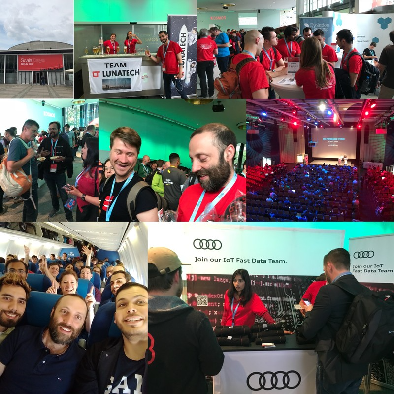
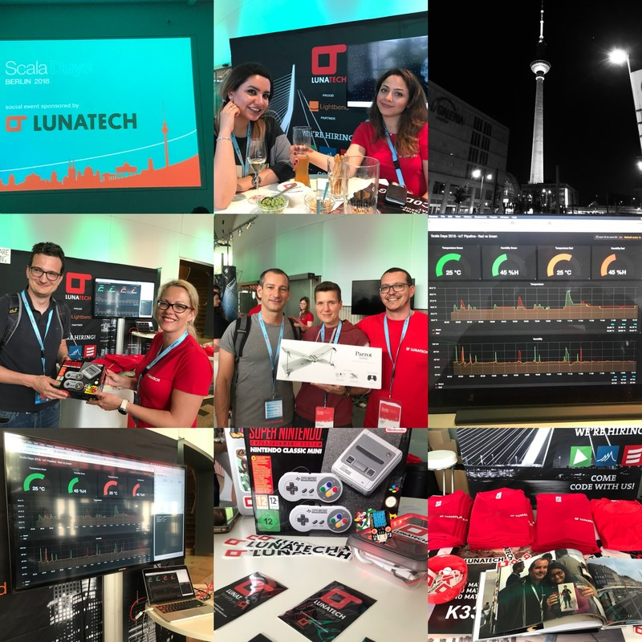

= Scala Days 2018 review
Antoine Laffez
v1.0, 2018-05-25
:title: Scala Days 2018 review
:tags: [event,scala]

== 900 people! 

This is the memorable amount of these https://eu.scaladays.org/[Scala Days] Berlin. The European edition of Scala Days was held from May 14th to 17th at the https://www.kosmos-berlin.de/[Kosmos center]. Located 20 minutes walk from the famous Alexanderplatz, this former cinema became the center of the European Scala community for a few days. Organised by https://www.linkedin.com/company/heise-zeitschriften-verlag/[Heise Developer], https://www.linkedin.com/company/dpunkt.verlag/[Dpunkt] and http://lighbend.com[Lightbend], this event was able to bring together the greatest International speakers. Note that the event was totally sold out 1 month before the start.

The first day was reserved for the Partner Executive Summit organised by Lightbend. The main orientations and novelties Lightbend in Akka, Lagom, Play and of course Scala were presented to a panel of partners, mostly composed of CEO's and CTO's. The meeting has followed by a dozen presentations on various topics ranging from case studies to the latest releases.

In the early afternoon the stands rose as they were being built, and the first arrivals were lining up. The expected highlight of the day was at 18.00H with https://www.linkedin.com/in/martin-odersky-1b039613/[Martin Odersky]'s keynote that would reveal some surprises:

1. Fusion of functional and object oriented programming is the most promising way to move forward. The goal is to become an opinionated language promoting idioms which are proven to work well. Scala is not just a better Java or a worse Haskell, but a language with its own vision. Despite many differences Scala 2 and Scala 3 are fundamentally the same language.

2. Scala 3 is around the corner. Dotty compiler will eventually become Scala 3. The language will be simplified and built on strong theoretical foundations. Concretely, the focus is on consistency, safety, ergonomics and performance. The plan is to release Scala 3 in 2020!

3. Tooling is essential especially during migration. TASTY, a new serialization format for Scala programs, is here to help us. Most tooling will be built around TASTY. It should solve binary compatibility problem and relieve library maintainers form burden of cross publishing artifacts for different Scala versions and even target platforms (JVM, JS, Native).

4. Migration to Scala 3 is to be taken seriously. For smooth migration experience, changes will be introduced gradually with each subsequent Scala language release. The most tedious changes will be handled by rewriting tools which will transform source code automatically.

Check this out for more technical insight of the https://www.scala-lang.org/blog/2018/04/19/scala-3.html[Keynote]!

Lunatech sponsored the communal event the first evening with nearly 40 of our employees joining the party. The organisation at Kosmos center was very efficient with an army of waiters so that the 900 people present were able to eat and drink without problems (very few organisations could have done better)

On the 2nd day we had a demo on our stand: A working IoT pipeline with real hardware. Multiple Raspberry Pi Zero's was collecting sensor data around the booth. These real-time measurements were processed with Scala services running on a local Kubernetes cluster. Thanks Willem Jan for that.

Apart from Lunatech, some prestigious sponsors such as Audi (and their recognisable t-shirts) were also present, as part of the human development of their IOT system.

While the conferences took place in different rooms (a technical blog will enlighten you on the subject soon) the Lunateam answered the questions of many developers. Swags, t-shirts and gifts were distributed. Our winner of the day, randomly selected among the new subscribers of our newsletter left with a Mini Super-Nes Nintendo.

The evening festivities continued with the installation of a beer stand. By modesty we will not disclose the amount of beer drunk that evening ;)

On the last day we gave away 2 drones in a super raffle which took place on the main stage, one of the winners was https://www.linkedin.com/in/petrabierleutgeb/[Petra Bierleutgeb].

We would like to thank all of the organizers and attendees for their enthusiasm in the Scala community. We are looking forward to experiencing these awesome moments again next year. A Special thanks to https://www.linkedin.com/in/tarik-el-badaoui-25803253/[Tarik el Badaoui], Ellrik Freienberg and Christian Reifert.

== Some numbers…

*600* stickers, *400* anti-hackers cam-covers, *130* T-shirts, *39* Lunatech Employees, *2* drones, *1* Platinum Sponsorship and a lot, a lot of fun!

== and

If you want to be a part of our team next year for this big event, you can have a look at our job offers on LinkedIn / Lunatech.

