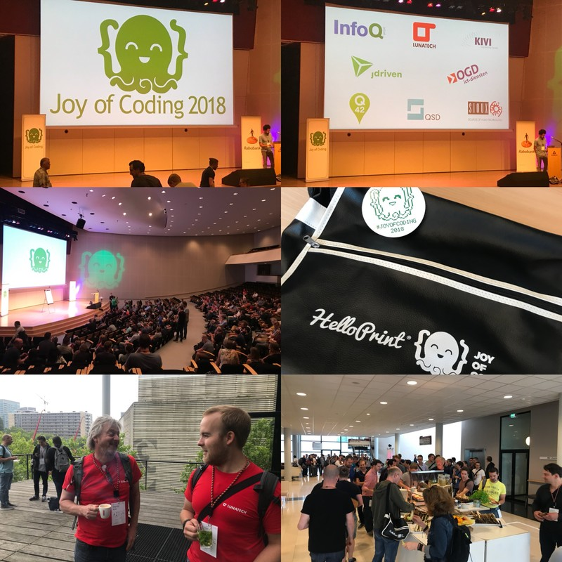

= A journey into Joy of Coding  2018
Antoine Laffez
v1.0, 2018-06-15
:title: A journey into Joy of Coding  2018
:tags: [event]

On the 8th of June, the "Joy of Coding conference” was held in De Doelen, Rotterdam. The format of this conference was completely different from conventional IT conferences. Unlike most of her sisters, Joy of Coding is not dedicated to a programming language or very precise topics such as JVM, Big-data, Cloud etc... This moment is 100% dedicated to developers. 250 of them had the chance to attend.

An almost poetic introduction by John Skeet, alternating between art and songs, was followed by talks that were all more exciting than the previous (complete schedule http://joyofcoding.org/2018/schedule.html[here]). Some talks are already on-line like "https://monospacedmonologues.com/2018/06/teaching-a-machine-to-code/[Teaching a Machine to Code]" by https://twitter.com/SamirTalwar[Samir Talwar]. I really hope that videos will be published on the website or links on the https://twitter.com/JoyOfCoding?lang=en[J.O.C official Twitter].

The leitmotiv of this conference is the pleasure, a journey into a magical and digital garden: an area of discovery, of sharing and for sure, of coding. There are no booths, no (physical) sponsors present. Only many original goodies! All the talks were presented in the magnificent main room of De Doelen. Rotterdam now has its' reference conference: a deep and fascinating dive into the world of code. J.O.C demonstrates that programming is not only a matter of 1 and 0 but is also about joy, pleasure and motivation of coding. 

As an attendee to many conferences, I can say J.O.C is an experience you have once in a lifetime. Even the http://joyofcoding.org[website] designed by Peter Hilton was original and so far off from commercial standards (have a look please it's really worth it). A big thanks to 010 developers and in particular to Peter Hilton, Barre Dijkstra, Francisco Canedo and Alex Kuiper. 50% technical + 50% fun = 100% highly recommended. The ticket's price was also very low with a special student offer.

Lunatech was happy to be a tiny part of this breathtaking experience (a small delegation of 4 developers made the short trip from our offices). And now, there is an octopus who is looking at you and wondering if you will be lucky enough, one day, to be part of this incredible journey.