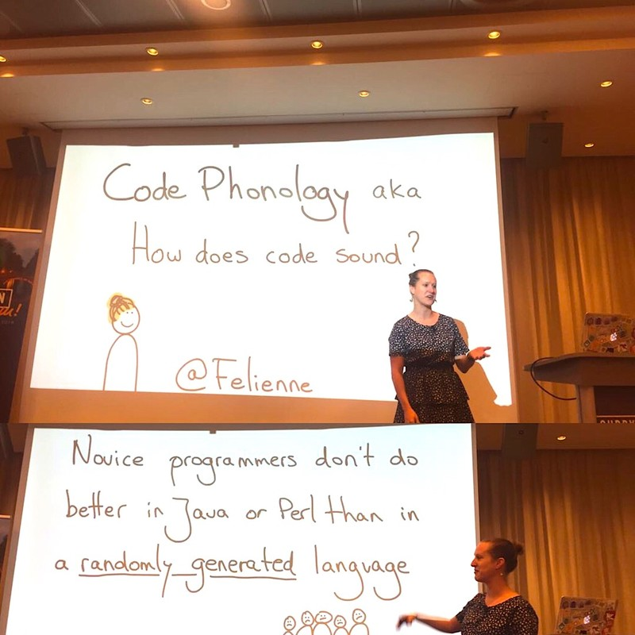
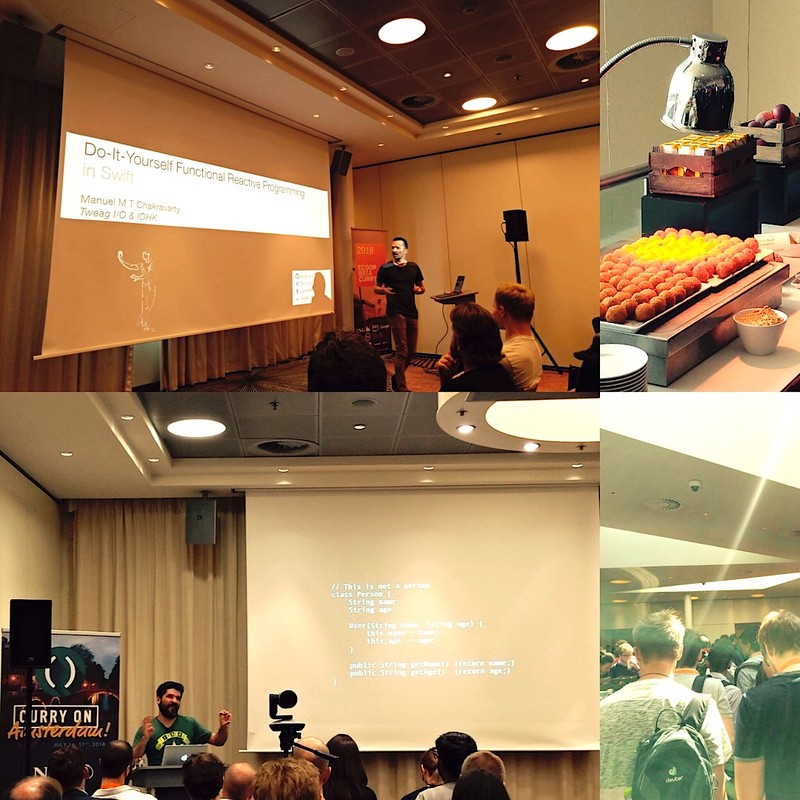

= Curry on Amsterdam 2018
LeonorLunatech
v1.0, 2018-07-19
:title: Curry on Amsterdam 2018
:tags: [event]

Curry On Amsterdam 2018 was a pretty busy venue! With more than 40 speakers choosing talks to attend was hard. This conference series is a meeting point between academy and industry, and indeed the discussions where interesting and involving.

The conference opened with the presentation of https://webassembly.org/[Web Assembly] by JanVitek and Heather Miller. These guys are trying to make C++ compile to a new back end, which looks much more the JavaScript one. Although in its early age, this project has strong foundations: the software has a https://github.com/WebAssembly/spec/blob/master/papers/pldi2017.pdf[formal specification] that comes with a proof of soundness (i.e., the specification does not leave any undefined behaviour).

The Curry On conference has also special talks called Chess Timer. In these talks the time is split between audience and speaker: Jesse Alama did well in handling questions and sharing how he managed to make regression integration testing of multiple API versions easier by baking a small domain specific language in https://en.wikipedia.org/wiki/Racket_%2528programming_language%2529[Rackett].

In the late morning Sunjay Cauligi presented https://ctford.github.io/it-aint-necessarily-so/[FaCT], the C-based DSL he is constructing to deal with a delicate issue in cryptography: constant time programming. When the information you encrypt is very precious, attackers care about any details that may help them out decrypt your data: the time your functions take to run may give away the algorithm you are using to encrypt data. FaCT propose an approach to fix this for C code while leaving the code maintainable.

John Mumm did the incredible: he managed to explain monotonic join semi-lattices after lunch keeping the audience excited about the topic. In short, you can actually use https://github.com/jtfmumm/curryon2018[mathematical concepts] from order theory to let multiple nodes maintain the same mutable piece of data, and let the nodes asynchronously converge to the latest value of the muted data (given that you can allow yourself to present the user with stale data in the meanwhile).

Ron Pressler gave a bit of history of computation, logic and algebra. You can check out https://pron.github.io/posts/computation-logic-algebra-pt1[his book].

Chris Ford showed how his https://ctford.github.io/it-aint-necessarily-so/[ClojuScript app] can generate sound close to our expectations. He also talked about Mezzo, an Haskell music library written with dependent-types, and about how it refused to compile Chopin's music.

An interesting development is the merging of Rackett and Haskell: Alexis King is working on https://docs.racket-lang.org/hackett/index.html[Hackett], a Lisp with the Haskell type system or Haskell with Lisp macros. It is not ready yet, but sounds promising!

At the end of the first day, linear types are making their appearance in Haskell: Simon Peyton Jones closed the day by going through https://arxiv.org/abs/1710.09756[their proposed extension] of the GHC compiler with the polymorphic "lollipop" arrow. Linear types enforce that the arguments of a function are evaluated once and once only. This is very useful for resource management, where IO channels needs to be opened once and closed to not create memory leaks.

The second day opens with sound: the lively http://www.felienne.com/[Felienne Hermans] shares her attempts to make people write code in order to read it as a poem. Apparently the main challenge was making people agree on translating symbol to common words (is == spelled "equals", "is equal to", "equivalent" or something else?). By the way, apparently some study found that Java and Perl syntax is as difficult to grasp as the one of a randomly generated language!

After such discoveries, a talk on Akka streams. Arnout Engelen explained the basic attributes of streams such as being non-blocking, asynchronous and capable to handle back pressure.

Manu Sridharan gave some hints on how Uber keeps mobile apps performance up. Reactive programming, Continuous Integration and a research team collaborating with devs full-time are keeping the usability of Uber apps at the top even if they work on pretty old hardware.

Again after lunch a surprise: Dave Thomas shocked everybody by delivering a talk on the lines "Excel tables are the simplest tool ever". Also hitting on K8S, Docker & co. by saying that they lack advanced security measures. A very provocatory and inspirational talk. Most of the speechless people became themselves conservative when hearing Nick Mitchell talk: Serverless Computing with Functions. Running lambdas in the cloud looks cool, but the mechanism has many open issues:

it is not possible to maintain a state for the function to operate upon, containerisation and network latency can make the function waste precious seconds, etc...

After a short break Tyler McMullen gave another Chess Talk, in which the secrets of containerisation were explained. Apparently WebAssembly has the potential of making Docker redundant!

After something very functional happened: Michael Arntzenius presented his functional query language https://github.com/rntz/datafun[Datafun]. Do you want to query a database? Use a set comprehension! Do you want to reuse a query that you use often and that changes only slightly? Use an higher order function!

It is not ready yet, but very promising.

The conference closed with Steve Francia who read a fascinating report regarding the evolution of the Go language. Apparently we are getting into Go 2.0 through a long series of minor releases. For the Go enthusiasts that are not updated yet: reproducible builds will be available from this August!

And that is all from an interesting conference. Next Curry On will be in London!

P.S. Curry On Amsterdam was very interesting. It needs to be said that the management of the event was approximate: e.g., the registration queues made the event start late, the lunch instructions were not precise, speakers had technical problems such screens and microphones not working properly. Still the quality of the speakers and of the contents made these defects appear unimportant.

