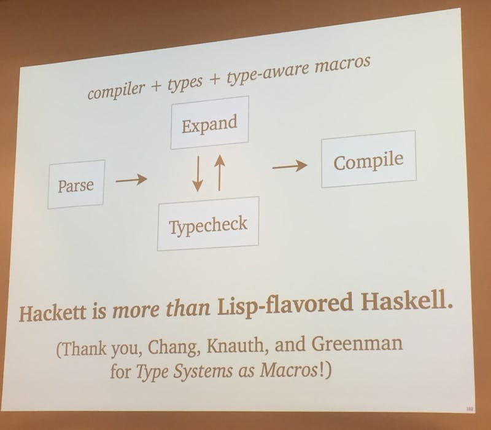
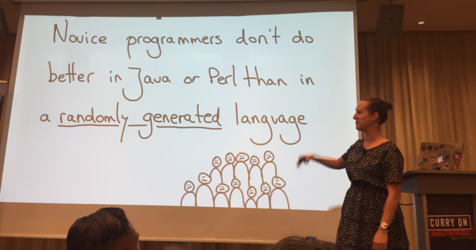

= Curry on 2018 impressions
Andrea Giugliano
v1.0, 2018-07-23
:title: Curry on 2018 impressions
:tags: [event]

Once again https://lunatech.com/[Lunatech] gave me the opportunity to attending a great conference: http://www.curry-on.org/2018/[Curry On], which took place in Amsterdam from the 16th to the 17th of July. What’s so special about this conference is that it successfully brings industry and academia together, which is reflected in the variety of speakers and topics of the talks.

In this article I intend to breakdown my favourite talks. The thing is, the quality of the talks were really good! Unfortunately, for the sake of the length of this article, I can only pick a few.

The opening Keynote was given by Ben Titzer and Andreas Rooberg titled “https://github.com/WebAssembly/spec/blob/master/papers/pldi2017.pdf[WebAssembly, past, present and future]”. WebAssembly is a carefully specified and designed web standard aimed at providing fast, safe and portable low level code on the web. WebAssembly is strongly shadowing JavaScript. The keynote ended with a final remark: "WebAssembly is neither Web, nor Assembly!”.

Now to the talks.

https://www.linkedin.com/in/milessabin/[Miles Sabin] presented “Adding kind-polymorphism to the Scala programming language”. What is kind-polymorphism? It’s a form of parametric polymorphism, the ability of abstracting over type constructors of any arity. Miles demonstrated how this kind of polymorphism could greatly simplify programming in Scala, if supported natively. He managed to catch the attention of https://www.linkedin.com/in/martin-odersky-1b039613/[Martin Odersky] who announced that kind-polymorphism is currently being implemented in Dotty.

In “Constant-time programming with FaCT”, Sunjay Cauligi presented how difficult it is to write secure code that does not leak secret information. Even if the programmers manage to achieve this, the compiler can optimise the code and outsmart the developers. So, the current main strategy is to write very non-readable low level code using the C language. At this point, Sunjay presented https://cseweb.ucsd.edu/~dstefan/pubs/cauligi:2017:fact.pdf[Fact] to the rescue. "With FaCT, developers write crypto code using standard, high-level language constructs; FaCT, in turn, compiles such high-level code into constant-time assembly.” Fact is not a standalone language and is being embedded into other languages such as Python and Haskell and WebAssembly.

And now onto “Hackett: a metaprogrammable Haskell” by Alexis King. What if we could have the power of a pure and functional programming language, with a strong type system, like Haskell, combined with the Racket macro system? The result of this merge is called Hackett. "Hackett is Haskell implement in Racket". It is still in development but, with the recent attempts at solving the problem of interleaving macro-expansion with type checking, the future of Hackett sounds promising. Maybe more on this in the next Curry On? Hope so!

The second day of Curry On started with a keynote by https://www.linkedin.com/in/felienne/[Felienne Hermans] with the curious title “How does code sound?”. She explained that, when initially introduced to programming, people don’t perform any better in a language like Java or Perl compared to a bogus randomly generated language. Amazing right? Turns out that teaching a code phonology, agreeing on a way of how a programming language should be read, can improve by a lot the ability of learning a language. How to read a variable assignment “val A = 1"? A is 1? A equals 1? How to read a loop? Each programming language could easily define it’s own phonology.

https://www.linkedin.com/in/tylermcmullen/[Tyler McMullen] brought in a very interesting topic “Isolation without containers”. He navigated through the different ways software fault isolation is currently achieved using processors, containers and VM’s, to then introduce how WebAssembly can be a solution for isolation, without the overhead that the previous bring in. Curry On is introducing a new concept of talks, called chess-timer talks, where 20 minutes are for solo speaking and another 20 minutes are for discussion and the whole audience is invited to participate. Unfortunately, the 20 solo speaking minutes where not enough for Tyler to finish his talk.

For more insights about this conference your best bet is to attend the next one. It will be held in London in 2019. 

Happy currying! 
