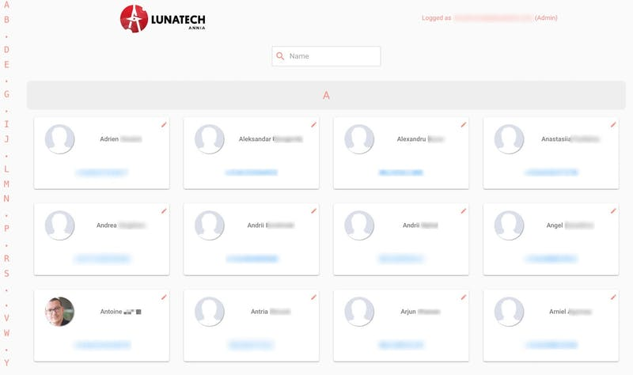
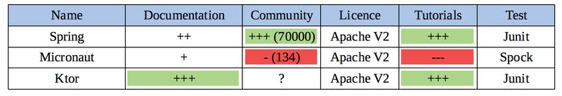
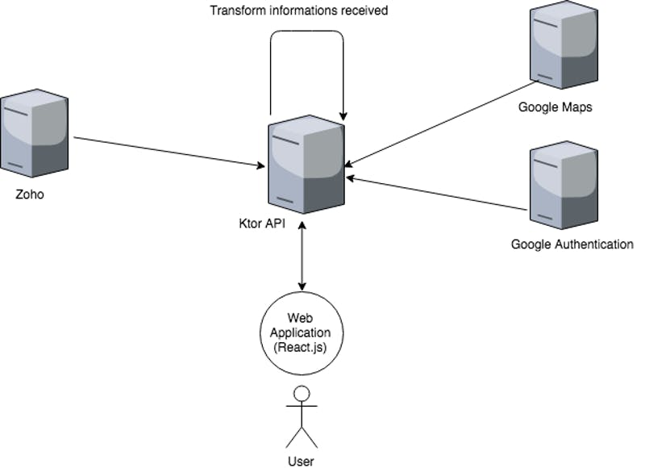
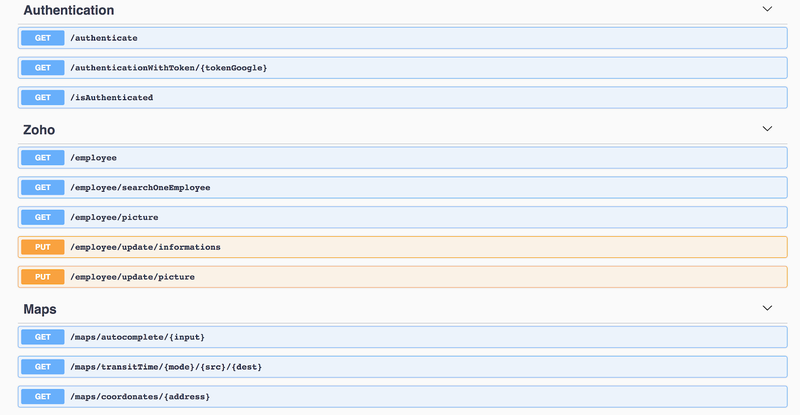
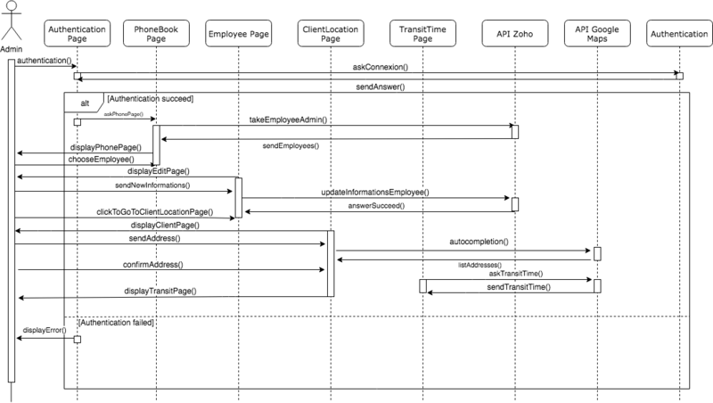
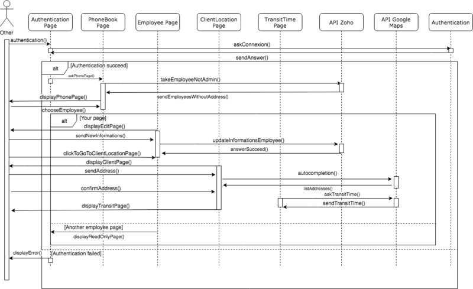

= A Journey Into Annia's Project!
VincentBrule
v1.0, 2018-09-06
:title: A Journey Into Annia's Project!
:tags: [ktor,kotlin]

Hi! In this article, we will present an internal project called Annia. We will start by presenting the design and goals of Annia. In addition, we will explain technicals choices to resolve these purposes.

== Introduction

For my internship at Lunatech Rotterdam, my assigned task was to design an internal project called Annia. The project has two purposes. First, Annia provides a phonebook for all Lunatech employees _(fig.1)_. Second, Annia offers a quick solution to see the commute time between the employee’s home and a customer’s office. In fact, it is an issue that appears each time Lunatech has a new client. The company tries to optimize the travel time of each collaborator. In next part, we will describe how the application is designed and how Annia solve each problem.

_Figure 1: Phonebook feature_

== Technologies used in Annia

Annia is composed of two parts : a backend that exposes a REST API built with Kotlin and a web application designed with React.js.

For the backend, we chose https://kotlinlang.org/docs/tutorials[Kotlin], a new and very promising language. Historically, Lunatech favors Java and Scala for projects. For that project, it was decided to experiment with Kotlin. In addition of Kotlin, we needed a framework to adapt it on the backend. I had the choice between three differents frameworks. As you can see, in the figure 2, we reduce the choice between Spring, Micronaut and Ktor. Micronaut was not chosen because it has a very small community and no documentation so very hard for me to learn how to use it. Ktor and Spring seems good but I prefer chose Ktor because it’s fully written in Kotlin and I think Ktor will become really good in the coming years.

_Figure 2: Comparison between Spring, Micronaut and Ktor_

Indeed, JetBrains support make the community growing each day as I saw on the Kotlin Slack (channel ktor).

For the frontend, we had the choice between Vue.js, Angular.js and React.js. Angular.js was put aside because I’ve already done a personal project using it, and I was eager to discover a new framework. Between Vue.js and React.js, the second was chosen. This decision was based on many recommendations, and the fact is that I was really not disappointed! Maybe, my next project will be in Vue.js to explore again a new way of thinking front application. We will have a look how the backend was built.

== Global organisation of Annia

_Figure 3: Global Architecture_

The diagram above shows the general structure of Annia. The application interfaces with Zoho and to Google Maps by their APIs and we transform informations received for our use cases. Annia exposes 3 routes to interact with these APIs. First, a route to authenticate yourself through Google Authentication (only Lunatech employee are allowed). Another routes was set to interact with Zoho. You need to be authenticated to access all Zoho routes. You can interact with Zoho to retrieve all employees, to pick up one, or to update employee informations. Finally, we have a route pack to interact with Google Maps API. No authentication is needed to access these routes. You can choose a transit between two locations while specifying mode transport. It’s also possible to autofill an address and finally  transform it by its tuple (latitude, longitude). As you can see in the figure 4, a https://annia.lunatech.com/doc/[swagger documentation] exposes all routes availables for Annia and explain each one better than text above!

_Figure 4 : Annia swagger documentation_

The backend was not really complicated because we do not have a database. All the data are in Zoho so we transform informations to adapt it for our user cases. They are two users role, admin and regular user, they will be explain thereafter (fig 8 and 9). Let’s switch to the next part, we will explain first steps with Ktor and Kotlin.

== Ktor and Kotlin in practice

When I start using Ktor, first impression given is a lack of documentation and some annoying bugs. However, after some days, the framework is handy. Many features were made to simplify development and tests. Moreover, you can count on a vibrant community to help you, Ktor’s developers are easily reachable on Slack in https://kotlinlang.slack.com/["#ktor public channel”].

In addition, Kotlin is a very good language when it comes to solve the null pointer exception in a smart way. Indeed (fig 5), in Java you need to check null very often to avoid the NullPointerException.  We defined two variables. Name1 is String. This variable can’t be `` `null`. Name2 is String?`` so this variable can be `null` In first print, we are sure that name1 will not be null, so we can call it directly. In the second print, `name2` can be `null`, so we use the Elvis operator `?:`. Basically,  the operator will take the right-value if something is null on the left-value, otherwise it will return the left-value. For the second print: The ? between name2 and length allow to check if the variable is not `null`. e.g `if (name2 != null) name2.length else “null has no length”`.

In last code line, that operation will not be possible and the IDE will show you an error since you tried to access length of a variable who can be null so you have to use the null safety operator? to avoid NullPointerException.

[source,kotlin]
----
val name1: String = "Vincent"
var name2: String? = null

println("$name1 has length : ${name1.length}")
println("${name2 ?: "Null has no name"}  ${name2?.length ?: "null has no length"}")

val tailleName2 = name2.length / /Not possible, an error will appear
----

_Figure 5: Example of handle Null_

All convenient Kotlin features will not be explained but if you want to discover a  new powerful language, it’s really worth it!

Ktor has a lot of useful tools too. If you want to discover all the potential of this framework, feel free to go to the https://ktor.io/[official page]. Take an exemple: with the feature `ContentNegotiation` you will be able to automatically convert a response or an answer to your `DataClass` according to `Content-Type` and `Accept` headers. If you call an API to receive an Employee, the feature will check if the header ``Content-Type` is equals to `application/json`` and will automatically convert the response to your `DataClass` Employee. In the code below, the variable `myDataClass` will be directly convert to an `Employee` instance. Same mechanism apply for the response. On the last line code, you send your employee instance and it will be convert to the json corresponding without action from you. Easy way to handle json response and answer!

[source,kotlin]
----
install(ContentNegotiation) {
  gson {
    disableHtmlEscaping()
  }
}

val myDataClass = call.receive()
call.respond(MyDataClass("firstName", "lastName"))
----

_Figure 6: Example ContentNegotiation feature Ktor_

Another important feature for a backend, is the **routing**. In figure 7, there is  a route `/employees` to take all employees without authentication. In the route `/employees/admin/update/{id}` a handler will check if  user got admin access and consecutively accept or not to go in the subsidiary route. Routing is really convenient with Ktor. We have many features to handle all user cases easily. For example, in the next version, you would like to have  parameter id not required, just put `?` after like `{id?}` and that’s done! I will not present all the routing features but it’s quite easy, and the learning curve is not really important.

[source,kotlin]
----
route("/employees") {
  get("") { ... } // get all employees
  
  route("admin") {
    intercept(ApplicationCallPipeline.Infrastructure) { ... } // verify admin privileges
    put("/update/{id}") { ... } // update an employee
  }
}
----
_Figure 7: Example routing using Ktor_

Speaking about Kotlin and Ktor can take hours and I’ll need a lot of pages to describe all their benefits. Do not hesitate to take a look at the official https://ktor.io/[Ktor website] and official https://kotlinlang.org/docs/tutorials/[Kotlin website]. If you want to see the swagger documentation for this API, you can access it by follow https://annia.lunatech.com/doc[this link]. In the next section, we will describe the web application designed with React.js.

=== Web application using React.js

You can access front application by following https://annia.lunatech.com/[this link] but you must be a Lunatech employee. As said above, I chose React.js for this part. As a matter of fact, React.js has a specific way to design the front-end based on the component concept. Main thing is that you can see React.js as a **library** and Angular.js as a **framework**. You are less constrained with React but also more is so broad in the options that you can spend lots of time picking a path. At this moment, choice is yours, depending on your goals. Personally I would rather use the “library way” because you can select the appropriate thing to work. Plus, the learning curve is not that steep... if you know HTML/CSS/JS.  For CSS framework, I used https://material-ui.com/[Material-UI] because it provides React components directly and there is no need to modify the css in most of the use cases.

The web application is simple (fig 10) In order, we have: Authentication page, Phone book page, Edit Page, See information Page, Search and autocomplete address Page and Transit time Page. (All interactions of the web application are with the API described above). The workflow is: you start by authenticate yourself with a Lunatech Google account.

At this point, you can see a list of all the employees. Depends of your role, as said above, you can see informations from Zoho about each employee. On this page, you can call an employee if you click on their phone number. To explain the difference between admin and other, look at figures 8 and 9.

_Figure 8: Sequence diagram Admin_

_Figure 9: Sequence diagram Other_

As said above, admin and other employee have not the same right. Their options are not the same for each call using Zoho API. An admin will be able to see all informations of each employee and update any of them. A regular user will be limited in some points. For example, this kind of user will not be allowed to see phone number of other employee if they don’t want to share it. Moreover, a not admin user will not receive the address of other employee and will be able to edit only his information.

If you click on your card, you can click on \`Calculate transit time\`, and then, you will have to fill the client’s address (the address is automatically autofill).

Finally, transit time between your home and the client is release. You can click on the different icon representing the different transport mode to see on the map the most efficient route. Annia is fully responsive so you can use it with your mobile phone!

_Figure 10: Screenshots Annia_

== Conclusion

In conclusion, this project was a wonderful experience for me. It allows me to discover many unknown concepts and new languages. I want to thank Vincent Grente for his help in every steps of Annia and Lunatech in general for very interesting and kind people I met!

== Resources

1. https://kotlinlang.org/docs/tutorials/[Official website Kotlin]
2. https://www.udacity.com/course/kotlin-bootcamp-for-programmers--ud9011[Udacity Kotlin Bootcamp]
3. https://kotlinlang.org/docs/tutorials/edu-tools-learner.html[EduTools IntelliJ Plugin]
4. https://ktor.io/[Official website Ktor]
5. https://reactjs.org/[Official website React.js]
6. https://www.youtube.com/watch?v=MhkGQAoc7bc&list=PLoYCgNOIyGABj2GQSlDRjgvXtqfDxKm5b[React.js tutorial]

