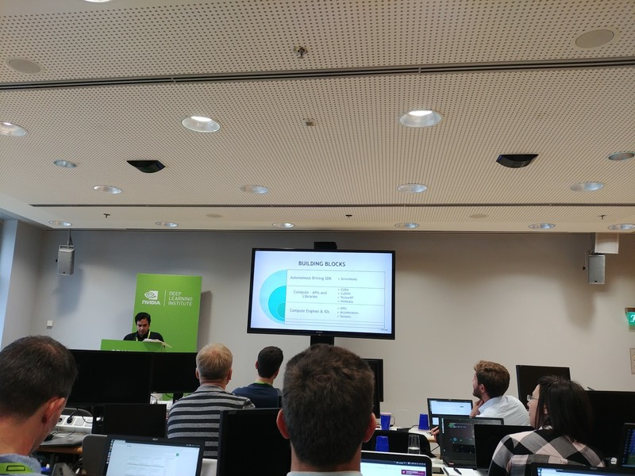
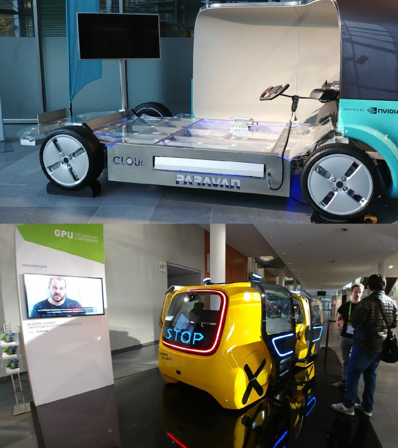
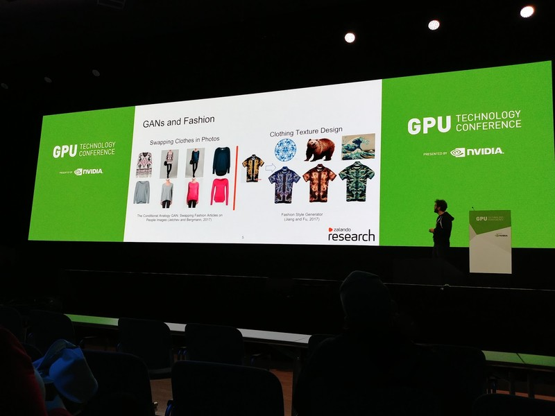
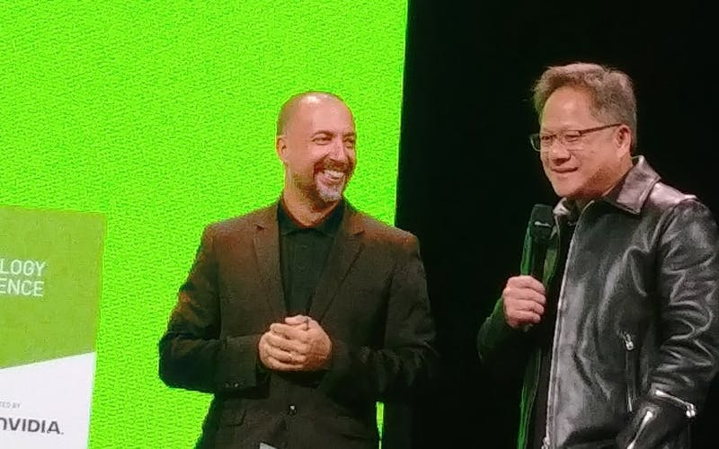
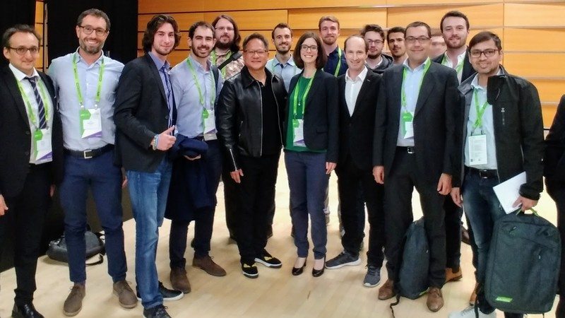
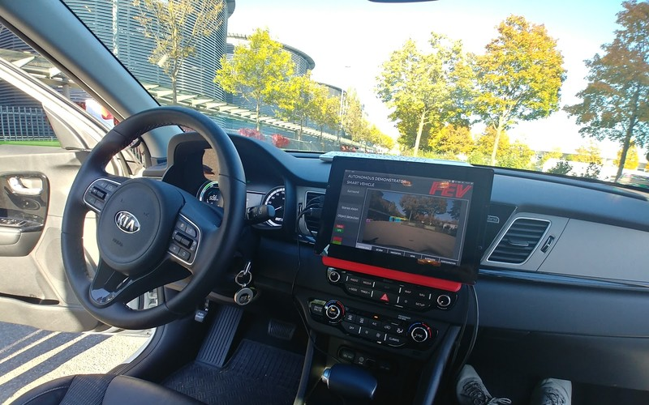
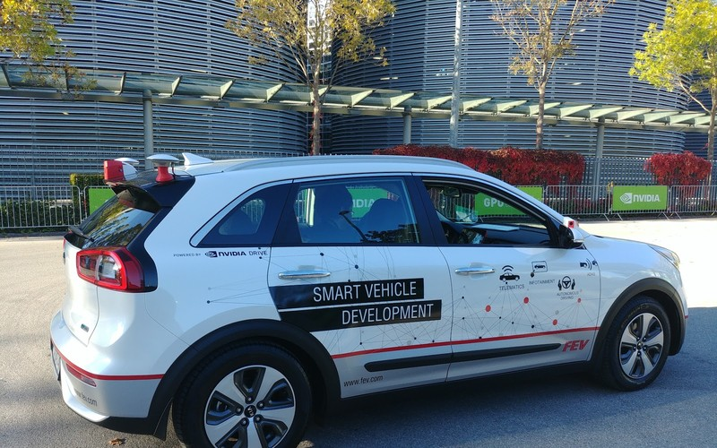
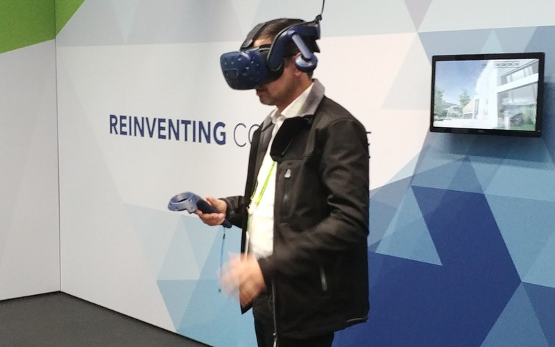
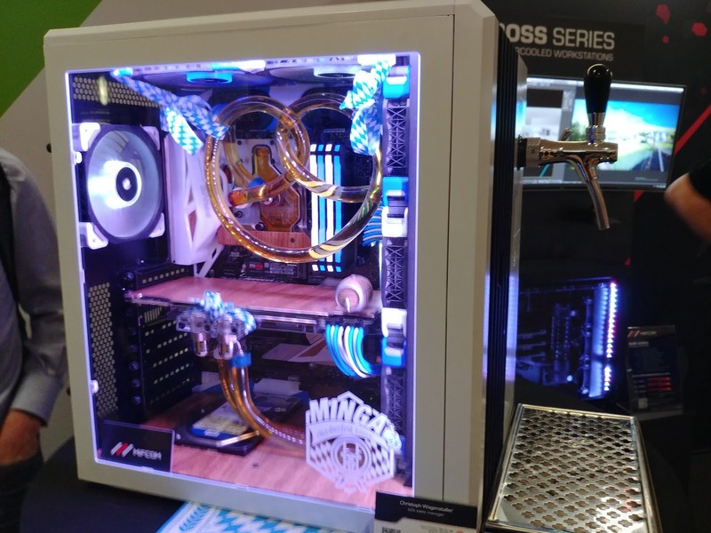

= Nvidia GPU Technology Conference In Munich
Ravi Gupta
v1.0, 2018-10-30
:title: Nvidia GPU Technology Conference In Munich
:tags: [event]

Nvidia holds https://www.nvidia.com/en-eu/gtc/[European GTC], its “all about GPU” conference, in Munich every year, in the month of October. So when I learned I could attend my first GTC, thanks to https://lunatech.com/[Lunatech] (my employer), I was really excited because I have always been interested in the field of GPUs, how it’s progressing and how it’s affecting the computing world especially the cutting edge fields like Artificial Intelligence, Deep Learning, Autonomous Driving etc.

It was such a fantastic place to be where you could be with people from industry and academia alike at one venue. I was especially eager to learn and get first hand  experiences of latest works being done in the domain of Autonomous Driving and Deep learning. I enjoyed every bit of the three days (9-11 Oct) spent there. I got to attend really enjoyable and enlightening hands on trainings, talks, panel discussions, demos, expos etc. I would love to share my experience with you all.

== Day 1

It was difficult to pick among the tracks Nvidia had organised -  Autonomous Driving, Financial Market, Natural Language Processing etc. They were all good. However, I ended up attending one that matched well with my field of interest-: “Deep Learning for Autonomous Vehicles - Perception”. This was a full day hands-on training on Nvidia Drive platform constituting of hardware and software frameworks for autonomous driving.

_Nvidia DLI Training session_

We solved one of the problems of perception for autonomous driving. We developed an algorithm to do semantic segmentation of various objects in a video feed, which meant assigning each pixel to one of the predefined classes like sky, road, pedestrian etc. We built the solution on a GPU enabled device and then we deployed it on a remote Nvidia Drive PX2 hardware and ran the system on a pre-recorded video feed of a driving car. For training the deep learning network we used the Cityscape dataset1 and we did downscaling of the image sizes for the exercise. We also used some of the existing algorithms with some modifications. The main algorithm explored was MobileNets2. It is a type of FCN (Fully Convolutional Networks) which is very lightweight deep neural network and gives access to hyperparameters to control latency and accuracy.

The hardware platform which we used for testing was Nvidia Drive Px2, which is a SoC for autonomous driving cars in which you can run production ready autonomous driving software to drive a car. Nvidia also announced the next generation of SoC for Drive platform called AGX series. You can think of the hardware as a single add-on which you can connect to various types of sensors required for autonomous driving like camera, lidar, radar etc. and to CAN interface of a car and then you can make the car have autonomous driving level based on the AI software you have built3.

The software platform is called Nvidia Drive4, which includes its own OS called Drive OS a variant of Ubuntu OS. Besides the OS, Drive software platform consists of two important components called Drive AV and Drive IX. Drive AV is more focused towards building autonomous driving applications. It has a SDK called Driveworks5 with multiple in built modules having implementations of various deep learning networks for different problems related to autonomous driving e.g. lane detection, object segmentation etc. And the 2nd component, Drive IX, is a general purpose AI software system built for autonomous car safety and experience enhancement by driving monitoring, natural language processing of voice commands etc.

There is one more aspect of software platform which is related to autonomous drive training and for that Nvidia provides a simulation platform called Constellation6. It is a VR platform where one can simulate various types of driving scenarios and train their AI system in that scenario. Constellation provides a safer and more scalable way for faster training of an autonomous driving system.

_Concepts of Autonomous vehicles for children and people with wheelchair_

At the end of the full day hands-on training, I was able to understand how to build and deploy autonomous driving software system using Nvidia Drive Platform.

== Day 2 And 3

The next two days were full of events.

Day 2 started with keynote by Jensen Huang, CEO of Nvidia. One of the highlights of his keynote was announcing release of https://rapids.ai/[RAPIDS] which is an open source software suite for Python that gives you access to libraries to do data science work completely on GPU. For the rest of the day lots of talks were going on for different tracks. I attended a couple of  them from autonomous driving, medicine, and ecommerce:

* The Reinvention of the Car – and How to Consider Safety Aspects for Launching Autonomous Driving
* Feature Visualisation Techniques for Medical Image Analysis
* Continental's Next Generation AV Systems
* Fashion Design with GANs: Disentangling Color, Texture, and Shape
* AI for Perception of Autonomous Vehicles.
* Accelerating Research to Production with PyTorch 1.0 and ONNX - Presented by Facebook
* Machine and Deep Learning in Online Marketplaces, FinTech and Video Entertainment
* Commercial Vehicle Automation

_Zalando talk session about Deep Learning in Fashion_

These sessions were very informative about how AI and Deep learning are changing many other domains. In one of the panel discussions, a company names https://www.perceptiveautomata.com/[Perceptive Automata] built an AI system which learns on human behaviour to understand intentions and apply the same to autonomous driving to react in similar way to how human would react for e.g. the system will see and understand that there is pedestrian who is standing near the zebra crossing but not looking in the direction so not interested in crossing the road. Another company called https://research.zalando.com/[Zalando], an ecommerce company, is trying Deep Learning based system to design trending fashion apparels.

_Nvidia CEO during Inception Awards_

Besides talks there were other experiences well. In the evening of day 2, there was an event called Inception Awards. For this event, European startups need to apply before GTC starts and based on selection process final 10 startups are selected. And during the event these 10 startups from Europe, pitched their startup ideas to Judges and GTC attendees for $100k and a Nvidia DGX 2 as the prize.

_With Inception Awards finalist and Nvidia’s CEO_

All the 10 startups had amazing ideas and technologies. The winner of the Inception Award was a startup named https://brighter.ai/[Brighter.ai] who are anonymizing the data collected by video cameras. There was also an interesting startup from Netherlands, https://www.serket-tech.com/[Serket Tech], who are using AI to do livestock health management. Though this startup could not win the award but received commendation from Nvidia CEO for their novel idea and implementation.

_Inside of FEV AD Car_

Nvidia, Continental, FEV and other companies working on autonomous driving vehicles like cars, trucks, road cleaning van etc. had their test vehicle present in the event. Attendees could take test ride in some of autonomous driving cars or see their demos. I took a ride in a FEV  autonomous driving car. It was good and smooth ride except for a moment the car took little diversion when it seemed the car was trying to avoid the direct sunlight. It was a good ride towards the future.

_FEV Autonomous Driving Car_

It’s almost like missing the whole point if one doesn’t talk about games when you talk about GPU. Next generations of gaming is full of VR. There were companies who had setup VR experience rooms. I tried one of them which was a VR setup for an environment close to water and mountain, where I tried to do a virtual hiking trip. Last year when I went to Scala world conference, I joined the hiking day trip. In that hiking trip of Lake District, I was almost lost together with a group after I opted for a difficult hiking route. But in this VR experience I was able to climb the mountain from steep side and was lost in amazing views and wasn’t literally lost like last time. Maybe I’d stick to VR hikes.\

_Experiencing VR Hiking_

For academics, there was a poster presentation area where university scholars were presenting their research. Attendees could walk by and interact with the scholars. Inventors of LSTM8, Sepp Hochreiter and Jürgen Schmidhuber were also present and gave talks. There were talks sessions from multiple academicians also.

There was an expo area where companies had their stalls and demos. Companies of all sizes and types had something to showcase there. There were few interesting ones I came across like a startup called https://bilberry.io/[BilBerry] which has AI based agriculture technology. There were VR based demos for medical surgery you could execute yourself. Multiple PoC designs of various kinds of vehicles for different purposes like school bus, autonomous rickshaw, logistics vehicle, sports car etc. There were other companies showcasing their software and hardware solutions like customised GPU workstations or cloud-based infrastructure.

_GPU Gaming Desktop with customised Beer Tap_

GTC was an awesome experience, satisfying the developer in me as well as giving a holistic consumer side of experience. It feels really exciting to think of the promising  landscape of this field in few years due to the development in computing by GPU mixed with Deep Learning and AI advancements touching many aspects of our lives.

=== References

1. M. Cordts, M. Omran, S. Ramos, T. Rehfeld, M. Enzweiler, R. Benenson, U. Franke, S. Roth, and B. Schiele, “The Cityscapes Dataset for Semantic Urban Scene Understanding,” in Proc. of the IEEE Conference on Computer Vision and Pattern Recognition (CVPR), 2016.https://www.cityscapes-dataset.com/[Data]https://arxiv.org/abs/1604.01685[[Paper]

2. Howard, Andrew G., et al. "Mobilenets: Efficient convolutional neural networks for mobile vision applications." _arXiv preprint arXiv:1704.04861_ (2017).https://arxiv.org/abs/1704.04861[Paper]
3. https://www.nvidia.com/en-us/self-driving-cars/drive-platform/hardware/[Nvidia Drive Platform Hardware]
4. https://developer.nvidia.com/drive/software[Nvidia Drive Software]
5. https://developer.nvidia.com/driveworks[Nvidia Driveworks]
6. https://www.nvidia.com/en-us/self-driving-cars/drive-constellation/[Nvidia Drive Constellation]
7. https://2018gtceurope.smarteventscloud.com/connect/search.ww#loadSearch-searchPhrase=&searchType=session&tc=0&sortBy=dayTime&p[GTC Full list of session]
8. https://en.wikipedia.org/wiki/Long_short-term_memory[LSTM]

