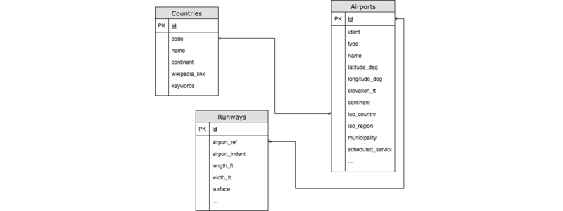
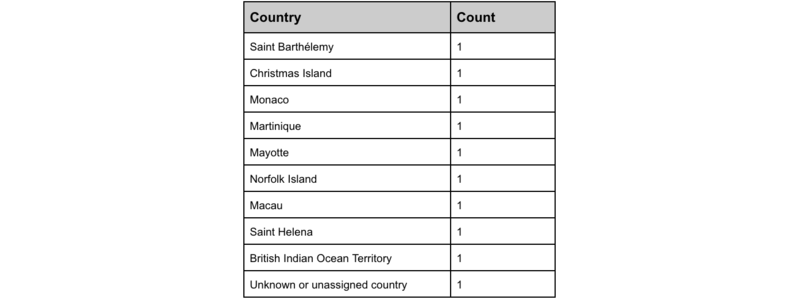

= Lunatech Airport Assessment
Gustavo De Micheli <gustavo.de.micheli@lunatech.nl>
2018-11-07
:title: Lunatech Airport Assessment
:tags: [recruitment, airport]

As part of the recruitment team our goal is to assess candidates on multiple dimensions using an exercise, code produced being just a single of those dimensions.
For several years we used a single exercise on this process, which we had to retire due to a number of reasons; in this article I will build the assessment like we’d intend to receive it, giving a glimpse on how we recruit at Lunatech.

== Assessment
The assessment’s text went as follows:

. Download three CSV files from Amazon S3 :
** https://s3-eu-west-1.amazonaws.com/lunatechassessments/countries.csv[countries.csv]
** https://s3-eu-west-1.amazonaws.com/lunatechassessments/airports.csv[airports.csv]
** https://s3-eu-west-1.amazonaws.com/lunatechassessments/runways.csv[runways.csv]
. Write a web application in Java or Scala that will ask the user for two actions : Query or Reports.
.. Query Option will ask the user for the country name or code and print the airports & runways at each airport. The input can be country code or country name. For bonus points make the test partial/fuzzy. e.g. entering zimb will result in Zimbabwe :)
.. Choosing Reports will print the following:
*** 10 countries with highest number of airports (with count) and countries with lowest number of airports.
*** Type of runways (as indicated in "surface" column) per country
*** Bonus: Print the top 10 most common runway identifications (indicated in "le_ident" column)

Feel free to use any library/framework as necessary but write it as a web application.

Please write the code as if you are writing production code, possibly with tests.

Here we’re told to download three CSV files and that the goal is to write a web application on either Java or Scala, which must provide two features: Query and Reports. This is the first place where things could go wrong, if you read the description carefully we request a Web Application, but some people have submitted a CLI, Spark jobs or some other type of project that wasn’t what was asked.

As software developers we usually work with some kind of process (eg. Scrum) where we take tickets or issues out of a board or backlog. These specify what we ought to build, bad reading or interpretation of this description can turn into an implementation that doesn’t fit what the client hoped to get. Without even touching a single line of code this is our first evaluation dimension, how well can you read and interpret software requirements.

“Carefully read the assessment, take the time to understand what you have to build”.
== Implementation
Now that we know what we have to do, let’s choose the technologies which we will use:

* Java
* Spring Boot
* PostgreSQL

*Java* is one of the languages we work on, and is the one I’ve more experience with, also we’ll see that we can be more error prone with it (not that you can’t shoot yourself in the foot with Scala, but it’s somewhat easier with Java, idiomatic Scala tends to be more disciplined).

*Spring Boot* I haven’t personally used, but have experience with Spring Framework.
Their ecosystem is rich, and let’s face it is the defacto standard.
Spring Boot provides a lot of scaffolding for us, making the task of building an application easier and faster, we want to concentrate on the assessment here.
Integration with database, web and security layers are straightforward and can be mocked during testing.

And finally, my experience is mainly on Oracle DB, but I want to use an open source and free database so I decided to go for *PostgreSQL* (although we could as easily picked MySQL or MariaDB). In this case I also base my choice on experience, having used SQL databases for almost my entire career, and again we’ll also be able to see several errors that popped up on multiple instances of the recruitment process.

“Always stand behind your technical decisions, be able to explain the rationale behind them.”

Familiarity and experience are good reasons to pick technologies; and on the other hand, there is nothing wrong with picking less familiar ones. The point is that you should be able to tell why you pick them and how they apply to the requirements. Implementing the assessment in https://en.wikipedia.org/wiki/LOLCODE[LOLCODE] may be fun but you must be able to pull it off.

=== I - Data Entry
Taking a look at the headers of the three CSV files we can deduce that we’ve three relational tables like:

Based on this we can create an schema and upload the CSV data with a single SQL command per table:

[source,SQL]
----
COPY countries(id, code, name, continent, wikipedia_link, keywords)
FROM 'countries.csv' DELIMITER ',' CSV HEADER;
----

Normally we would get an error, since one of the columns can have a comma making the CSV not straightforward to parse, but a little of sed and we are good to go.

Usually here is where most candidates would develop their own CSV parsing routine, but this goes against a good engineering principle: Don’t reinvent the wheel.
Just as you wouldn’t develop an HTTP framework for an assessment, you wouldn’t implement your own basic libraries and utilities (like data structures).
Doing so can be error prone, as we show there are some edge cases that you may not consider.

Now, if I can expand on this a little more, one thing that we saw time and time again was the use of certain anti-patterns, please imagine a code like the following:

[source,java]
----
public class Country {
    ...
    public Country(int id, String code, String name, ...) { ... }
    ...
}
----

Just a regular Country class, nothing wrong here, but let’s see if you can spot the problem on the code that would load the data from the CSV file:

[source,java]
----
String[] columns = line.split(“,”)
Country country = new Country(
    Integer.parseInt(columns[0]),
    Columns[1],
    Columns[2],
    ...
)
----

We can ignore the parseInt method, which could throw an exception.
I would say that the biggest offender here are lines 1, 3, 4 and 5 (and probably more).
Could you spot the issue? Here we are in the presence of the https://en.wikipedia.org/wiki/Magic_number_(programming)#Unnamed_numerical_constants[Magic Number] anti-pattern.
And although we could argue that’s not a big problem, it’s if the project suddenly turned bigger, we could lose track of what 0, 1, 2, etc. means, or even change meaning.
If I may quote Harold Abelson:

“Programs must be written for people to read, and only incidentally for machines to execute”

If we did everything correctly we should have the same number of rows on both ends:

[source,SQL]
----
$ wc -l countries.csv airports.csv runways.csv
     248 countries.csv
   46506 airports.csv
   39537 runways.csv

> select count(*) from countries union select count(*) from airports union select count(*) from runways;

count
-------
   247
 46505
 39536
----

Looks good (the extra line in the first command is due to the header), let’s move onto our next step.

=== II - Project Setup And Architecture
Deriving our domain models from our schema is pretty easy, creating Country, Airport and Runway, and Spring Boot integration with Hibernate/JPA makes the ORM just as easy.

Implementing the web layer (ie. Controllers) and User Interface (HTML) is also done with a little of Spring magic (more on this later) and some annotations.

Where I want to focus our attention is on the repository, where most of the code in this implementation resides:

[source,java]
public interface CountryRepository extends JpaRepository<Country, Long> {
    Optional<Country> findByCode(String code);
    @Query(value = "SELECT c.name as name, count(*) as count " +
                   "FROM countries c " +
                   "INNER JOIN airports a ON c.code = a.iso_country " +
                   "GROUP BY c.name ORDER BY count DESC LIMIT ?1",
           nativeQuery = true)
    List<ReportRow> queryTopAirports(int limit);

This interface has two interesting things, *JpaRepository* and *queryToAirports*.

Let’s start with the interface, having chosen Spring Boot there is a lot of things that get for free, we can easily leverage from it to deliver real business value (ie. the assessment requirements).
This has always been the holy grail of libraries, and using Spring Boot is not inherently bad, but treating the library as pure magic can be troublesome when you get to the limits of that tool.
During the interview we would get a sense of your technical knowledge by asking questions such as: _is the repository backed by a connection pool? If so, how can I tune that pool? Do you know if parameters are properly sanitized?_ And so on.

_“Working with a higher level of abstraction doesn’t spare us from knowing low level details, curiosity and in depth knowledge are also rewarded.”_

Now let’s focus on the query, which would be used to fulfil the first report (Highest and Lowest amount of airports per country).
If you read the SQL query you will find that there is nothing wrong with it, in a matter of fact it will return the following:

The problem is hidden on the data, which is: some countries don’t have any airports.
Here we would ask the candidate to analyse the issue and try to solve it on the go, showing how well can he or she reason about the produced code, being of a manageable size the developer should be able to hold the entire program on his or her head.
By now you probably noticed that the reason is the *INNER JOIN* used on the query, but another implementation could require a bigger change.
If I may quote one last person, Paul Graham said:

_“Your code is your understanding of the problem you're exploring. So it's only when you have your code in your head that you really understand the problem.”_

After these two points there isn’t too much else to see, Spring Boot let us get away with it, but I feel we covered the essence of most implementations.
Feel free to take a look at the full source code https://github.com/lunatech-labs/lunatech-airport-assessment[here].

Finally, this is only one of the multiple ways to achieve the same result; the technology stack could be different (Scala instead of Java, Play! Instead of Spring or MongoDB instead of PostgreSQL) or even have something more extravagant like using Apache Lucene to implement Fuzzy search.

=== III - Closing Comments
On this article we hoped to give a peek on how we recruit at Lunatech, what we look for on candidates, namely the aforementioned dimensions, the mindset we wish people to approach the process.

The most important takeaway from all this is that the assessment is an excuse to engage a discussion, we never strive to find a perfect solution. We actually want to have a casual conversation with a possible colleague about software engineering, good practices and what are the pros and cons about this or that approach. The assessment would be a transport for doing that and more, we could even talk about what does this project lack to be a real world project, such as documentation, tests or Docker images.
