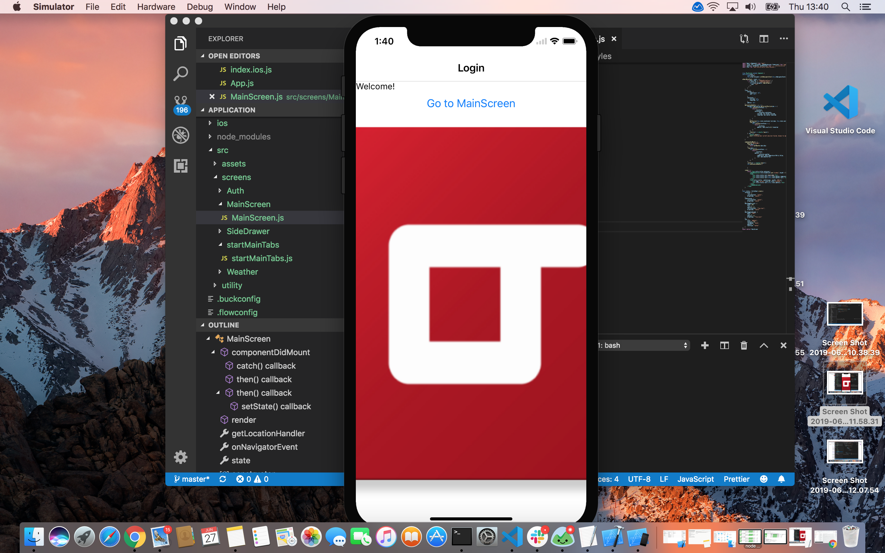

= The road to mastering React Native
Evegnii Frank <evgenii.frank@lunatech.nl>
v1.0, 2019-07-10
:title: The road to mastering React Native, part 1
:tags: [react, javascript]

The road of mastering React Native.

To bring a piece of diversity to backender’s life, from this month we decided to immerse into cross-platform framework React Native for building an internal mobile app for our company. 

There are two ways of installing and building your first React native app:

1.With help of Expo, in this case you don’t need to install and configure Android Studio and Xcode. You run following commands in your terminal: 

    npm install -g expo-cli
    expo init Name of your project
    npm start

2. More complex way, your path of installation will be longer. Firstly, you need to install Homebrew and afterwards run following commands:

    brew install node
    brew install watchman
    brew tap AdoptOpenJDK/openjdk
    brew cask install adoptopenjdk8

    npm install -g react-native-cli
    react-native init <ame of your project>
    react-native run-ios/ react-native run-android

Make sure that you have on your Mac Xcode and Android Studio already installed.

For navigation we plumped for the package of react-native-navigation@1. For more information and the installation process for iOS and android check the official GitHub-repository:
https://github.com/wix/react-native-navigation

We register all screens that we have in our application, so as a simple start we use Authentication screen, Main screen and SideDrawer which is regarded as a screen as well. After that we star single screen app and set the screen to our Authentication screen which will be displayed when user launches the app. 

The process of authentication will be added later. For now by clicking the button the user will be redirected to the main screen, containing one tab. On this screen we fetch weather data in Amsterdam and determine the location of user than render this information

To obtain the current location of a user, the first thing you should do is to get the user permission. That requires extra steps in setting up. Navigate to Xcode =>info.pilst=>in Information property list add Privacy-Location Usage Description and write a string which will be displayed as a notification on a device. 

In addition, our application has a toggle button that triggers SideDrawer, allowing user to log out and automatically send you back to Authentication screen

More to come in an irresistible desire to grasp React Native, follow our adventurous journey through the React Native world, we are going to keep you up-to-date.



