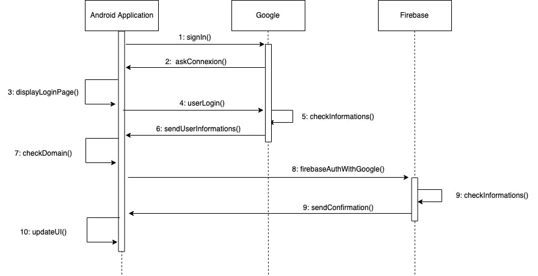
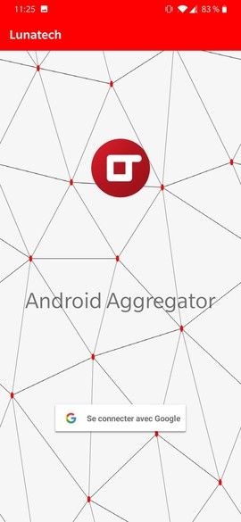
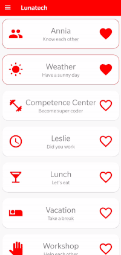
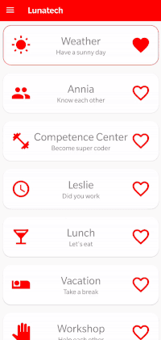

= Bootstrapping Our Internal Android App With Kotlin (Part 2)
VincentBrule
v1.0, 2019-08-07
:title: Bootstrapping Our Internal Android App With Kotlin (Part 2)
:tags: [ktor,kotlin]

We are back for a second post to show you the progress of our Android application.

To read the first article, follow the https://lunatech.com/posts/2019-06-19-bootstrapping-our-internal-android-app-with-kotlin[guide].

The objective of our application is to centralise all Lunatech internal services. We will talk about three topics discovered during the development of our application. We start by explaining how to integrate a secure connection with Google and Firebase. Then, we discover the process of creating our main screen and finally how to call an external API efficiently.

== Authentication With Google And Firebase

First of all, if you are looking for a tutorial step by step, I invite you to look at this https://firebase.google.com/docs/auth/android/google-signin[link] which explains in detail how to implement the solution that will follow, in your code. In this blog post, we explore the main steps to set up an authentication with **Google** and **Firebase** for an Android application. Our workflow to login a user goes through four major phases:

=== Client creation

First of all, we need to create a client that will allow us to authenticate later. In this part of the code, we can specify all the information we want to retrieve from each Google Account. In this case, we only need the _user's email address_. A good practice is to limit fields to be retrieved to the strict minimum in order to avoid taking risks with unnecessary personal information.

[source,kotlin]
----
val gso = GoogleSignInOptions.Builder(GoogleSignInOptions.DEFAULT\_SIGN\_IN)
  .GoogleSignInOptions(getString(R.string.client\_id)) // for Firebase
  .requestEmail() // take only user's email
  .build()

mGoogleSignInClient = GoogleSignIn.getClient(this, gso)
auth = FirebaseAuth.getInstance()
----

=== Login to Google

Then, we set up a function and we link it to the login button. This function starts the connection process from our client. After that, the `startActivityForResult` function will display the Google login page. Finally, the `onActivityResult` function will be called when the user logs in with his Google account. This function will provide us with a `GoogleSignInAccount` object with important informations for the future.

[source,kotlin]
----
private fun signIn() {
  val signInIntent = mGoogleSignInClient.signInIntent
  startActivityForResult(signInIntent, RC\_SIGN\_IN) // display Google Login page
}
----

=== Verification of user's identity

Now, we check if the user belongs to the company domain. If this is the case, we proceed to the next step with Firebase, otherwise we display an error message. At this point, the connection with Google is established and all we have to do is link the user to Firebase.

[source,kotlin]
----
if(authDomains.contains(domain)) firebaseAuthWithGoogle(account) else updateUI()
----

=== Login to Firebase

For the last step, we connect the user to Firebase. Once again, we use the power of Kotlin to handle null in an efficient way. After the connection is established with both parties, we update the user interface. Thanks to the variable auth, we will be able to find our user later and implement a verification when the application is opened (onStart function). This method will allow users to avoid having to log in each time they use the application.

[source,kotlin]
----
private fun firebaseAuthWithGoogle(account: GoogleSignInAccount?) {
  val credential = GoogleAuthProvider.getCredential(account?.idToken?:"null", null)
  auth.signInWithCredential(credential)
    .addOnCompleteListener(this) { task ->
        val userOrNull = if(task.isSuccessful) auth.currentUser else null
        updateUI(userOrNull)
  }
}
---- 

The figure below illustrates all the steps of the connection workflow with a sequence diagram.

The figure below shows the current login screen with the Google button to launch the login workflow explained above. After logging in, we are on the main screen. We will explain how this view is organised to make it maintainable and customisable.

== Main Screen

We decided to organise the main screen as a list of `Card`. Each `Card` corresponds to a different service (i.e. Weather, Annia, etc.). We want to have the most flexible interface possible to increase or reduce the number of services available afterwards. In addition, we have added a drawer from the left side of the screen, containing the list of applications and user actions as `logout`. To obtain this flexible result, we use `RecyclerView` coupled with `CardView`. I recommend this https://developer.android.com/guide/topics/ui/layout/recyclerview[tutorial] to implement the same kind of interface step by step.

image:../media/2019-08-07-bootstrapping-our-internal-android-app-with-kotlin-part-2/main_screen.gif[]

A `RecyclerView` is a view adapted to this use case. It allows to implement a view corresponding to an `item`, here, a `Card`. Then, an adapter is defined. Finally, the `RecyclerView` and its adapter will take care of creating all the sub-views and make several optimisations to make the application more fluid. We will see the code corresponding to the main steps of this implementation. Our main screen includes three `RecycleView`. The first one is used for the list displayed on the main screen. The other two make up the sliding drawer: one for the favourite applications and one for the other applications. To reduce the code to be displayed, we will explore the `RecycleView` used for the main screen.

=== Description of the data

The first step is to define the class representing the dataset for the adapter. This class includes three attributes to describe each of our applications and a `clickListener` function to adapt the action followed by clicking on each service. The `id` attribute allows you to optimise the processing of views thereafter. I used several tips to optimise `RecyclerView` like this `id` attribute. If you are interested, I can make a dedicated article so don't hesitate to let me know!

[source,kotlin]
----
data class ModelApplication(val icon: Int,
                            val name: String,
                            val description: String,
                            var like: Boolean = false,
                            val id: Long = idGenerator++,
                            val clickListener:  (ModelApplication) -> Unit) {
  
  companion object { var idGenerator: Long = 0 }
}
----

=== Adapter creation

Afterwards, we implement the adapter to transform instances of the previous class into a view (`Card` in this case). We start by selecting fields to update thanks to their `id`. We update all these fields with our `ModelApplication` instance. Finally, we link a `clickListener` on the heart icon to have the _like interaction_ to keep applications we use most regularly in focus. You can see the functionality of _Like_ in the following figure.

We link another `clickListener` on our `Card` to trigger the interaction specific to each application. As we can see, apart from the `clickListener` to like an application, all the other information is filled in our `ModelApplication` instance. Therefore, we only need to create a new `ModelApplication` instance in our dataset and our logic will take care of creating all views.

[source,kotlin]
----
class ModelViewHolder(itemV: View, val context: Context) : RecyclerView.ViewHolder(itemV) {

  // We select all fields that need to be updated
  private val nameApp = itemV.name\_card
  private val descriptionApp = itemV.description\_card
  private val iconApp = itemV.icon\_app
  private val iconLove = itemV.icon\_love
  private val layoutCard = itemV.layout\_card

  fun bindItems(application: ModelApplication, clickListener: (ModelApplication) -> Unit) {
    // We set fields in function of the ModelApplication instance
    nameApp.text = application.name
    descriptionApp.text = application.description
    iconApp.setImageDrawable(ContextCompat.getDrawable(context,application.icon))

    val drawableLove = if (application.like) {
      layoutCard.setBackgroundResource(R.drawable.card\_edge)
      R.drawable.ic\_favorite\_black\_24dp
    }
    else {
      layoutCard.setBackgroundResource(0)
      R.drawable.ic\_favorite\_border\_black\_24dp
    }

    iconLove.setImageDrawable(ContextCompat.getDrawable(context, drawableLove))
    iconLove.setOnClickListener { clickListener(application) }
    layoutCard.setOnClickListener { application.clickListener(application) }
  }
}
----

=== Assembly of all elements

The last step is to gather the previous elements. We start by defining a `viewManager` that represent the organisation of all our sub-elements. We choose a `LinearLayoutManager` which, by default, organises our child views vertically, perfect for this use case! Then, we define the adapter with the dataset and the `clickListener` associated with the "Like" functionality. That's all for the core of the code! If we need to add or remove a service, we just have to modify our dataset (`application` variable here) and everything else is automated.

[source,kotlin]
----
val viewManager = LinearLayoutManager(this)
val mainScreenAdapter = RecyclerAdapterMainScreen(applications) {
  application: ModelApplication ->  clickListenerLike(application) 
}

mainScreenAdapter.setHasStableIds(true) // Optimisation with the id

val recyclerView = findViewById(R.id.recycler\_view)

listRecyclerView.apply {
  setHasFixedSize(true) // Other optimisation
  layoutManager = viewManager
  adapter = mainScreenAdapter
}

----

== Use External APIs With Retrofit

We move on to the last part of this second blog post: using an external API from our Android application. To do this, we have chosen to use the HTTP client https://square.github.io/retrofit/[Retrofit]. We chose Retrofit because it integrates perfectly with Android applications and allows you to make asynchronous calls. For this example, we decided to implement a very simple service to retrieve the current weather in order to be able to perform our tests in a small environment. To do this, we use https://openweathermap.org/api[OpenWeatherMap].

We break down the problem into several steps:

=== Description of API calls

We create an interface to describe the interaction with the API. It's not necessary to write the entire URL because we will specify, when creating the HTTP client, a base URL to concatenate with start of each request. So we have a GET request taking two parameters and returning an instance of Call<WeatherResponse>. The parameter q represents the name of the city and APPID our API key.

_Disclaimer: For our first experiments, we stored our API key in the Android application and this is a practice to avoid if you don't want to have bad surprises._

[source,kotlin]
----
interface WeatherService {
  @GET("/data/2.5/weather?units=metric")
  fun getCurrentWeatherData(@Query("q") cityName: String,
                            @Query("APPID") app\_id: String): Call
}
----

=== HTTP client creation

Then we instantiate the HTTP client. We configure a base URL that will be concatenated at the beginning of each request. We add a `GsonConverter` to transform the response of each request directly into an instance of an object that we will see next.

[source,kotlin]
----
retrofit = Retrofit.Builder()
  .baseUrl(getString(BaseUrl)) // BaseUrl = http://api.openweathermap.org
  .addConverterFactory(GsonConverterFactory.create())
  .build()

service = retrofit.create(WeatherService::class.java)
----

=== Handle responses returned by the API

To continue, we define a class allowing the GsonConverter to know how to transform responses. To do this, you must first look at the fields returned by the API. [OpenWeatherMap](https://openweathermap.org/current) provides us a description of a standard answer and an explanation of each field. In our case, we are interested by the description of the weather (cloudy, sunny, etc.), the image corresponding to the weather and the current temperature.

[source,kotlin]
----
class WeatherResponse {
  @SerializedName("weather")
  var weather = ArrayList()

  @SerializedName("main")
  var main: Main = Main()
}
class Weather {
  @SerializedName("description")
  var description: String = "?" // overcast, fog, etc.
  
  @SerializedName("icon")
  var icon: String = "11d"  // name of the weather image
}
class Main {
  @SerializedName("temp")
  var temp: Float = 0.toFloat()
}
----

=== Call the API

Finally, we can now make calls to the API asynchronously. If the request fails, we display an error message and redirect the user to the main page. If the request is successful, we display results on the user interface (_Picasso_ is a library that allows you to optimally manage remote image download).

[source,kotlin]
----
val call = service.getCurrentWeatherData(city, getString(AppId))

// Start API call
call.enqueue(object : Callback {
  override fun onResponse(call: Call, response: Response) {
    if (response.code() == 200) {
      val imageViewWeather: ImageView = findViewById(R.id.icon\_weather)
      val weatherResponse: WeatherResponse = response.body() ?: WeatherResponse()
      val weatherObj = weatherResponse.weather.getOrElse(0) { Weather() }
      
      Picasso.with(applicationContext)
        .load(${getString(BaseUrl)}/img/w/${weatherObj.icon}.png)
        .into(imageViewWeather)
      
      temperature.text = getString(R.string.symbole\_celcius, weatherResponse.main.temp.toString())
      description.text = weatherObj.description.capitalize()
      cityTextView.setText(city)
    }
    else { handleErrorWeather() }
  }

  override fun onFailure(call: Call, t: Throwable) {
    handleErrorWeather(t.message)
  }
})
----

As you can see, **Retrofit** is a perfect client for using external APIs in Android applications. Next Figure shows final result of the weather service.

We're finished for this well-filled blog post, thank you for reading! If you have any comments or questions, please do not hesitate to contact me.

And stay tuned for the next post about this Android application!
