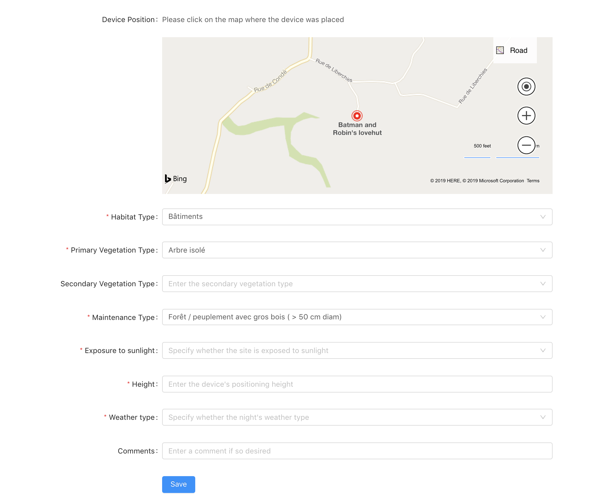
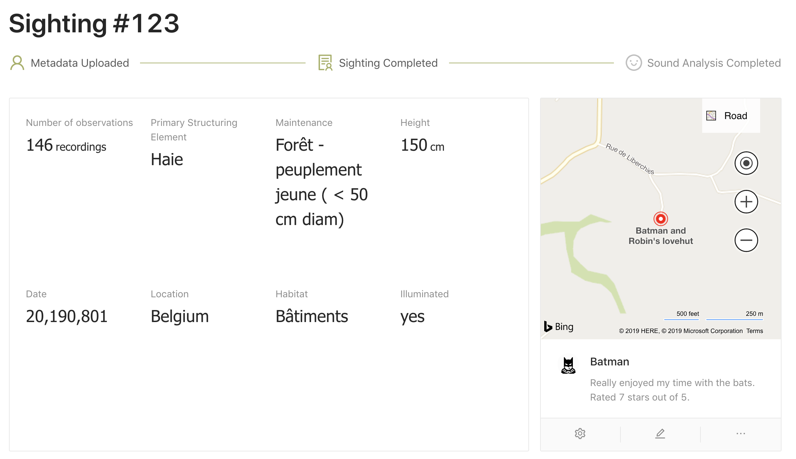
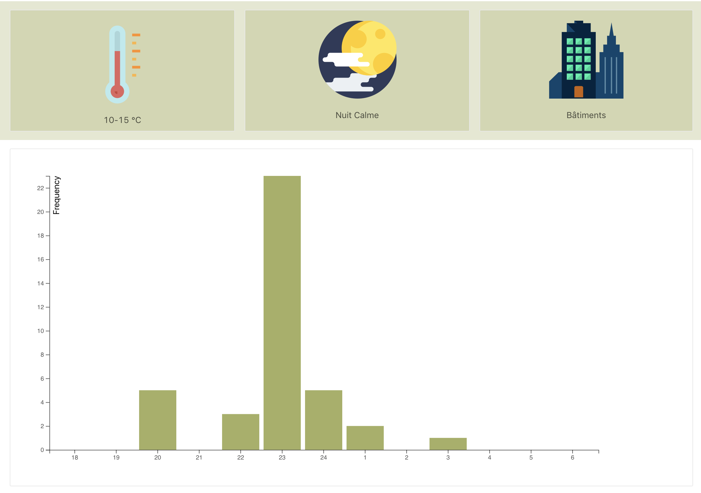

= Hack In The Woods: Programming For Fun And Good
adrienhaxaire
v1.0, 2019-08-20
:title: Hack In The Woods: Programming For Fun And Good
:tags: [fun,event]

This summer I went to http://www.hackinthewoods.be/[Hack in the Woods], following the warm invitation from my colleague Xavier Tordoir who lives in Belgium and attended last year. Three days and three nights in the Belgian countryside to meet new people and work on projects for non profit and non governmental organisations, ranging from bats preservation to fighting leprosy.

It was a great experience, I had a ton of fun, I met nice people and I even managed to learn new things. I'm glad I went.

One important aspect of this hackathon is that it's not a competition. We are here to help organisations, not to win a prize or boast on LinkedIn. This made the whole atmosphere relaxed and stimulating, encouraging collaboration instead of competition.

image:../media/2019-08-20-hack-in-the-woods-programming-for-fun-and-good/team.png[]

Xavier knew some people from last year. After two beers we were in their team. A well balanced one, with devops, frontend and backend developers. They know each other from work, other friends, former colleagues. It was also something special to be together for so long for them. Same culture: work hard, party hard, be curious, question the status quo, fix the problem, deliver.

image:../media/2019-08-20-hack-in-the-woods-programming-for-fun-and-good/meal.png[]

Programming in the night, for the win. Good lads, we'll meet again.

== The location

image:../media/2019-08-20-hack-in-the-woods-programming-for-fun-and-good/tent.png[]

The Domaine de Graux in Tournai is a beautiful place with lots of trees, ponds, pathways and animals, from pigs to Black Angus cows to, well, roosters:

video::kd-um9-9N7A[]

I followed the guided tour of the domain and it is impressive how far the owners go in a responsible and biodynamic approach to managing the domain.

image:../media/2019-08-20-hack-in-the-woods-programming-for-fun-and-good/food.png[]

The BBQ on Saturday was excellent! I know I should have taken pictures of the pies!

== The project

image:../media/2019-08-20-hack-in-the-woods-programming-for-fun-and-good/project.png[]

From the projects document: _The preservation of bats is vital for our ecosystem. To measure the evolution of these populations, volunteers cover the country to capture their screams. Today the transfer of this data is often manual and incomplete. What is needed is a tool to streamline the transmission of these sounds to the analysts and to allow the volunteers to better identify the areas to cover._

At first I thought: easy, Kafka, bam, done, see you next year. On the Friday morning we had the opportunity to talk with two persons from the organisation. As you can see on the picture, there are four SD cards to collect the recordings. These cards are then taken off of the box and their content copied on a hard disk collected by https://plecotus.natagora.be/[Plecotus] when getting the box back from the volunteers. In other words, no streaming, no Kafka. We took the angle of easing the filling of the Excel spreadsheets required for every recording. For volunteers and administrators and to speed up the feedback loop. This was well received, it was a useful low hanging fruit.

About the technology, I was thinking about writing a separate blog post but reading about it will take you more time than getting a sample project running. We went for the dynamic and explosive combo Python with https://palletsprojects.com/p/flask/[Flask] + MongoDB hosted on https://www.mongodb.com/cloud/atlas[Cloud Atlas]. We got something running in minutes, with swagger documentation, sane defaults, etc. Excellent for prototyping. We used a temporary account on Azure for deploying, to the joy of the devops in the team who hadn't experimented with it yet. The frontend was in React which is simple enough to be edited by people who don't know much about frontend development in general.

Here is the form that simplifies and normalises the input of the recording metadata:

Resulting to the following summaries:

So you see, nothing too complicated, but working enough as a prototype. And looking good yes, that's when you see you have _real_ frontend developers in your team. The cherry on the pie was to pre-fill this form with the data on the SD card. We wrote a small Python program to fetch the data and the metadata in the various folders and files, send it to the backend and open a browser tab on the right page to finish inputting the data by hand. Once again, nothing fancy, just finding the pain points and start addressing them.

== Conclusion

All in all, an interesting experience. I met nice people, did some coding and laughed a lot. We contributed to an organisation preserving bats which is cool enough in itself. I got to speak French for four days, learning Wallonian, Flemish and Brusselian expressions. The Microsoft Innovation Center did a great job organising the event. I returned happy and motivated, having the confirmation that pro bono contribution to non profit organisations is intrinsically rewarding. Something I look forward to doing at Lunatech.
