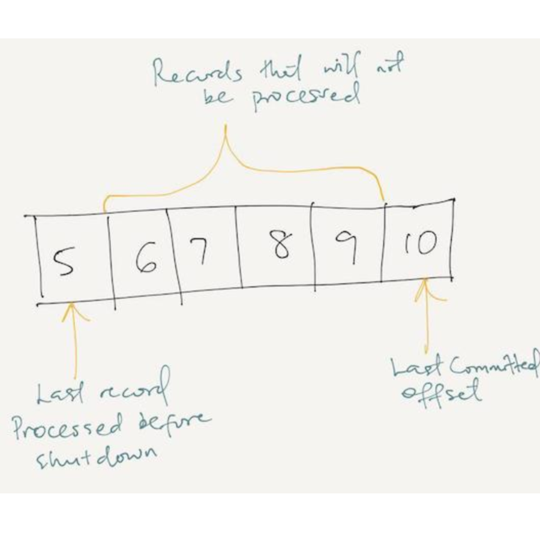
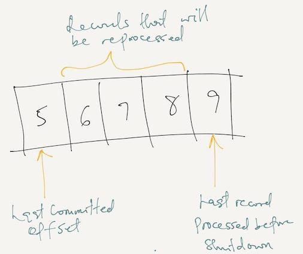

= Message Reliability In Kafka
idarlington
v1.0, 2019-08-27
:title: Message Reliability In Kafka
:tags: [kafka,messaging,scala]

== Outline

- Introduction to message delivery semantics in Kafka
- Configuring producer delivery semantics
- Configuring consumer delivery semantics
- Kafka streams delivery semantics
- Conclusion

This post assumes you understand the basic use of Kafka producer, consumer and streams client and how to configure them. This post also uses the Java client for examples.

== Introduction To Message Delivery Semantics In Kafka

There are three messaging delivery semantics. They are: At most once, at least once, exactly once.

In _at most once delivery_, the message is either delivered or not delivered. This delivery semantic is suited for use cases where losing some messages do not affect the result of processing the complete data. It is useful when achieving high throughput is important since there is no overhead from waiting for acknowledgment from the brokers.

In _at least once delivery_, messages can be delivered and consumed several times. In this semantic, it is important that messages are not lost. There is little concern with the duplication of data.

For _exactly-once delivery_, messages are delivered and read once. For e.g in financial transactions, it is important that messages are received and processed once.

In Kafka, the delivery semantics can be configured on both the consumer, producer and stream clients.

== Configuring Producer Delivery Semantics

**At most once.** This is the default producer delivery semantic. To achieve at most once delivery, you can configure the producer with the following:

- Acks : 0 : This configures the producer not to wait for acknowledgment from the broker after sending a message.
- When using the producer client, you can use the send method asynchronously without a callback.

[source,scala]
----
// Producer instance
val producer  =  new KafkaProducer\[String, String\]
​
// Send records asynchronously without a callback
producer.send(record)
----

**At least once.** You can configure your producer with the following settings to achieve at-least-once delivery:

-  Configuring acks: 1, ensures that the producer receives an acknowledgment from the leader of the partition it is writing to. Configuring acks: all, ensures that the producer receives an acknowledgment from each replica of the partition it is writing to for each record. If the producer doesn't receive acknowledgment it will keep trying based on the retries setting.
- Send records with a callback and perform some logging in the callback.

[source,scala]
----
// callback implementation
class SampleCallback extends Callback {
  def onCompletion(recordMetadata: RecordMetadata, e: Exception): Unit = {
    if (e != null) e.printStackTrace()
  }
}

// producer using callback
producer.send(record, new SampleCallback())
----

**Exactly once.** Exactly once reliability is configured when message durability is important and duplication is not tolerated.

Most services prefer exactly once delivery but it is quite complex to achieve. Since Kafka 0.10, configurations were introduced to allow that:

-  Configuring the producer to be idempotent using `enable.idempotence=true`. This setting ensures that a record is sent exactly once to a particular partition within the lifetime of the producer.
- You can also use https://www.confluent.io/blog/transactions-apache-kafka/[transactions]. The transactions concept in Kafka producers is similar to that of databases. All messages are delivered or none of them are.

== Configuring Consumer Delivery Semantics

**At most once.** This is the default delivery semantic for the consumer. The configuration for `enable.auto.commit` is set to true by default.This can be problematic for a consumer that does some processing on the records. The consumer could shut down before processing records that have their offsets committed. When the consumer restarts, it will begin from the last committed offset. It will not process records with offsets within the point it failed to the last committed offset.

_Possible processing error (lost records) when auto-commit is enabled._

**At least once.** This is configured in the consumer client by setting `enable.auto.commit` to false and committing offsets manually. The consumer application then commits offsets after processing them. Offsets are committed using `consumer.commitSync` or `consumer.commitAsync`. Using the latter, a callback can be configured for successful or failed commits. The consumer client may reprocess records but it will not lose records. For instance if the consumer has finished processing a record and crashes before committing its offset. Or when the consumer application restarts, it will reprocess the formerly processed record.

_Possible processing error (re-processed records) when auto-commit is disabled._

**Exactly once.** Consumers can be configured to read messages produced with https://www.confluent.io/blog/transactions-apache-kafka/[transactions] using `isolation.level=read_committed`.

== Configuring Streams Delivery Semantics

Kafka streams is basically a combination of a consumer and producer. [Configuring the delivery semantic](https://docs.confluent.io/current/streams/concepts.html#streams-concepts-processing-guarantees) in streaming applications is as simple as setting a `processing.guarantee` parameter.

The available options are `at_least_once` and `exactly_once`.