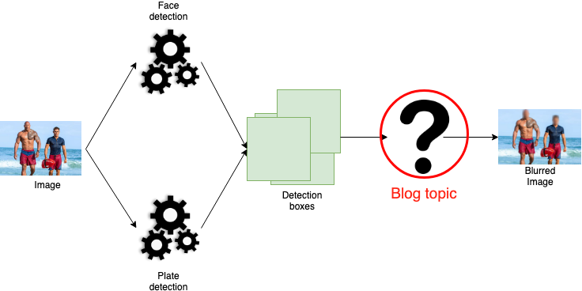
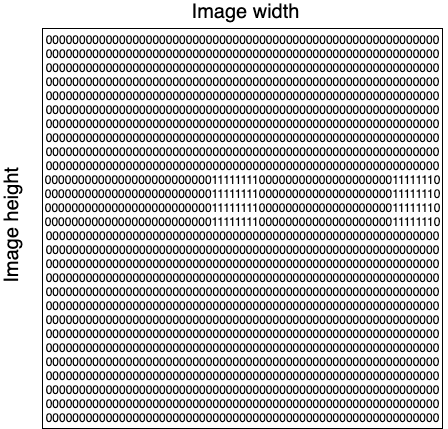
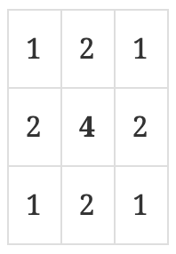
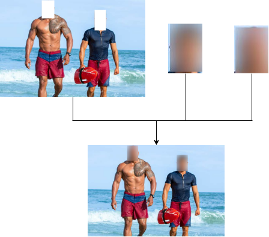
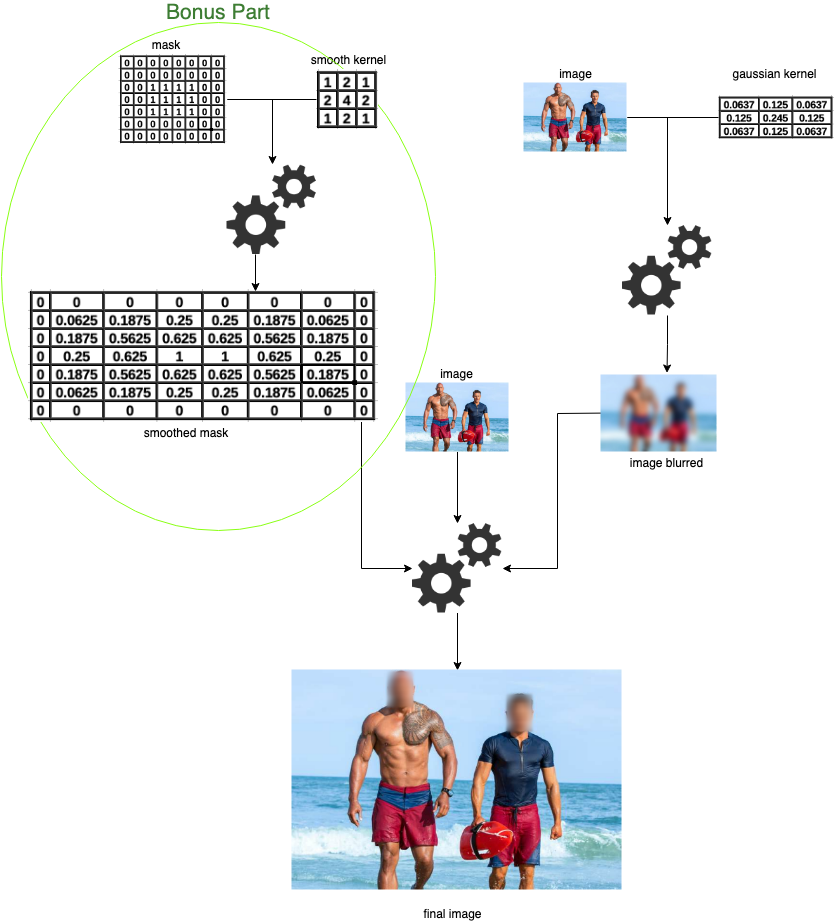
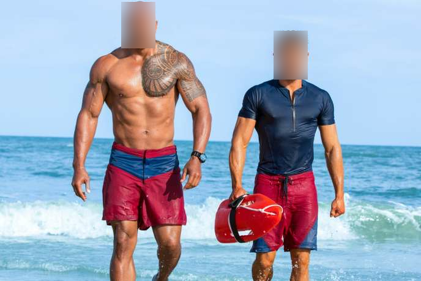

= Anonymization Opensource With Scala Tensorflow
VincentBrule
v1.0, 2019-10-08
:title: Anonymization Opensource With Scala Tensorflow
:tags: [ktor,kotlin]

Today, I present https://github.com/lunatech-labs/lunatech-scala-anonymization[my first open source contribution.] This project is an adaptation of this https://github.com/understand-ai/anonymizer[GitHub Python repository] allowing to anonymize an image, i.e. detect faces and license plates in an image in order to blur them. The initial code is in Python/Tensorflow and we wanted to adapt it to Scala with https://github.com/eaplatanios/tensorflow_scala[Scala API for Tensorflow].

In this blog post, we will explore, step by step, how to achieve the final result that you can see in the image above.

== Introduction

As you can see in the diagram below, anonymization involves two main steps.

First, give an image to two different Tensorflow models. One of the model will detect faces while the other will detect license plates. After this, we merge the detection boxes returned by both models. Boxes have the following pattern: **[Label, Score, Position]**. The _Label_ represents the detected category (face or license plate in this case). The _Score_ describes the confidence of the model for the associated detection. It's limited between 0 (not confident) and 1 (very confident). The _Position_ represents points at the top left and bottom right of each detection box.

We will not expand on the detection part which remains classic: conversion of images into Tensor then we launch two models on this set of images using the code below. The feeds variable contains our images transformed into Tensor and we retrieve informations specific to each detection as explained above.

[source,scala]
----
//Box = Position, Class = Label, Num = number of detection
val Seq(boxes, scores, classes, num) =
  session.run(
    fetches = Seq(detectionBoxes,
                  detectionScores,
                  detectionClasses,
                  numDetections),
    feeds = feeds)
----

As we can see from the diagram below, we will focus on the next part. This section use different detection boxes to blur the target areas of the image.

== Create a mask

The first step is to create a _mask_ to delimit areas to be blurred during future convolutions. `Convolution` is an awful word to describe the operation of applying a filter/kernel throughout an image. For this purpose, we design a mask with same size of the original image, initialised with `0` for 1 in the mask. Once the mask is ready, we transform it into Tensor to use the power of Tensorflow afterwards. Below, a visual representation of a mask with two objects detected in the initial image.

== Generation of a gaussian kernel

To blur desired areas, we need a _gaussian kernel_ in addition of the previous _mask_. The gaussian kernel allows, through a convolution, to make an average of neighbours around the pixel considered according to a Gaussian distribution. A Gaussian distribution depends on two parameters, the mean μ and the standard deviation σ. Below, you can see an example of a 3x3 gaussian kernel that we will use to illustrate next examples. All values are normalised (each value is multiplied by 1/16).

We center each pixel on the gaussian kernel. In the example kernel, central cell with value 1/4. Then, this pixel has a new value depending on the weighted average of its neighbours by the gaussian window. For example, with the gaussian kernel above, for each pixel, we will take 1/4 of its value \+ 1/8 of its neighbour's value on the left and so on. To blur the image, we _drag_ the gaussian window through the image in order to assign a new value for each pixel. In our project, we can choose two parameters to change _level of blur_. The first parameter is the standard deviation σ. The higher the standard deviation, the lower the blur. In addition, we can set the size of the gaussian window to increase the number of neighbours involved during the weighted average. I will not present any code for this part because it's only a succession of mathematical operations to generate the gaussian kernel according to the input parameters. However, if you want to see the corresponding code, I refer you to the https://github.com/lunatech-labs/lunatech-scala-anonymization/blob/master/src/main/scala/nl/lunatech/anonymization/Obfuscator.scala[class concerned]. We will see how to apply this window to an image using Tensorflow operations.

== Blur images

_Disclaimer: We will not show all the code in this part to focus more on core of the problem._

We now have all the information necessary to design the core of the anonymization. The first step is to add a padding to the image in order to avoid side effects during future convolutions. We start by creating the padding with the code below:

[source,scala]
----
val pad = (kernel\_size - 1) / 2 //kernel\_size: need to be odd
val paddings = Tensor(Tensor(pad, pad), Tensor(pad, pad), Tensor(0, 0))
----

Then, thanks to Scala https://github.com/eaplatanios/tensorflow_scala[Tensorflow API], we can generate the image with padding with a single line of code:

[source,scala]
----
val imageWithPadding = tf.pad(image, paddings=paddings, mode=tf.ReflectivePadding)
----

The https://github.com/eaplatanios/tensorflow_scala[Scala Tensorflow API] is very close to the Python API. However, some operations are not supported and alternatives must be found to achieve the same result. The next step is a typical example. The Python Tensorflow API provides the function tf.nn.depthwise\_conv2d\_native which is not available in our case. Nevertheless, nothing is impossible thanks to all the other functions available in the [Scala Tensorflow API](https://github.com/eaplatanios/tensorflow_scala). The code below allows to blur the whole image through the gaussian kernel generated previously (variable kernelGaussian):

[source,scala]
----
// Split each channel
val splitColors = (0 to 2).map(i =>
  tf.slice(
    imageWithPadding,
    Tensor(0, 0, i),
    Tensor(-1, -1, 1)
  )
)

// Blur everything
val imageConv = splitColors.map(color =>
  tf.conv2D(
    input = color,
    filter = kernelGaussian,
    stride1 = 1,
    stride2 = 1,
    padding=org.platanios.tensorflow.api.ops.NN.ValidConvPadding
  )
)

val imageBlurred = tf.concatenate(inputs = imageConv, axis = 3) //Merge channels
----

We split each channel of the image (variable splitColors), then we apply a convolution with the gaussian kernel on each channel. Finally, we merge all the channels. Currently, we have a completely blurred image. We will use the mask to keep only the areas corresponding to detection boxes. To do this, we use the following code:

[source,scala]
----
val imageWithoutBox = image.toFloat \* (Tensor(1.0f) - mask) // image = initial image without transformation
val imageCombined = ((imageBlurred \* mask) + imageWithoutBox).toUByte
----

We start by filtering the image to get the initial image without fields corresponding to the detection boxes (variable imageWithoutBox). Then, we fill in these gaps with the blurred areas. The figure below shows an example.

As we can see, except for the mask generation, all other steps are independent of the image. Therefore, most elements are reusable for different images.

To complete the question mark in Figure 1, we can summarise the previous steps with the following diagram:

== Bonus: Smooth blurred areas' borders

A last additional step is available in the https://github.com/lunatech-labs/lunatech-scala-anonymization[OpenSource code]. This step smoothes borders of blurred areas. Indeed, if we stop the implementation here, we have strict boundaries between blurred and initial areas. These delimitations create an undesirable visual effect as we can see in the image below with blurred rectangles visible:

To solve this problem, we use the same principle mentioned for the gaussian kernel. Indeed, we will generate a window to make a weighted average of the neighbours. We will apply a convolution with the mask created previously and this window in order to obtain more vague blurred areas at borders. Indeed, borders of regions to be blurred will no longer be straight lines because they will have been averaged with the neighbouring pixels. All pixels in the mask are initially at 0 for normal areas and 1 for blurred areas. All pixels present at transitions (between a blurred area and a normal area) will be weighted with pixels at 0 and 1. We will therefore obtain pixels between 0 and 1 allowing us to smooth the transitions. Code to perform this convolution is as follows:

[source,scala]
----
// meanKernel represents the previous smooth kernel
val smoothedMask = tf.conv2D(
  input = mask,
  filter = meanKernel,
  stride1 = 1,
  stride2 = 1,
  padding=org.platanios.tensorflow.api.ops.NN.SameConvPadding
)
----

Finally, in all previous code, simply replace the mask variable with smoothedMask. We are already at the end of this article about my **first open source project**. I didn't go into the mathematical details or the code underlying this project to stay focused on the explanations. However, if you are interested in a longer and more detailed article, don't hesitate to let me know!

To access the open source project, https://github.com/lunatech-labs/lunatech-scala-anonymization[it's here].

To look at the initial Python implementation, https://github.com/understand-ai/anonymizer[it's there].

Thank you for reading and see you soon for my second OpenSource project concerning object tracking through a video sequence using https://arxiv.org/abs/1602.00763[the SORT algorithm] and https://github.com/eaplatanios/tensorflow_scala[Scala Tensorflow API].

