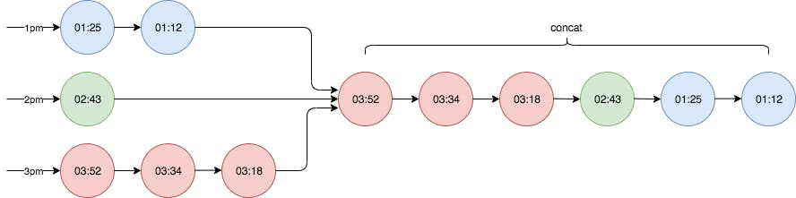
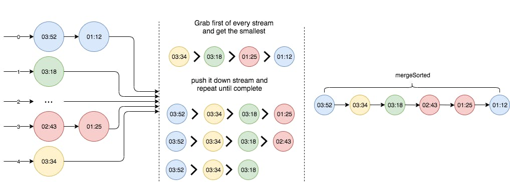

= Time range queries with Cassandra and Akka Streams
nMoncho
2020-01-02
:title: Time range queries with Cassandra and Akka Streams
:tags: [scala,akka,cassandra]

Apache Cassandra and Akka Streams, a match made in heaven. In this blogpost I hope to explain how the two seamlessly work together by using a real-life example. For a client we'd to use Cassandra as our data store to serve REST requests, one special requirement was that it had to support sorted time range queries over the entire data set or for a specific data producer (in our case, an IoT device recording temperature and atmospheric pressure).

Cassandra data modelling is different from Relational modelling, in the former we design our tables around the queries we want to perform disregarding any data normalisation (duplication is in fact encouraged) whereas in the latter we normalise each table, avoid duplication like the plague, and let the DMBS handle how to efficiently query a table. From this fact we must also consider: 1

* Queries should target few partitions, only one if possible.
* Data should be evenly spread across partitions.

Now onto the problem presented, let's say the user wants to query all the records made yesterday seems we should model our table like:

[source, sql]
----
CREATE TABLE readings(
  day           DATE,
  ts            TIMESTAMP,
  device_id     UUID,
  temperature   DOUBLE,
  pressure      DOUBLE,
  PRIMARY KEY (day, ts, device_id)
) WITH CLUSTERING ORDER BY (ts ASC, device_id ASC);
----

And a query for this schema would look like:

[source, sql]
----
SELECT * FROM readings where day = ? AND ts >= ? AND ts < ?;
----

This query would select all readings from a single date, filtering by a time range within that date (eg. where interested on all readings from 1pm to 3pm).

With this setup it looks like we solved the first problem, when we query the recordings made on a specific date we target only one partition, but actually we've created another problem, hot partitions. The recordings will write to the same partition for the whole day, leaving every other partitions untouched. This wouldn't be an issue if we'd processing data over an entire month, data would be evenly spread, but in this case our users will probably want to query the latest data, and eventually historical data. In a way it feels like going back to square one.

Our first thought on this was: make partitions smaller. Instead of having the partition being the whole day we'd split by another arbitrary amount, let's say hourly. Now when we want to make the same query, from 1pm to 3pm, we'd have to make 3 queries instead of one and concatenate the results (remember that users want to query ordered results), which is possible with Akka Streams:

[source, scala]
----
def queryRange(start: Instant, end: Instant): Source[Row, NotUsed] =
  HourRange(start, end)
    .foldLeft(Source.empty[Row]) { (rowsSource, hour) =>
      rowsSource.concat(
        CassandraSource(pstmt.bind(hour, start, end))
      )
  }

private val pstmt = session.prepare(
  "SELECT * FROM readings where hour = ? AND ts >= ? AND ts < ?"
)
----

In the previous snippet we're folding over a sequence of hours, 1pm to 3pm, and the using `concat` appends one source after another, giving results from the next stream once the previous has been exhausted.

We don't have to concatenate results manually like we would do if we'd use a Seq or a List, or even direct Cassandra's ResultSet. Although convenient this feels more like rehash of the same idea, we still have hot partitions, just smaller and for a shorter period of time. Let's see if we can do better.

== Place it in a bucket

Our requirement is that we've to serve ordered results and, given the possible size of the data set, it's too costly to sort results on the API Backend, image bringing 1GB of data to first sort it and then send it to the client. As we saw, Cassandra can sort data but only within the same partition and our queries should involve a single partition, but we cannot put everything into one partition, this looks like contradicting goals. So what can we do? Akka Streams to the rescue.

The goal using Cassandra is to spread data in different partitions so it can be queried later with little to no coordination between nodes by querying only one partition, gaining speed on concurrent queries targeting different nodes. A common practice to spread the data is to create artificial columns that work as buckets, kind of like a hash table. Let's see how that would apply to the schema:

[source, sql]
----
CREATE TABLE readings(
  day            DATE, -- We replace 'hour' with 'day' again
  bucket         INT,
  ts             TIMESTAMP,
  device_id      UUID,
  temperature    DOUBLE,
  pressure       DOUBLE,
  PRIMARY KEY ((day, bucket), ts, device_id)
) WITH CLUSTERING ORDER BY (ts ASC, device_id ASC);
----

The key concept here is to use every bucket to distribute data evenly, every bucket should have roughly the same amount of rows. If we think about insertion sequentially, considering just 5 buckets, the selection should be a repeating pattern going from 0 to 4, over and over again. The issue here is that on concurrent requests we've to manage this pattern (maybe with an increment AtomicInteger), but this solution would only work for a single machine. If we go back to our hash table analogy, we can use the hash code of the device id modulo the buckets (ie: `Math.abs(reading.deviceId) % 5`) where we use collisions to select a bucket again. With this we don't obtain a perfect even spread but close enough.

Since Cassandra ensures order for a partition, now the issue becomes how to merge the results from different partitions so the aggregated result is sorted as well. Imagine for a moment that if we query all buckets within a time range, some buckets can be empty, some with results. We cannot concatenate or zip the different queries to get what we want.

image:../media/2020-01-02-time-range-queries-with-cassandra-and-akka-streams/CassandraAkkaStreams-buckets.jpeg[]

There is another way to concatenate streams such that the aggregated result is sorted, enter `mergeSorted`:

[source, scala]
----
def queryRange(start: Instant, end: Instant): Source[Row, NotUsed] = {
  def queryBuckets(day: LocalDate) = {
    (0 until BucketAmount)
      .foldLeft(Source.empty[Row]) { (bucketSource, bucket) =>
        bucketSource
          .mergeSorted(
            CassandraSource(pstmt.bind(day, bucket, start, end)))
      }
   }

  DayRange(start, end)
    .foldLeft(Source.empty[Row]) { (daysRowSource, day) =>
      daysRowSource.concat(queryBuckets(day))
    }
}

implicit val rowOrdering: Ordering[Row] = new Ordering[Row] {
  override def compare(x: Row, y: Row): Int = {
    x.get("ts", classOf[Instant])
      .compareTo(y.get("ts", classOf[Instant]))
  }
}

private val pstmt = session.prepare(
  "SELECT * FROM readings where day = ? AND bucket = ? AND ts >= ? AND ts < ?"
)
----

The way `mergeSorted` works is by grabbing one element from each upstream and comparing against each other. In the previous snippet, when we query by time range we're using two stream operations:

* `concat`: If we query multiple dates on the instant range, we can safely concatenate each stream one after another since we provide the order on the query execution. This is similar to the example where we'd partition by hours.
* `mergeSorted`: With the maximum number of buckets (`BucketAmount`), we can query Cassandra that many times targeting different buckets in the same day partition, and then let mergeSorted figure out the order downstream.

We also need to defined how elements are ordered, which we provide by declaring the `implicit Ordering[Row]`, where we delegate to `Instant` implementation of `compareTo`.

One interesting property of using deviceId for calculating buckets is that all recordings made from the same device will end up in the same partition, the downside from it is that if we only have one device is that we'll have a hot partition, although if that's the case we would be in presence of a bigger problem. We could otherwise use the reading timestamp to decide which bucket to use, avoiding the aforementioned problem.

Another downside is that the bucket amount must remain static, going back to our hash table example, we cannot easily redistribute keys when one bucket becomes to big (eg. deviceId before moment t belongs to bucket 1 but after t belongs to bucket 4). We can workaround the issue but it's probably better to come with a good understanding of how big partitions can get.

== Conclusion

I hope this blogpost gives you a glimpse of what's possible by combining these two technologies which require a different way of thinking. You can get the companion code to this blogpost here